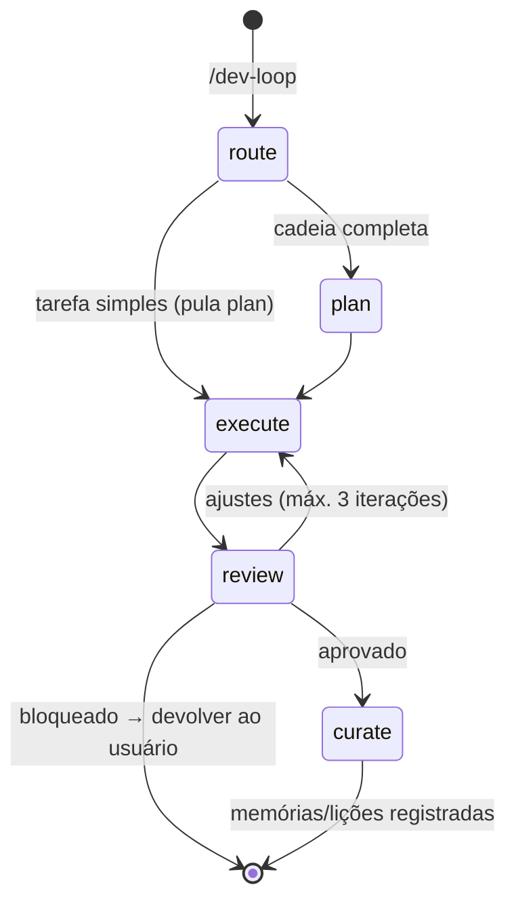

# dev-loop — Loop de desenvolvimento com handoff entre agents

Orquestra uma tarefa através de uma cadeia de agents do repositório com **handoff automático
via briefing**: cada agente termina sua etapa produzindo um briefing compacto, e o agente
seguinte recebe SOMENTE esse briefing (mais os arquivos que ele cita). Nenhum agente recebe a
transcrição de outro.

## Máquina de estados



Etapas e agents default (o router pode substituí-los):

| Etapa | Agente default | Effort | Pode ser pulada? |
|---|---|---|---|
| `route` | `task-router` | low | não (mas é 1 chamada curta) |
| `plan` | `curriculum-architect` (conteúdo) ou `platform-architect` (código) | herdado | sim — tarefa trivial ou já planejada |
| `execute` | escolhido pelo router (`content-author`, `exercise-designer`, `web-implementer`, `docs-writer`…) | herdado | não |
| `review` | `math-reviewer` (+ `i18n-steward` / `a11y-ux-reviewer` em paralelo quando aplicável) | herdado | sim — mudança mecânica sem regra de domínio |
| `curate` | `retrospective-curator` | low | não (mas pode ser "express") |

## Procedimento (Claude Code — automático)

1. **Workspace:** `bash tools/dev-loop.sh init <task-slug>` cria `.dev-loop/<task-slug>/`
   com `loop.md` (estado) e `briefings/`.
2. **Route:** invoque `task-router` (effort low) com a tarefa do usuário. Ele devolve o
   briefing `01-route.md` definindo a **cadeia mínima**.
3. **Loop:** para cada etapa, invoque o agente via tool `Agent` passando exatamente: (a) o
   objetivo em 1–2 frases; (b) o conteúdo do briefing anterior; (c) a instrução de handoff
   abaixo. Grave o texto final como `briefings/NN-<etapa>.md` e valide com
   `bash tools/dev-loop.sh validate <arquivo>`.
4. **Review:** o veredito decide — `aprovado` → curate; `ajustes` → nova iteração de execute
   (incrementar iteração em `loop.md`); `bloqueado` OU 3ª iteração sem aprovação → parar e
   apresentar o último briefing ao usuário.
5. **Curate:** `retrospective-curator` fecha o loop — atualiza `memory/agents/<name>.md` dos
   envolvidos e registra lição **somente se houve aprendizado real**.
6. Apresente ao usuário: resultado, veredito, iterações usadas e caminho dos briefings.

### Instrução de handoff (colar no prompt de cada agente)

```text
Você é uma etapa de um dev-loop. Leia memory/agents/<seu-nome>.md e apenas os
arquivos citados no briefing abaixo — não varra o repositório. Execute somente
a "Próxima ação exata" do briefing. Ao terminar, seu texto final deve ser um
briefing no formato de .claude/skills/dev-loop/references/briefing-template.md
(máx. 40 linhas, só deltas, sem colar código/diff/transcrição — referencie
caminhos e `git diff`). Não faça commit nem push.
```

## Regras de eficiência (OBRIGATÓRIO — tokens e tempo)

- **Briefing ≤ 40 linhas, só deltas.** Proibido colar transcrições, diffs completos ou
  conteúdo de arquivos — referenciar caminho + linha e `git diff`.
- **Cadeia mínima.** O router pula `plan`/`review` quando não agregam (justificando em 1
  linha). Tarefa trivial = `route → execute → curate-express`.
- **Contexto mínimo por agente.** Cada agente recebe apenas o briefing anterior, lê apenas
  os arquivos citados nele e a própria memória. Nunca reenviar briefings antigos.
- **Effort calibrado.** `low` para route/curate; herdado para plan/execute/review.
- **Paralelizar reviews independentes** (rigor + idioma + acessibilidade) numa única rodada.
- **Limite duro de 3 iterações** execute↔review; sem aprovação, devolver o impasse ao
  usuário.
- **Saída antecipada.** Se qualquer etapa descobrir que a tarefa já está resolvida ou mal
  definida, encerrar com veredito `bloqueado` e a justificativa.

## Copilot, Codex e Gemini (assistido)

Sem tool de subagente, o loop roda com a mesma máquina de estados de forma assistida:
`bash tools/dev-loop.sh next <task-slug>` informa a próxima etapa/agente; ative o chatmode
homônimo (Copilot), o `/agent:<nome>` (Gemini) ou cole `.claude/agents/<name>.md` como
instrução (Codex), sempre com a instrução de handoff e o briefing anterior. Os briefings em
`.dev-loop/` continuam sendo o único contrato entre etapas.

## Relação com /agent-handoff e /ticket-loop

- `/dev-loop` transfere trabalho **entre agents** dentro da mesma ferramenta.
- `/agent-handoff` troca de **CLI** no meio do trabalho.
- `/ticket-loop` é a camada acima: recebe um **ticket** e roda o dev-loop até o ticket
  atender a Definition of Done.
