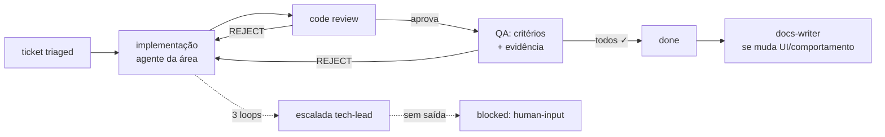

# Skill: /ticket-loop

Orquestra os agentes de [`.claude/agents/`](../../../.claude/agents/) sobre um ticket até
`done`, `blocked` ou o limite de loops, seguindo
[`docs/ai/ticket-protocol.md`](../../../docs/ai/ticket-protocol.md).

> **Execução automática:** este ciclo é disparado ao final do `/ticket` (pós-triagem) e pela
> continuação de cada `/handoff`. A invocação manual serve para **retomar** um ticket parado
> (desbloqueado, sessão interrompida, escalada resolvida).

## Passos

1. **Carregar estado:** ler `ticket.md` e o `log.md` inteiro. Se `status: new`, rodar a
   triagem do `tech-lead` primeiro.
2. **Carregar memória:** ler `memory/context/<área>.md` da área do ticket + as lições
   relevantes de `memory/LESSONS.md`. Lição que muda a abordagem é citada no log
   (`aplicada L-NNN`).
3. **Loop principal** (cada etapa gera `ACTION`/`HANDOFF` no log):
   - **a. Execução** — assumir (ou invocar como subagente) o agente responsável:
     `frontend-developer`, `backend-developer`, `devops-engineer`, `content-author`,
     `exercise-designer`, `docs-writer`… Commits `TCK-NNNN:` (sem push).
     Para `type: bug`: reproduzir → identificar causa raiz → corrigir → **adicionar teste de
     regressão** que falharia antes da correção.
   - **b. Code review** — papel do `code-reviewer` sobre o diff completo, como terceiro.
     `REJECT` numerado devolve ao passo (a).
   - **c. Revisões de domínio** (quando aplicável, **em paralelo**): `math-reviewer`
     (conteúdo/gabarito), `i18n-steward` (paridade de idiomas), `a11y-ux-reviewer`
     (acessibilidade), `security-auditor` (ticket sensível).
   - **d. Validação** — papel do `qa-validator`: executar de verdade, checklist de critérios
     com evidência, casos hostis (offline, dois idiomas, teclado, tema, dados vazios).
     `REJECT` devolve ao passo (a).
   - **e.** Todos os critérios ✓ → status `done`; acionar `docs-writer` se a entrega muda
     interface, comportamento ou documentação.
4. **Limites:** 3 `REJECT`s no mesmo par → parar e escalar ao `tech-lead` (resumo do impasse
   + opções). Falta de decisão do usuário → `blocked: human-input` com perguntas objetivas.
5. **Relatório final:** o que foi entregue, arquivos/commits, evidência da validação, o que
   ficou pendente e o caminho do `log.md` para auditoria.

## Regras

- Papéis são exercidos **de verdade**: o reviewer critica o diff como terceiro, sem defender
  a implementação. Quando a ferramenta permitir, usar subagentes separados — nenhuma
  instância valida artefato da própria cadeia.
- **Paralelismo:** tickets independentes rodam simultaneamente; agente ocupado spawna
  `<agente>#N` (entrada `SPAWN` no log).
- Nunca marcar critério como atendido sem evidência executável.
- **Memória:** a `ACTION` que resolve um `REJECT` termina com `Lição: L-NNN` ou
  `Lição: n/a — erro pontual`; erro que já tem lição registrada é defeito **bloqueante**. Ao
  fechar o ticket, atualizar `memory/context/<área>.md` se o conhecimento operacional mudou.
- Se o ambiente local não sobe, esse é o **primeiro defeito** a resolver — nada de validar
  "por leitura de código".
- Commit e push, deploy em produção e qualquer gasto exigem pedido explícito do usuário.
