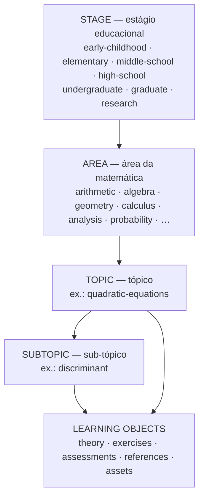
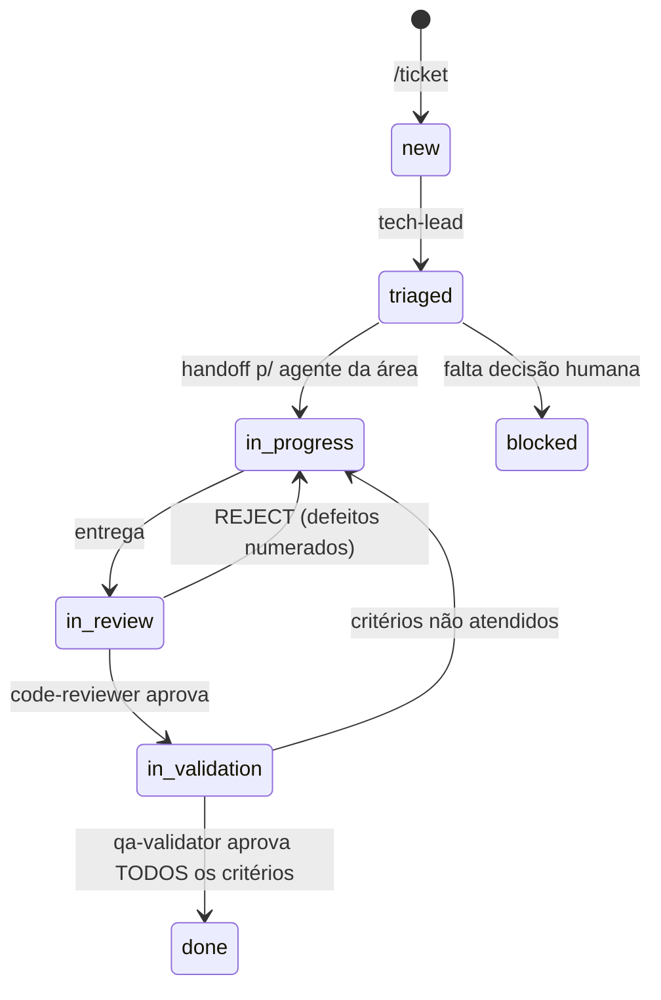

# AGENTS.md — Instruções Canônicas para Agentes de IA

> Este é o **arquivo-fonte único** de instruções do projeto. É lido nativamente por
> **Codex**, **Grok CLI**, **Cursor**, **Antigravity**, **Zed** e qualquer ferramenta que
> siga a convenção `AGENTS.md`; é importado pelo **Claude Code** (`CLAUDE.md`) e pelo
> **Gemini CLI** (`GEMINI.md`); e é resumido em
> `.github/instructions/core.instructions.md`, de onde saem as regras do **Copilot**,
> **Cursor**, **Windsurf**, **Antigravity**, **Zed**, **Cline** e **Junie**.
>
> Qualquer regra nova deve ser adicionada **AQUI** — os demais arquivos apenas referenciam
> este ou são gerados a partir dele. Matriz por ferramenta: `docs/ai/tool-support.md`.

## 1. Sobre o projeto

`mathematics-studies` é uma **plataforma gratuita e aberta de estudos de matemática**:
conteúdo didático da matemática mais básica à mais avançada, organizado por estágio
educacional, área e nível de dificuldade, com exercícios interativos, feedback imediato e
acompanhamento de progresso — tudo bilíngue (**pt-BR** e **en-US**).

**Visão:** dar a qualquer pessoa, de graça, uma trilha completa e navegável de aprendizado
matemático — da educação infantil à pesquisa — com teoria correta, prática deliberada,
diagnóstico de erros e materiais de apoio gratuitos e devidamente licenciados.

**Pilares (não negociáveis):**

| Pilar | Significado prático |
|---|---|
| **Correção matemática** | Nenhuma afirmação sem rigor; demonstrações verificáveis; exercícios com gabarito conferido. |
| **Didática** | Progressão explícita (pré-requisitos → objetivo → exemplo → prática → avaliação). |
| **Bilinguismo total** | Todo objeto de aprendizagem existe em pt-BR **e** en-US. Sem fallback parcial. |
| **Gratuidade e acesso** | Sem paywall; funciona offline (PWA); referências externas sempre gratuitas e com licença registrada. |
| **Acessibilidade** | WCAG 2.2 AA; matemática acessível a leitor de tela; navegação por teclado. |
| **Evidência de aprendizado** | Estatísticas de acerto/erro, diagnóstico de lacunas e recomendação do próximo passo. |

**Produto (estado atual do plano):** aplicação web **PWA** (deploy na **Vercel**) com
módulos de plataforma de cursos: trilhas de aprendizado, quizzes, progresso, fóruns de
discussão e certificados de conclusão. A stack ainda **não está fechada** — a proposta em
avaliação está em `docs/adr/ADR-0003-platform-stack.md` (status `proposed`). Enquanto o ADR
não for aceito, nenhum agente deve assumir framework, banco ou biblioteca como decidido.

## 2. Convenções de idioma (OBRIGATÓRIO)

Há **dois planos de idioma** neste repositório; não confundi-los:

**a) Plano do repositório (trabalho interno)**
- **en-US**: nomes de arquivos, pastas, variáveis, funções, classes, componentes, siglas,
  chaves de configuração, IDs de conteúdo, nomes de branches e identificadores em geral.
- **pt-BR**: descrições, comentários, documentação interna (`docs/`, `memory/`), specs,
  ADRs, mensagens de commit (corpo) e qualquer texto voltado ao time.

**b) Plano do produto (conteúdo entregue ao usuário final)**
- **Todo objeto de aprendizagem é bilíngue pt-BR + en-US**, sempre em paridade.
- Sufixo de idioma no nome do arquivo: `theory.pt-BR.md` / `theory.en-US.md`; em JSON,
  campos localizados são objetos `{ "pt-BR": …, "en-US": … }`.
- **Proibido publicar conteúdo com apenas um idioma**, misturar idiomas na mesma seção ou
  deixar fallback silencioso. Falta de tradução → `status: "draft"` no `meta.json` e
  registro em `/i18n-parity`.
- Notação matemática é neutra (LaTeX/KaTeX); apenas o texto ao redor é traduzido.
  Convenções de vírgula decimal (pt-BR) vs ponto decimal (en-US) seguem
  `docs/content/i18n.md`.

Exemplo: pasta `content/high-school/algebra/quadratic-equations/` (en-US) com
`theory.pt-BR.md` e `theory.en-US.md`.

## 3. Taxonomia do conteúdo

Todo conteúdo pertence a exatamente um nó da taxonomia, endereçado por um caminho estável:

```
content/<stage>/<area>/<topic>/[<subtopic>/]
```



- **`stage`** (estágio educacional): `early-childhood`, `elementary`, `middle-school`,
  `high-school`, `undergraduate`, `graduate`, `research`. O mapeamento para a BNCC e para
  sistemas estrangeiros está em `docs/content/taxonomy.md` — a pasta usa o slug en-US.
- **`area`**: `arithmetic`, `algebra`, `geometry`, `trigonometry`, `precalculus`,
  `calculus`, `linear-algebra`, `analysis`, `abstract-algebra`, `topology`, `probability`,
  `statistics`, `discrete-math`, `number-theory`, `logic-foundations`,
  `differential-equations`, `numerical-methods`, `optimization`. Lista canônica (com
  critérios de inclusão de novas áreas): `docs/content/taxonomy.md`.
- **`topic` / `subtopic`**: slug en-US kebab-case, estável — o slug é parte da URL pública
  e **não pode ser renomeado** sem ADR e redirect.

Cada nó folha contém:

```
meta.json            # id, stage, area, prerequisites[], difficulty, tags[], status, i18n
theory.pt-BR.md      # teoria em pt-BR (KaTeX)
theory.en-US.md      # teoria em en-US (KaTeX)
exercises.json       # itens de prática (schema em docs/content/exercise-schema.md)
assessments.json     # avaliação somativa do nó (opcional)
references.json      # fontes externas gratuitas + licença + idioma
assets/              # imagens, SVGs, vídeos (ou ponteiros para mídia externa)
```

**Regra de dependência:** um nó só pode declarar como `prerequisites` nós de dificuldade
menor ou igual, e o grafo de pré-requisitos **deve ser acíclico**. `/content-audit`
verifica isso.

**Regra de escopo:** conhecimento sobre *como o projeto funciona* vai para `docs/`;
conhecimento *matemático entregue ao usuário* vai para `content/`. Nunca misturar.

Camadas **operacionais** (fora da taxonomia de conteúdo): `memory/`, `docs/`, `tickets/`,
`scripts/`, `tools/`, `prompts/` e os diretórios de configuração das ferramentas de IA
(`.claude/`, `.github/`, `.codex/`, `.gemini/`, `.cursor/`, `.agents/`, `.windsurf/`).

## 4. Estrutura do repositório

```
AGENTS.md                    # Este arquivo (fonte única de instruções)
CLAUDE.md                    # Adaptador para Claude Code (importa AGENTS.md)
GEMINI.md                    # Adaptador para Gemini CLI (importa AGENTS.md)
SLASH_COMMANDS.md            # Inventário de comandos por ferramenta (parcialmente gerado)
.claude/agents/              # FONTE: papéis (todos os CLIs derivam daqui)
.claude/skills/              # FONTE: capacidades (todos os CLIs derivam daqui)
.claude/workflows/           # Claude Code: workflows determinísticos (.js)
.claude/commands/            # Claude Code: slash commands dos agents — gerados
.github/instructions/        # FONTE: regras por escopo (applyTo) — origem das rules
.github/copilot-instructions.md   # Adaptador para GitHub Copilot
.github/prompts/             # Copilot: prompt files — gerados
.github/chatmodes/           # Copilot: chat modes — gerados
.github/workflows/           # CI (auditoria da superfície de IA e do conteúdo)
.codex/README.md             # Adaptador/notas para OpenAI Codex
.gemini/commands/            # Gemini CLI: custom commands (.toml) — gerados
.cursor/rules/ + commands/   # Cursor: rules (.mdc) e comandos — gerados
.agents/rules/ + workflows/  # Google Antigravity: rules e workflows — gerados
.windsurf/rules/ + workflows/# Windsurf: rules e workflows — gerados
.rules · .clinerules · .junie/  # Zed, Cline/Roo e JetBrains Junie — gerados
content/                     # CONTEÚDO do produto (taxonomia da seção 3)
content/paths/               # Trilhas de aprendizado (descritores JSON)
tickets/                     # Unidades de trabalho: TCK-NNNN-<slug>/ (ticket.md + log.md)
docs/DOC-STANDARDS.md        # Padrões C4 + ADR + SDD
docs/product/                # Visão, roadmap, glossário
docs/content/                # Padrões de conteúdo: taxonomia, i18n, exercícios, a11y, didática
docs/architecture/           # C4 da plataforma (Mermaid)
docs/adr/                    # ADRs numerados + template
docs/specs/                  # Spec-Driven Development (spec → plan → tasks)
docs/errors/                 # Registro de erros e soluções (anti-repetição)
docs/ai/                     # ticket-protocol.md (fluxo de agentes) + cross-agent-handoff.md
memory/                      # Memória persistente: contexto, lições, agents/, context/<área>
scripts/                     # Gerador de adapters, auditorias determinísticas
tools/                       # dev-loop, agent-handoff
prompts/                     # Prompts operacionais (bootstrap, tarefas recorrentes)
```

## 5. Protocolo de memória (todos os agentes)

Antes de iniciar qualquer tarefa significativa:

1. **Ler** `memory/MEMORY.md` (índice) e os arquivos de memória relevantes para a tarefa.
2. **Ler** a própria memória em `memory/agents/<agent-name>.md` (quando atuando como um
   agente nomeado — agent Claude, chatmode Copilot, command Gemini ou papel assumido no
   Codex).
3. **Ler** `docs/errors/README.md` para não repetir erros já documentados.

Ao concluir uma tarefa significativa:

4. **Atualizar** `memory/context/project-context.md` se o estado do projeto mudou.
5. **Atualizar** a própria memória `memory/agents/<agent-name>.md` (notas persistentes +
   linha em "Últimas execuções").
6. **Registrar** lições novas em `memory/lessons/` (um arquivo por lição, nome en-US
   kebab-case, campo `**Tipo:** sucesso | erro | correção`) — tudo que foi aprendido com
   erros E com sucessos.
7. **Atualizar** os índices: `memory/LESSONS.md` (seção do tipo correspondente) e
   `memory/MEMORY.md` (uma linha por arquivo novo).

Regras: uma lição por arquivo; datas absolutas (nunca "semana passada"); não duplicar o que
já está no git ou no próprio conteúdo; conhecimento de interesse geral vai para
`memory/lessons/`, não para a memória individual do agente.

## 6. Protocolo de auto-aprendizado (self-learning)

- **Correção do usuário** → registrar em `memory/lessons/` no formato
  `**Tipo:** … / **Contexto:** … / **Lição:** … / **Como aplicar:** …`.
- **Erro cometido e resolvido** → registrar em `docs/errors/` usando
  `docs/errors/error-template.md`.
- **Padrão que funcionou bem** → registrar como lição positiva em `memory/lessons/`.
- **Erro matemático detectado em conteúdo publicado** → além do registro de erro, abrir
  correção no nó afetado e verificar se o mesmo equívoco aparece em nós irmãos.
- **Antes de agir**, verificar se já existe lição ou erro documentado sobre o assunto; se
  existir e estiver desatualizado, corrigir o registro em vez de duplicar.

## 7. Registro de erros (anti-repetição)

Todo erro não-trivial (comando que falhou por causa evitável, afirmação matemática errada,
suposição equivocada sobre a taxonomia, retrabalho por instrução mal interpretada) vira um
arquivo em `docs/errors/` seguindo o template, com atualização do índice
`docs/errors/README.md`. Consultar esse índice é parte do início de qualquer tarefa.

## 8. Padrões de documentação

Padrão consolidado em `docs/DOC-STANDARDS.md`. Resumo:

- **C4 Model** (`docs/architecture/`): diagramas em Mermaid (`C4Context`, `C4Container`,
  `C4Component`); um arquivo por nível/escopo.
- **Parte visual obrigatória:** todo documento novo deve avaliar a estrutura visual do
  assunto e, quando houver fluxo, sequência, dependência, ciclo, hierarquia, mapa mental ou
  relação entre partes, incluir pelo menos uma seção Mermaid (`flowchart`,
  `sequenceDiagram`, `stateDiagram`, `mindmap`), acompanhada de leitura curta e fontes.
  Tabelas ficam reservadas a contratos, matrizes, checklists e dados tabulares.
- **ADR** (`docs/adr/`): toda decisão arquitetural, de produto ou de processo relevante vira
  um ADR numerado (`ADR-NNNN-short-title.md`) a partir de `docs/adr/adr-template.md`.
  Status: `proposed | accepted | deprecated | superseded`.
- **Spec-Driven Development** (`docs/specs/`): trabalho novo começa por uma spec.
  Fluxo `spec.md` (o quê/por quê) → `plan.md` (como) → `tasks.md` (passos executáveis).
  Templates em `docs/specs/templates/`. **Nenhuma implementação sem spec aprovada.**

## 9. Padrões de conteúdo matemático

Detalhamento em `docs/content/`. Regras duras:

1. **Notação:** LaTeX renderizado por KaTeX; delimitadores `$…$` (inline) e `$$…$$`
   (display). Nada de imagem de fórmula quando o LaTeX resolve.
2. **Acessibilidade da matemática:** toda fórmula em display precisa de descrição textual
   (`alt`/`aria-label` ou parágrafo de leitura) — ver `docs/content/accessibility.md`.
3. **Estrutura mínima de um `theory.<lang>.md`:** objetivo de aprendizagem → pré-requisitos
   → intuição → definição formal → exemplos resolvidos → erros comuns → resumo.
4. **Exercícios:** seguem `docs/content/exercise-schema.md` — enunciado bilíngue, tipo,
   gabarito, solução passo a passo, dicas progressivas, feedback por alternativa errada
   (diagnóstico do equívoco, não só "errado"), dificuldade 1–5 e tags de habilidade.
5. **Verificação:** todo resultado numérico ou algébrico não trivial deve ser verificado
   (`/math-verify`, com SymPy/numérico) antes de virar gabarito.
6. **Fontes externas:** só materiais **gratuitos**, com licença registrada em
   `references.json` (preferência por CC BY / CC BY-SA / domínio público). Nunca linkar
   conteúdo pirateado. Citar autor, ano e URL.
7. **Sem plágio:** conteúdo autoral; quando adaptar algo licenciado, atribuir explicitamente
   e respeitar a licença (inclusive share-alike).

## 10. Workflows, agents e orquestração

O repositório é operável por **qualquer** assistente de código. Há três fontes canônicas,
escritas uma única vez, das quais todo o resto é **gerado**:

| Fonte | O que define |
|---|---|
| `.claude/agents/<nome>.md` | Papéis: missão, escopo exclusivo, limites, memória |
| `.claude/skills/<nome>/SKILL.md` | Capacidades: procedimentos executáveis |
| `.github/instructions/<nome>.instructions.md` | Regras por escopo (`applyTo` = glob) |

`python3 scripts/sync-ai-adapters.py` gera, a partir delas, os adapters de Claude Code,
Copilot, Gemini CLI, Cursor, Antigravity, Windsurf, Zed, Cline/Roo, Junie e Codex.
Matriz completa, limitações e instalação: **`docs/ai/tool-support.md`**.

- **Carregam tudo sozinhas** (zero setup): Claude Code (`CLAUDE.md`), Grok CLI (lê
  `AGENTS.md`, `CLAUDE.md` e `.claude/`), Cursor, Copilot, Gemini CLI, Windsurf,
  Zed, Cline/Roo, Junie.
- **Antigravity**: lê `AGENTS.md`; as regras em `.agents/rules/` precisam do modo de ativação
  escolhido na UI (a sugestão está no topo de cada arquivo).
- **Codex**: lê `AGENTS.md` nativamente; prompts são **globais por usuário** — instalar com
  `--codex`, usando `--codex-prefix` ou um `CODEX_HOME` próprio para não colidir com outros
  repositórios.
- **Ferramentas web (ChatGPT, Grok, Claude)**: colar `prompts/bootstrap-session.md` ou
  `prompts/assume-agent-role.md`.

**Só o Claude Code tem subagentes isolados em paralelo e os workflows `.js`.** Nas demais, os
papéis são executados em sequência pelo próprio modelo — a regra "quem produz não valida"
passa a depender de disciplina e deve ser declarada no `log.md` do ticket.

### Agents (`.claude/agents/`, espelhados como chatmodes/commands)

Cada agente tem **escopo exclusivo**: não mexe na área de outro — se precisar, faz handoff.

**Fluxo de trabalho (desenvolvimento e manutenção)**

| Agente | Área exclusiva | Recebe de | Entrega para |
|---|---|---|---|
| `tech-lead` | Triagem, orquestração, decisões técnicas, desbloqueio | usuário (`/ticket`), qualquer agente escalado | todos |
| `product-analyst` | Requisito refinado e critérios de aceite verificáveis | tech-lead | tech-lead |
| `platform-architect` | Arquitetura da aplicação, dados, deploy; ADRs | tech-lead | devs, tech-lead |
| `ui-ux-designer` | Fluxos, design system, estados de tela, textos de interface | tech-lead, product-analyst | frontend-developer |
| `frontend-developer` | Interface, PWA, KaTeX, exercícios interativos, i18n | tech-lead | code-reviewer |
| `backend-developer` | Dados, progresso, pipeline de conteúdo, APIs | tech-lead | code-reviewer |
| `devops-engineer` | CI/CD, build, deploy na Vercel, ambientes | tech-lead | code-reviewer |
| `code-reviewer` | Revisão do diff (correção, segurança, a11y, i18n, testes) | devs | qa-validator ou devolve |
| `qa-validator` | Validação contra critérios de aceite; **único que marca `done`** | code-reviewer | docs-writer ou devolve |
| `security-auditor` | Privacidade de menores (LGPD/COPPA), segredos, dependências | tech-lead | tech-lead |
| `docs-writer` | Documentação interna nos padrões da seção 8 | qa-validator (pós-`done`), tech-lead | tech-lead |

**Conteúdo e currículo**

| Agente | Papel |
|---|---|
| `curriculum-architect` | Taxonomia, trilhas e grafo de pré-requisitos. |
| `content-author` | Teoria didática bilíngue de um nó. |
| `math-reviewer` | Rigor matemático, demonstrações e gabaritos. |
| `exercise-designer` | Exercícios e quizzes com feedback diagnóstico. |
| `i18n-steward` | Paridade e qualidade pt-BR/en-US. |
| `a11y-ux-reviewer` | Acessibilidade (WCAG 2.2 AA) e UX de aprendizagem. |
| `learning-analytics` | Progresso, domínio de habilidades, diagnóstico de lacunas. |
| `researcher` | Fontes gratuitas, licenças e literatura didática. |

**Suporte ao loop**

| Agente | Papel |
|---|---|
| `task-router` | Define a cadeia mínima do `/dev-loop` para tarefas sem ticket. |
| `retrospective-curator` | Fecha o loop: memória, lições e índices. |

### Sistema de tickets (desenvolvimento orientado a demanda)

Todo desenvolvimento, manutenção, correção de bug e produção de conteúdo de porte passa por
um **ticket** em `tickets/TCK-NNNN-<slug>/` (`ticket.md` + `log.md` append-only) — ADR-0004.
Contrato completo: **`docs/ai/ticket-protocol.md`**.



Regras estruturais:

1. **Handoff executa, não espera:** handoff registrado = próximo agente assume imediatamente.
   O fluxo só para em `done`, `blocked: human-input` ou escalada por 3 loops.
2. **Log ou não aconteceu:** toda ação vira entrada no `log.md` (`ACTION`, `HANDOFF`,
   `REJECT`, `SPAWN`, `STOP`, `CORRECTION`), com `[SEQ]` incremental e append-only.
3. **Critérios de aceite são a definição de pronto** — não a opinião do agente. Só o
   `qa-validator` marca `done`, com evidência por critério.
4. **Nenhum agente valida artefato produzido pela própria cadeia.**
5. **Agente ocupado não enfileira — spawna** subagente (`<agente>#N`) para o ticket novo da
   sua área. Área de outro agente continua sendo handoff.
6. **Loop limitado:** 3 devoluções no mesmo par → `tech-lead`; sem saída → usuário.
7. **Erro vira lição:** a `ACTION` que resolve um `REJECT` termina com `Lição: L-NNN`.
   Repetir erro que já tem lição registrada é defeito **bloqueante**.
8. Commits usam prefixo `TCK-NNNN:`; commit, push, deploy em produção e gasto financeiro
   exigem pedido explícito do usuário.

### Capacidades (`.claude/skills/`) — mesmo nome em todas as ferramentas

| Capacidade | Comando |
|---|---|
| Criar ticket + triagem, e entrar no ciclo | `/ticket` |
| Executar/retomar o ticket em loop | `/ticket-loop` |
| Handoff dentro do ticket | `/handoff` |
| Loop leve entre agents, sem ticket | `/dev-loop` |
| Handoff entre ferramentas | `/agent-handoff` |
| Criar ADR · spec · revisar spec | `/create-adr` · `/create-spec` · `/spec-review` |
| Diagrama C4 | `/c4-diagram` |
| Registrar erro · capturar lição | `/log-error` · `/capture-lesson` |
| Regenerar o contexto do projeto | `/generate-project-context` |
| Novo nó de conteúdo · exercícios · trilha | `/new-topic` · `/new-exercise-set` · `/learning-path` |
| Verificar matemática | `/math-verify` |
| Auditar conteúdo · idiomas | `/content-audit` · `/i18n-parity` |
| Auditar acessibilidade · PWA/performance | `/a11y-audit` · `/pwa-audit` |
| Auditoria determinística (qualquer ferramenta) | `bash scripts/audit-ai-surface.sh` · `bash scripts/audit-content.sh` |

Os **papéis** usam o mesmo nome do agente. Duas exceções de namespace: no Gemini CLI são
`/agent:<nome>`; no Cursor, Antigravity e Windsurf, `/agent-<nome>`.

**Paridade é gerada, não escrita à mão:** `scripts/sync-ai-adapters.py` lê as três fontes
canônicas e escreve os adapters de todas as ferramentas. Arquivos **sem** o marcador
`managed-by:mathematics-studies/sync-ai-adapters` são tratados como escritos à mão e
preservados. `--check` falha se algo estiver desatualizado, se faltar
`memory/agents/<name>.md` ou se alguma regra passar de 12.000 caracteres (limite de
Antigravity e Windsurf). Inventário em `SLASH_COMMANDS.md`; matriz por ferramenta em
`docs/ai/tool-support.md`.

### Workflows (`.claude/workflows/`)

| Workflow | Uso |
|---|---|
| `content-review` | Revisão multidimensional de um nó de conteúdo (rigor, didática, exercícios, i18n, a11y) com verificação adversarial. |
| `curriculum-audit` | Auditoria da taxonomia: lacunas, ciclos de pré-requisito, dificuldade inconsistente, cobertura por estágio. |
| `ai-surface-audit` | Paridade e saúde da superfície de IA em todas as ferramentas. |
| `feature-plan-review` | Revisão adversarial de um plano de implementação/estimativa. |
| `research-sweep` | Varredura multi-ângulo de fontes gratuitas e referências para um tópico. |

Invocar via tool `Workflow` com `{name: "content-review"}` etc. **Somente quando o usuário
pedir orquestração multi-agente explicitamente.**

### Os três loops (quando usar cada um)

| Mecanismo | Entrada | Quando usar |
|---|---|---|
| **`/ticket-loop`** | Ticket `TCK-NNNN` | Desenvolvimento auditado: feature, bug, infra, conteúdo de porte. Roda até `done`. |
| **`/dev-loop`** | Tarefa em texto | Tarefa pontual sem ticket, com handoff por briefing compacto. |
| **`/agent-handoff`** | `.agent-handoff.md` | Trocar de **CLI** (Claude ↔ Codex ↔ Copilot ↔ Gemini) no meio do trabalho. |

**`/dev-loop`** encadeia `route → plan → execute → review → curate` com **handoff por briefing
compacto** (≤ 40 linhas, só deltas): cada agente recebe apenas o briefing anterior, os
arquivos citados nele e a própria memória — nunca a transcrição de outro agente. Estado em
`.dev-loop/<task-slug>/` (gitignored); helper `tools/dev-loop.sh` (init/status/next/validate).
No Claude Code é automático (tool Agent); nos demais CLIs é assistido — `tools/dev-loop.sh
next` indica a próxima etapa. Contrato: `.claude/skills/dev-loop/SKILL.md`.

## 11. Regras operacionais

### Handoff entre CLIs

Claude, Codex, Copilot e Gemini possuem sessões independentes. Para transferir uma tarefa
entre quaisquer dois deles, use `.agent-handoff.md` como contrato compartilhado, junto com
os arquivos atuais e o `git diff`. Procedimento em `docs/ai/cross-agent-handoff.md`;
inicie com `tools/agent-handoff.sh init` e valide com `tools/agent-handoff.sh validate`.
Apenas um agente pode editar o mesmo working tree por vez.

### Regras gerais

- **Todo trabalho de desenvolvimento passa por ticket** (`/ticket`), com log auditável.
  Tarefas pontuais sem ticket usam `/dev-loop`.
- **Não fazer commit ou push sem solicitação explícita** do usuário. O mesmo vale para deploy
  em produção, exclusão de dados e qualquer gasto financeiro.
- **Nenhuma implementação sem spec aprovada** (`docs/specs/`) e sem ADR para decisões
  estruturais.
- **Não assumir stack**: enquanto `ADR-0003` estiver `proposed`, tratar framework, banco e
  bibliotecas como hipótese, não como fato.
- **Não renomear slugs** de `content/` (fazem parte da URL pública) sem ADR + redirect.
- **Não publicar conteúdo monolíngue** — ver seção 2b.
- **Não afirmar matemática sem verificar**: resultado não trivial passa por `/math-verify`
  ou por demonstração explícita.
- **Citar sempre a origem** de fatos externos (autor, ano, URL, licença).
- **Arquivos temporários** ficam fora do repositório (scratchpad da ferramenta), nunca em
  `content/`, `docs/` ou `memory/`.
- **Dados de usuário**: qualquer funcionalidade que colete progresso, e-mail ou dados de
  menores de idade exige ADR próprio tratando LGPD/COPPA antes da implementação.
- Gerados nunca são editados à mão: `.claude/commands/`, `.github/prompts/`,
  `.github/chatmodes/`, `.gemini/commands/` (quando marcados como gerenciados) e
  `SLASH_COMMANDS.md` (seção entre marcadores).
