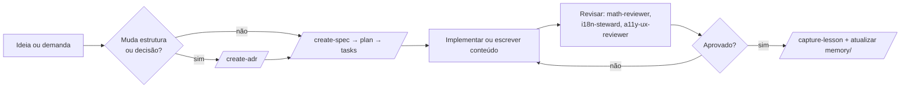

# Contribuindo com o mathematics-studies

Este guia vale para pessoas **e** para agentes de IA. As regras canônicas estão em
[`AGENTS.md`](AGENTS.md); aqui está o fluxo prático.

## 1. Antes de começar

1. Leia `AGENTS.md` (fonte única) e o adaptador do seu CLI (`CLAUDE.md`, `GEMINI.md`,
   `.github/copilot-instructions.md` ou `.codex/README.md`).
2. Leia `memory/MEMORY.md` e `docs/errors/README.md` — evita repetir erro já documentado.
3. Confirme em que **plano** você está mexendo:
   - `content/` → conteúdo entregue ao usuário (bilíngue, público);
   - `docs/` → como o projeto funciona (interno, pt-BR);
   - código da aplicação → só depois de spec aprovada.

## 2. Fluxo de trabalho

**Nenhuma implementação sem spec aprovada.** Trabalho novo começa em `docs/specs/<slug>/`
com `spec.md` → `plan.md` → `tasks.md` (templates em `docs/specs/templates/`).

## 3. Contribuindo com conteúdo

1. Crie o nó com `/new-topic <stage>/<area>/<topic>` — ele já monta `meta.json`,
   `theory.pt-BR.md`, `theory.en-US.md`, `exercises.json` e `references.json`.
2. Escreva a teoria seguindo a estrutura mínima (`docs/content/content-standards.md`):
   objetivo → pré-requisitos → intuição → definição formal → exemplos → erros comuns →
   resumo.
3. Crie exercícios com `/new-exercise-set` seguindo `docs/content/exercise-schema.md`:
   feedback por alternativa errada precisa **diagnosticar o equívoco**, não apenas dizer
   "incorreto".
4. Verifique todo resultado não trivial com `/math-verify` antes de fixar o gabarito.
5. Garanta paridade de idiomas com `/i18n-parity`.
6. Rode `bash scripts/audit-content.sh` antes de considerar o nó pronto.
7. Só marque `status: "published"` no `meta.json` quando teoria, exercícios, referências e
   os dois idiomas estiverem completos.

### Checklist de conteúdo (obrigatório)

- [ ] `theory.pt-BR.md` e `theory.en-US.md` equivalentes (mesmas seções, mesmos exemplos)
- [ ] Fórmulas em KaTeX, com descrição textual para display equations
- [ ] Pré-requisitos declarados e existentes (sem ciclos)
- [ ] Dificuldade coerente com o estágio
- [ ] Exercícios com solução passo a passo, dicas progressivas e feedback diagnóstico
- [ ] Referências gratuitas, com autor, ano, URL e licença
- [ ] Nenhum conteúdo copiado sem atribuição compatível com a licença de origem
- [ ] Nenhum trecho de fonte **NC / ND / sem licença** incorporado ou traduzido — essas fontes
      são **só citáveis** como leitura externa (`ADR-0005`; contribuições vão para `content/`
      sob CC BY-SA 4.0 e para o código sob MIT — ver `LICENSE-CONTENT` e `LICENSE`)

## 4. Contribuindo com a plataforma

- Decisões de stack, dados, autenticação e privacidade exigem **ADR** (`/create-adr`).
- Funcionalidade que colete dados de usuário (especialmente de menores) exige ADR tratando
  LGPD/COPPA **antes** da implementação.
- Acessibilidade é requisito, não polimento: WCAG 2.2 AA verificado com `/a11y-audit`.
- Performance e comportamento offline verificados com `/pwa-audit`.

## 5. Convenções

| Item | Convenção |
|---|---|
| Nomes de arquivos, pastas, identificadores | en-US, kebab-case (`quadratic-equations`) |
| Documentação e comentários | pt-BR |
| Conteúdo do produto | pt-BR **e** en-US |
| Branches | `feat/<slug>`, `content/<slug>`, `fix/<slug>`, `docs/<slug>` |
| Commits | Título curto em en-US ou pt-BR; corpo em pt-BR explicando o porquê |

## 6. Ao encerrar

- Atualize `memory/context/project-context.md` se o estado do projeto mudou.
- Registre lições em `memory/lessons/` (`/capture-lesson`) e erros em `docs/errors/`
  (`/log-error`), com os índices atualizados.
- **Não faça commit ou push sem pedido explícito** de quem conduz a tarefa.
