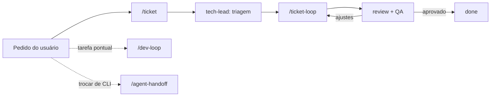

# Slash commands e comandos por ferramenta

Inventário da superfície de IA do projeto. A tabela abaixo é **gerada** por
`python3 scripts/sync-ai-adapters.py` a partir de `.claude/skills/` e `.claude/agents/` —
não editar à mão o trecho entre os marcadores.

## Como cada ferramenta enxerga a superfície

| Ferramenta | Skills | Agents | Setup |
|---|---|---|---|
| **Claude Code** | nativas `/<skill>` | subagentes + `/<agent>` | nenhum |
| **Grok CLI** | lê `.claude/skills/` | lê `.claude/agents/` | nenhum |
| **Cursor** | `/<skill>` | `/agent-<nome>` | nenhum |
| **GitHub Copilot** | prompt files `/<skill>` | chat modes | nenhum |
| **Gemini CLI** | `/<skill>` | `/agent:<nome>` | nenhum |
| **Antigravity** | `/<skill>` | `/agent-<nome>` | ativar rules na UI |
| **Windsurf** | `/<skill>` | `/agent-<nome>` | nenhum |
| **OpenAI Codex** | prompts globais | prompts globais | `--codex` (ver matriz) |
| **Zed · Cline · Junie** | abrir o `SKILL.md` | abrir `.claude/agents/<nome>.md` | nenhum |
| **ChatGPT · Grok · Claude (web)** | manual | manual | colar `prompts/bootstrap-session.md` |

Detalhes, limitações e o que fazer quando falta suporte nativo:
[`docs/ai/tool-support.md`](docs/ai/tool-support.md).

## Fluxos principais

| Quero… | Comando |
|---|---|
| Registrar e executar uma demanda | `/ticket <descrição>` |
| Retomar um ticket parado | `/ticket-loop TCK-NNNN` |
| Passar o ticket para o próximo agente | `/handoff TCK-NNNN` |
| Rodar um loop leve, sem ticket | `/dev-loop <tarefa>` |
| Trocar de CLI no meio do trabalho | `/agent-handoff` |
| Criar conteúdo | `/new-topic`, `/new-exercise-set`, `/learning-path` |
| Verificar qualidade | `/math-verify`, `/content-audit`, `/i18n-parity`, `/a11y-audit`, `/pwa-audit` |
| Registrar conhecimento | `/create-adr`, `/create-spec`, `/log-error`, `/capture-lesson` |

## Workflows (Claude Code — tool `Workflow`)

| Workflow | Uso |
|---|---|
| `content-review` | Revisão multidimensional de um nó, com verificação adversarial |
| `curriculum-audit` | Lacunas, ciclos e progressão da taxonomia |
| `ai-surface-audit` | Paridade e coerência da superfície de IA |
| `feature-plan-review` | Revisão adversarial de plano/spec por múltiplas perspectivas |
| `research-sweep` | Varredura de fontes gratuitas com licença verificada |

Invocar apenas quando o usuário pedir orquestração multi-agente.

## Inventário gerado

<!-- BEGIN GENERATED COMMANDS (sync-ai-adapters.py) -->
### Capacidades (skills)

Fonte: `.claude/skills/<nome>/SKILL.md`

| Comando | O que faz |
|---|---|
| `/a11y-audit` | Audita acessibilidade da plataforma e do conteúdo — WCAG 2.2 AA, matemática acessível a leitor de tela, navegação por teclado, co… |
| `/agent-handoff` | Transfere uma tarefa em andamento entre CLIs (Claude Code, Codex, Copilot, Gemini) usando .agent-handoff.md como contrato compart… |
| `/c4-diagram` | Cria ou atualiza diagramas C4 (Context, Container, Component) em Mermaid dentro de docs/architecture/. Usar ao documentar a arqui… |
| `/capture-lesson` | Registra uma lição aprendida em memory/lessons/ (protocolo de auto-aprendizado). Usar após correções do usuário, descobertas de d… |
| `/content-audit` | Audita um nó, uma área ou todo o conteúdo — estrutura da taxonomia, completude didática, rigor, exercícios, referências e metadad… |
| `/create-adr` | Registra uma decisão arquitetural, de produto ou de processo como ADR numerado em docs/adr/. Usar sempre que uma escolha estrutur… |
| `/create-spec` | Inicia trabalho novo pelo fluxo Spec-Driven Development em docs/specs/<slug>/ — spec.md (o quê/por quê) → plan.md (como) → tasks.… |
| `/dev-loop` | Executa um loop de desenvolvimento com handoff automático entre agents — cada agente produz um briefing compacto que é a única en… |
| `/generate-project-context` | Regenera memory/context/project-context.md com o estado atual do projeto — o que existe, o que está decidido, o que está em abert… |
| `/handoff` | Registra formalmente a transição de um ticket entre agentes — grava a entrada HANDOFF no log.md, atualiza status e owner no ticke… |
| `/i18n-parity` | Verifica a paridade pt-BR/en-US do conteúdo e da interface — arquivos ausentes, seções divergentes, campos localizados incompleto… |
| `/learning-path` | Desenha uma trilha de aprendizado — sequência de nós de conteúdo com objetivo, pré-requisitos, marcos, avaliações e critério de c… |
| `/log-error` | Registra um erro não-trivial em docs/errors/ para não repeti-lo — comando que falhou por causa evitável, afirmação matemática err… |
| `/math-verify` | Verifica computacional ou simbolicamente uma afirmação matemática, um gabarito ou uma manipulação algébrica antes de publicá-la.… |
| `/new-exercise-set` | Cria um conjunto de exercícios ou uma avaliação para um nó de conteúdo, com gradiente de dificuldade, feedback diagnóstico por al… |
| `/new-topic` | Cria um nó de conteúdo completo na taxonomia (content/<stage>/<area>/<topic>/[<subtopic>]) com meta.json, teoria bilíngue, exercí… |
| `/pwa-audit` | Audita a aplicação como PWA — instalabilidade, funcionamento offline, performance (Core Web Vitals), tamanho de bundle e comporta… |
| `/spec-review` | Revisa criticamente uma spec (docs/specs/<slug>/) antes da aprovação — completude, critérios de aceite verificáveis, requisitos d… |
| `/ticket` | Cria um ticket de desenvolvimento no fluxo de agentes — coleta o pedido, gera tickets/TCK-NNNN-<slug>/ (ticket.md + log.md) a par… |
| `/ticket-loop` | Executa o ciclo completo de um ticket — triagem → implementação → code review → validação de QA — com handoffs e logs a cada etap… |

### Papéis (agents)

Fonte: `.claude/agents/<nome>.md`. No Gemini são `/agent:<nome>`; no Cursor,
Antigravity e Windsurf, `/agent-<nome>`.

| Comando | Papel |
|---|---|
| `/a11y-ux-reviewer` | Revisa acessibilidade (WCAG 2.2 AA, matemática acessível a leitor de tela, teclado, contraste) e UX de aprendizagem (carga cognit… |
| `/backend-developer` | Implementa a camada de dados e serviços — persistência de progresso, sincronização, autenticação, APIs, pipeline de build do cont… |
| `/code-reviewer` | Revisa o diff de um ticket como terceiro — correção, segurança, acessibilidade, performance, convenções e testes — aprovando para… |
| `/content-author` | Escreve a teoria didática bilíngue (pt-BR + en-US) de um nó de conteúdo, seguindo a estrutura mínima do projeto — objetivo, pré-r… |
| `/curriculum-architect` | Desenha e mantém a taxonomia de conteúdo, as trilhas de aprendizado e o grafo de pré-requisitos (estágio → área → tópico → sub-tó… |
| `/devops-engineer` | Cuida de CI/CD, build, deploy na Vercel, previews, variáveis de ambiente, monitoramento e performance de entrega. Usar para ticke… |
| `/docs-writer` | Produz e mantém a documentação interna do projeto (docs/) nos padrões do repositório — ADRs, specs, C4, padrões de conteúdo, READ… |
| `/exercise-designer` | Cria exercícios, quizzes e avaliações com feedback diagnóstico, dicas progressivas, solução passo a passo e metadados (tipo, difi… |
| `/frontend-developer` | Implementa a interface da plataforma web/PWA — componentes, rotas, renderização de conteúdo com KaTeX, exercícios interativos, i1… |
| `/i18n-steward` | Garante paridade e qualidade das versões pt-BR e en-US de todo conteúdo e da interface — mesmas seções, mesma matemática, convenç… |
| `/learning-analytics` | Modela progresso, domínio de habilidades, estatísticas de acerto/erro, diagnóstico de lacunas e recomendação do próximo passo do… |
| `/math-reviewer` | Revisa rigor matemático — definições, enunciados, demonstrações, contra-exemplos, hipóteses omitidas e gabaritos de exercícios. U… |
| `/platform-architect` | Desenha a arquitetura da plataforma web/PWA — estrutura da aplicação, modelo de dados de conteúdo e progresso, renderização, offl… |
| `/product-analyst` | Refina pedidos em requisitos claros e critérios de aceite verificáveis, confrontando-os com a visão do produto, o roadmap e as sp… |
| `/qa-validator` | Valida a entrega contra os critérios de aceite do ticket, executando a aplicação de verdade e produzindo evidência por critério.… |
| `/researcher` | Pesquisa fontes gratuitas, referências bibliográficas, licenças, bancos de exercícios abertos e literatura de didática da matemát… |
| `/retrospective-curator` | Fecha o ciclo de trabalho — atualiza memory/agents/, registra lições em memory/lessons/, erros em docs/errors/ e mantém os índice… |
| `/security-auditor` | Audita segurança e privacidade — dados de menores (LGPD/COPPA), autenticação, regras de acesso, segredos, dependências e superfíc… |
| `/task-router` | Classifica a tarefa recebida e define a cadeia mínima de agents do /dev-loop (quais etapas rodam, quais agents, o que roda em par… |
| `/tech-lead` | Orquestrador técnico — recebe todo ticket novo, faz triagem, decide a abordagem, delega ao agente certo e desbloqueia loops trava… |
| `/ui-ux-designer` | Projeta fluxos, telas, design system e microinterações da plataforma, com foco em carga cognitiva, acessibilidade e público amplo… |

### Regras por escopo

Fonte: `.github/instructions/<nome>.instructions.md` (o campo `applyTo` vira o glob
de cada ferramenta).

| Regra | Escopo | Ativação |
|---|---|---|
| `app` | `src/**,app/**,api/**,tests/**,e2e/**` | por glob |
| `content` | `content/**` | por glob |
| `core` | `**` | sempre ativa |
| `docs` | `docs/**` | por glob |
| `memory` | `memory/**` | por glob |
| `tickets` | `tickets/**` | por glob |

<!-- END GENERATED COMMANDS -->
