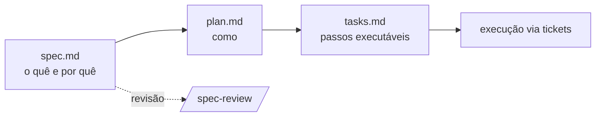
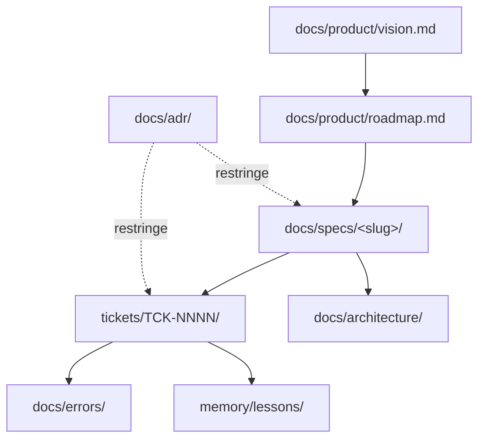

# Padrões de documentação

Este documento consolida os três padrões usados no projeto: **C4** (arquitetura), **ADR**
(decisões) e **SDD** (trabalho novo). Regras de idioma e estrutura estão no `AGENTS.md`.

## Regra visual (obrigatória)

Todo documento novo avalia a estrutura visual do assunto. Havendo **fluxo, sequência,
dependência, ciclo, hierarquia, mapa mental ou relação entre partes**, inclua pelo menos uma
seção em Mermaid (`flowchart`, `sequenceDiagram`, `stateDiagram`, `mindmap`, `C4*`),
acompanhada de:

1. uma **leitura** do diagrama em 3–6 linhas (o que ele mostra e o que **não** mostra);
2. as **fontes** (ADR, spec, código) que sustentam o desenho;
3. a marcação do que é **estado atual** × **proposta**.

Tabelas ficam reservadas a contratos, matrizes, checklists e dados tabulares.

## C4 — `docs/architecture/`

| Nível | Arquivo | Mostra |
|---|---|---|
| Context (`C4Context`) | `c4-context.md` | A plataforma e seus atores/sistemas externos |
| Container (`C4Container`) | `c4-container-*.md` | Aplicação, pipeline de conteúdo, armazenamento |
| Component (`C4Component`) | `c4-component-*.md` | Peças internas de um container |

Um arquivo por nível/escopo; índice em `docs/architecture/README.md`. Criar com
`/c4-diagram`.

## ADR — `docs/adr/`

Toda decisão arquitetural, de produto ou de processo vira `ADR-NNNN-short-title.md`
(sequencial, sem furos), a partir de `docs/adr/adr-template.md`.

- **Status:** `proposed` → `accepted` → (`deprecated` | `superseded by ADR-MMMM`).
- Um ADR nunca é reescrito para mudar a decisão: cria-se um novo que o substitui.
- Índice obrigatório em `docs/adr/README.md`.
- Criar com `/create-adr`.

## SDD — `docs/specs/`

Trabalho novo começa por uma spec. Fluxo:

- `spec.md`: problema, resultado esperado, critérios de aceite verificáveis, requisitos
  transversais, fora de escopo, perguntas em aberto.
- `plan.md`: abordagem, alternativas descartadas, impacto, riscos, dependências.
- `tasks.md`: passos pequenos, ordenados, com critério de pronto e agente sugerido.
- Status no índice `docs/specs/README.md`: `draft | in-review | approved | done`.
- **Nenhuma implementação sem spec `approved`.** Criar com `/create-spec`, revisar com
  `/spec-review`.

## Relação entre os artefatos

Visão define para onde vamos; roadmap ordena; spec descreve uma fatia; ticket executa; ADR
restringe todos; erros e lições realimentam o processo.

## Erros — `docs/errors/`

Todo erro não trivial vira arquivo a partir de `docs/errors/error-template.md`, com índice em
`docs/errors/README.md`. Criar com `/log-error`. Aprendizado generalizável também vira lição
(`/capture-lesson`).
