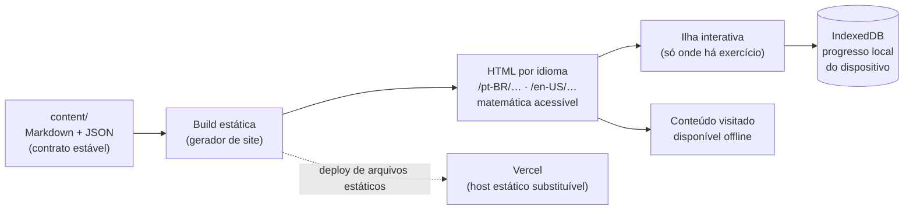

# ADR-0003 — Stack da plataforma web/PWA

- **Status:** accepted
- **Data:** 2026-08-01
- **Decisores:** Douglas Silva (decisão registrada em 2026-08-01)
- **Relacionados:** ADR-0001, ADR-0002, TCK-0003

> **Este ADR está `accepted`.** O aceite **destrava a frente de plataforma**: os tickets de
> `frontend-developer`, `backend-developer` e `devops-engineer` deixam de estar bloqueados
> pela indefinição de stack e passam a operar sob as restrições da seção **Consequências**.
> O que este ADR não decide (biblioteca de UI, de testes, de service worker, ferramenta de
> build auxiliar, **momento de renderização do KaTeX — build × runtime**) segue como decisão
> de implementação, dentro dessas restrições.

## Contexto

O produto é uma aplicação web **PWA**, gratuita, com deploy na **Vercel**, que precisa:

- renderizar conteúdo versionado em Git (`content/`: Markdown + JSON) com matemática em
  KaTeX;
- funcionar **offline** para o conteúdo já visitado;
- ser **bilíngue** em todas as rotas, com URLs estáveis por idioma;
- rodar bem em dispositivo modesto e rede lenta;
- registrar progresso do aluno com **custo operacional próximo de zero** e privacidade forte
  (o público inclui crianças);
- crescer para módulos de curso: trilhas, quizzes, fóruns, certificados.

## Alternativas consideradas

### A. Framework React full-stack com renderização estática do conteúdo (ex.: Next.js na Vercel)
- **Prós:** integração natural com a Vercel; geração estática das páginas de conteúdo; i18n
  por rota; ecossistema grande; API routes disponíveis se/quando houver backend.
- **Contras:** peso e complexidade acima do necessário para um site majoritariamente
  estático; acoplamento ao fornecedor se forem usados recursos proprietários.

### B. SPA leve com build estático (ex.: Vite + React/Preact) + Vercel como host estático
- **Prós:** bundle menor; portabilidade alta (qualquer host estático); simples de entender e
  manter; ótimo casamento com PWA offline-first.
- **Contras:** SEO exige pré-renderização explícita; roteamento e i18n ficam por conta do
  time; sem backend embutido.

### C. Gerador de site estático orientado a conteúdo (ex.: Astro)
- **Prós:** HTML mínimo por padrão (excelente performance e SEO); ilhas de interatividade só
  onde há exercício; ótimo para conteúdo Markdown volumoso.
- **Contras:** interatividade rica (player de exercícios, progresso) exige disciplina de
  arquitetura; ecossistema menor que o React puro.

### Persistência de progresso (transversal às opções)
1. **Local-first** (IndexedDB) sem conta — custo zero, privacidade máxima, sem sincronização
   entre dispositivos.
2. Local-first + **sincronização opcional** com backend gratuito — melhor experiência, exige
   ADR de privacidade e conta.
3. Backend obrigatório desde o início — pior custo e pior privacidade; descartado.

## Decisão

A plataforma é construída como **gerador de site estático orientado a conteúdo (opção C,
Astro)**: as páginas de `content/` são geradas em HTML na build, sem JavaScript por padrão, e
a interatividade existe apenas como **ilha** — um componente isolado, hidratado sob demanda,
onde há exercício, quiz ou controle de progresso. O progresso do aluno usa **persistência
local-first sem conta (opção 1, IndexedDB no próprio dispositivo)**. O deploy é estático na
**Vercel**.

Motivação: menor bundle enviado ao aluno, SEO nativo do HTML pré-renderizado, i18n por rota
estática (uma URL real por idioma), custo operacional zero e privacidade máxima — o público
inclui crianças, e o dado que não sai do dispositivo não precisa ser protegido em trânsito
nem em repouso por terceiros.

Alternativas descartadas, uma linha cada:

- **A. React full-stack (Next.js):** peso e complexidade de framework full-stack sem a
  contrapartida — o produto é majoritariamente leitura de conteúdo estático, e as API routes
  incentivariam um backend que a decisão de persistência torna desnecessário.
- **B. SPA leve com build estático (Vite + React/Preact):** portátil e enxuta, mas paga em
  pré-renderização explícita, roteamento e i18n manuais aquilo que a opção C entrega de
  fábrica, e envia JavaScript mesmo nas páginas que são só texto e fórmula.
- **Persistência 2 (local-first + sincronização opcional):** exigiria conta, identidade e um
  ADR de privacidade de menores antes de qualquer linha de código; adiada até haver demanda
  comprovada de uso multi-dispositivo.
- **Persistência 3 (backend obrigatório):** pior custo e pior privacidade, sem benefício para
  a fatia inicial do produto.

**Leitura:** o conteúdo entra como dado versionado, vira HTML por idioma na build e só então
ganha uma ilha de interatividade; o progresso nunca sai do dispositivo e a Vercel recebe
apenas arquivos estáticos. O diagrama mostra o **estado decidido**, não implementado — só
resultados exigidos, nenhum mecanismo. Ele **não** mostra backend, conta, login ou telemetria,
porque nenhum deles existe nesta decisão; e **não** decide *como* cada caixa é obtida — em que
momento a matemática é renderizada (build × runtime) e com que estratégia o conteúdo visitado
fica offline são escolhas do ticket de implementação.
Fontes: este ADR, ADR-0001 (taxonomia), ADR-0002 (bilinguismo).

## Consequências

**Positivas**

- **JavaScript mínimo por padrão.** Página de teoria é HTML e CSS; nenhum framework é
  carregado para ler conteúdo. Toda interatividade fica **confinada a ilhas** com fronteira
  explícita — se um recurso exige hidratar a página inteira, ele está mal desenhado.
- **Rotas estáticas por idioma**, uma URL real e indexável por idioma, com **paridade
  obrigatória** (ADR-0002): **nó sem paridade de idioma não é publicado**. Que tratamento
  dar a um nó bilíngue ainda em `status: "draft"` (publicar com rótulo, ocultar, publicar só
  em preview) é decisão de produto em aberto, não fechada por este ADR.
- **PWA offline-first para o conteúdo visitado**: o que o aluno abriu continua acessível sem
  rede, incluindo os exercícios daquele nó. Offline é requisito de arquitetura, não recurso
  opcional a ser acrescentado depois.
- **KaTeX acessível**: toda fórmula em display carrega descrição textual acessível a leitor
  de tela (`docs/content/accessibility.md`); imagem de fórmula continua proibida onde LaTeX
  resolve; e a matemática da teoria não pode custar JavaScript desproporcional ao resto da
  página. **Este ADR não decide *quando* a fórmula é renderizada** (build × runtime) — é
  decisão de implementação do ticket, desde que o resultado acima seja atendido.
- **Custo zero e privacidade máxima**: sem servidor de aplicação, sem banco, sem
  processamento de dado pessoal — nada a vazar, nada a inventariar sob LGPD/COPPA.

**Negativas / custos assumidos**

- **Progresso não sincroniza entre dispositivos** e se perde se o aluno limpar os dados do
  navegador. É o preço aceito pela privacidade. A restrição que decorre daqui é que **a perda
  de progresso precisa ser explícita ao aluno e recuperável sem servidor** — qual mitigação
  atende a isso (export/import de arquivo, aviso na interface, outra) é decisão de produto, em
  spec própria, não deste ADR.
- **O gabarito do exercício viaja no payload do cliente.** Não há servidor para guardar a
  resposta certa. Logo: **nada pode depender do segredo da resposta** — sem prova valendo
  nota, sem certificado com valor de verificação externa, sem ranking competitivo. Correção,
  feedback diagnóstico e trilha de estudo são desenhados assumindo que um aluno curioso pode
  ler a resposta, e isso é aceitável num produto de estudo, não de avaliação.
- **Ecossistema menor** que o de React puro para componentes prontos; parte da interatividade
  será escrita à mão dentro das ilhas.
- **Fóruns e certificados** — previstos no roadmap — não têm solução nesta decisão. Ambos
  exigem estado compartilhado e, portanto, ADR próprio.

**O que fica mais difícil depois desta decisão**

- **Não há backend, conta, login nem telemetria identificável.** Introduzir qualquer um dos
  quatro **exige ADR novo** — com tratamento explícito de LGPD/COPPA quando envolver dado de
  menor de idade. Nenhum ticket pode assumi-los como disponíveis.
- Recursos que dependam de estado do servidor (moderação de fórum, verificação de
  certificado, sincronização, painel de turma) ficam fora do alcance até esse ADR existir.
- Renderização dinâmica por requisição deixa de ser uma opção trivial: o que não cabe na
  build cabe na ilha, ou não cabe.

**Portabilidade**

- O deploy é estático na Vercel, mas a saída da build é um diretório de arquivos estáticos:
  qualquer host estático (GitHub Pages, Cloudflare Pages, Netlify, S3) serve. **Recursos
  proprietários da Vercel que quebrem essa propriedade não devem ser adotados sem ADR.**

## Restrição a preservar — independência do contrato de dados

**O contrato de dados de `content/` (`meta.json`, `theory.<lang>.md`, `exercises.json`,
`assessments.json`, `references.json`) permanece independente da stack.** Ele é o núcleo
estável do projeto; a aplicação é a peça substituível.

Na prática, isso proíbe:

- campo, formato ou convenção em `content/` que só faça sentido para o gerador escolhido
  (frontmatter proprietário, import de componente do framework dentro do Markdown, tipagem
  gerada por biblioteca específica);
- lógica de aprendizagem — pré-requisitos, dificuldade, gabarito, feedback diagnóstico —
  morando no código da aplicação em vez do dado;
- qualquer transformação de build que só possa ser refeita por essa stack.

O teste de conformidade é direto: um leitor de `content/` escrito do zero, sem a aplicação,
deve conseguir reconstruir a taxonomia, as rotas por idioma e os exercícios apenas lendo os
arquivos e o schema documentado em `docs/content/`.

## Impacto

- **Conteúdo:** nenhum — o contrato de dados de `content/` é deliberadamente independente da
  stack, e esta decisão o mantém assim (seção acima).
- **Plataforma:** define toda a implementação. Rotas estáticas por idioma, ilhas de
  interatividade, IndexedDB para progresso, deploy estático.
- **Processo/agentes:** destrava os tickets de `frontend-developer`, `backend-developer` e
  `devops-engineer`. O `backend-developer` passa a atuar sobre **pipeline de conteúdo e
  modelo de dados local**, não sobre servidor — não há servidor. Agentes deixam de tratar a
  stack como hipótese e passam a tratá-la como restrição.

## Como reverter

Enquanto o contrato de dados de `content/` permanecer independente da aplicação, trocar a
stack custa reescrever a camada de apresentação — não o acervo. Essa independência é a
restrição declarada acima e vale para qualquer stack futura.

A persistência local-first é reversível para frente sem perda: um ADR posterior pode
acrescentar sincronização opcional por cima do IndexedDB, desde que trate conta, consentimento
e dados de menores. O caminho inverso — remover um backend já em produção — seria caro, e é
justamente o que esta decisão evita ao não criá-lo.
