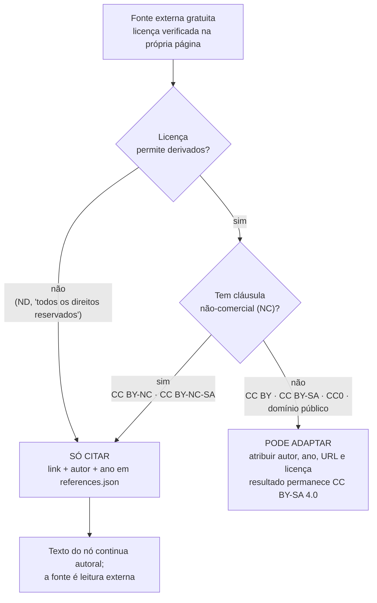

# ADR-0005 — Licença do projeto: CC BY-SA 4.0 para conteúdo, MIT para código

- **Status:** accepted
- **Data:** 2026-08-01
- **Decisores:** Douglas Silva
- **Relacionados:** `ADR-0002` (bilinguismo), `TCK-0004`, `TCK-0001`,
  `docs/content/content-standards.md`, lições `L-006`, `L-007`

## Contexto

O projeto se define como **gratuito e aberto**, mas até 2026-08-01 não tinha licença
declarada — situação registrada como decisão em aberto em
`memory/context/project-context.md`. Sem licença explícita vale o padrão do direito autoral
("todos os direitos reservados"), o que contradiz a proposta: professor, aluno ou outro
projeto não pode reusar legalmente nada do acervo, mesmo estando tudo publicamente visível.

O bloqueio é bidirecional e é o que tornou a decisão urgente:

- **Saída** — quem quiser traduzir, imprimir ou remixar um nó de `content/` não sabe se
  pode.
- **Entrada** — não é possível avaliar a compatibilidade de uma fonte externa sem saber sob
  que licença **nós** publicamos. Essa é exatamente a pergunta que o `TCK-0001` levantou ao
  verificar as referências do nó piloto.

Forças específicas do projeto:

- **Gratuidade e custo zero** — nenhuma das opções tem custo, mas a licença define se
  terceiros podem monetizar o acervo.
- **Reuso educacional** — o valor do projeto cresce se escola, cursinho e outros repositórios
  puderem copiar e adaptar.
- **Bilinguismo (`ADR-0002`)** — tradução é obra derivada; a licença precisa permitir
  derivados explicitamente, inclusive por terceiros.
- **Acervo majoritariamente autoral, com fontes externas ao redor** — cada `references.json`
  aponta para material de terceiros, cada um com a sua própria licença.
- **Código e conteúdo têm economias diferentes** — código aberto se beneficia de adoção sem
  atrito (inclusive comercial); conteúdo didático se beneficia de permanecer aberto ao ser
  redistribuído.

Fato verificado em 2026-08-01 pelo `researcher` no `TCK-0001`, que dá concretude à decisão:
as duas referências OpenStax do nó piloto estão sob **CC BY-NC-SA 4.0** (não CC BY, como
havia sido registrado de memória — lição `L-006`), e a única fonte gratuita em pt-BR
encontrada com licença explícita (*Livro Aberto de Matemática*, IMPA/OBMEP) também é
**CC BY-NC-SA**.

## Alternativas consideradas

### Conteúdo (`content/`)

#### A. CC BY 4.0
- **Prós:** máxima adoção; permite reuso comercial e derivados fechados; compatível com
  praticamente tudo que seja aberto.
- **Contras:** um terceiro pode fechar a versão derivada — o acervo pode virar produto pago
  sem que a melhoria retorne ao comum.

#### B. CC BY-SA 4.0 (escolhida)
- **Prós:** garante que toda adaptação permaneça aberta sob a mesma licença (share-alike),
  preservando o caráter de bem comum educacional; permite uso comercial, então escola e
  editora podem usar sem pedir permissão.
- **Contras:** é "viral" — quem mistura o nosso conteúdo com material sob outra licença
  precisa checar compatibilidade; e **material NC não pode ser absorvido** (ver
  Consequências).

#### C. Domínio público (CC0)
- **Prós:** zero atrito, zero dúvida jurídica, reuso irrestrito.
- **Contras:** abre mão da atribuição e do share-alike; o acervo pode ser reempacotado e
  vendido sem crédito e sem retorno ao comum.

### Código

#### A. MIT (escolhida)
- **Prós:** curta, universalmente compreendida, permissiva; nenhum atrito para quem quiser
  usar um componente isolado (renderizador de exercício, validador de conteúdo).
- **Contras:** não protege contra apropriação fechada nem concede proteção explícita de
  patentes.

#### B. Apache-2.0
- **Prós:** concessão explícita de patentes e cláusula de marca; preferida por empresas.
- **Contras:** texto longo e exigência de `NOTICE`, cerimônia desproporcional para um
  projeto sem exposição a patentes.

#### C. AGPL-3.0
- **Prós:** obriga a abrir também o código de serviços hospedados a partir de derivados.
- **Contras:** afasta contribuição e reuso; incoerente com um projeto cuja plataforma é um
  site estático sem backend (`ADR-0003`).

## Decisão

**Conteúdo** (`content/`, incluindo teoria, exercícios, avaliações, trilhas e assets
autorais) é publicado sob **Creative Commons Atribuição-CompartilhaIgual 4.0 Internacional
(CC BY-SA 4.0)**; **código** (aplicação, `scripts/`, `tools/` e configuração) é publicado sob
**MIT**, titular Douglas Silva, ano 2026.

Por quê: o conteúdo é o bem comum que o projeto existe para criar, e o share-alike é o que
impede que uma versão melhorada volte fechada; o código é infraestrutura, e o valor dele está
em ser adotado sem atrito. `docs/`, `memory/` e `tickets/` são material de processo e seguem
a licença do código.

Materialização: `LICENSE` (MIT, texto integral) e `LICENSE-CONTENT` (CC BY-SA 4.0, pt-BR e
en-US) na raiz.

## Consequência operacional: compatibilidade de fontes externas

Esta é a consequência que muda o trabalho do dia a dia. Sob CC BY-SA 4.0, **só entra no nosso
conteúdo material cuja licença permita redistribuição sob CC BY-SA 4.0**. A cláusula
não-comercial (NC) é *mais* restritiva que a nossa licença: incorporar material NC obrigaria
o resultado a ser NC, o que contradiz a licença que declaramos. Por isso material NC nunca é
adaptado — apenas citado.

**Leitura (3–6 linhas).** O diagrama é a árvore de decisão de quem escolhe uma fonte para um
nó: duas perguntas — permite derivados? tem NC? — separam "posso adaptar" de "só posso
citar". Ele **não** cobre licenças de software embutido em conteúdo, marcas registradas,
direito de imagem, nem a checagem de gratuidade e de leitura da licença sem JavaScript
(lição `L-007`), que são pré-condições anteriores à árvore. Uma ressalva que o desenho não
comporta: **domínio público é territorial** — o prazo de proteção no Brasil (Lei 9.610/98)
não coincide com o dos EUA e a etiqueta "public domain" de agregadores erra com frequência;
tratar uma fonte como domínio público exige confirmar a situação na jurisdição de origem
**e** no Brasil. Fontes: este ADR, `AGENTS.md` §9.6–9.7,
`docs/content/content-standards.md`. É **estado atual** e vale a partir de 2026-08-01.

Aplicado ao que já existe em `content/high-school/algebra/quadratic-equations/references.json`:

| Fonte real | Licença verificada | O que podemos fazer |
|---|---|---|
| OpenStax, *Algebra and Trigonometry 2e* §2.5 | CC BY-NC-SA 4.0 | **Só citar** como leitura externa. Não copiar enunciado, exemplo, figura nem sequência didática. |
| OpenStax, *Intermediate Algebra 2e* §9.3 | CC BY-NC-SA 4.0 | **Só citar**. Idem. |
| *Livro Aberto de Matemática* (IMPA/OBMEP), Função Quadrática | CC BY-NC-SA (declaração divergente — ver nota) | **Só citar**. Idem, enquanto a divergência não for resolvida. |
| Hipotética fonte CC BY 4.0 / CC BY-SA 4.0 / domínio público | — | **Pode adaptar**, com atribuição completa; o resultado sai sob CC BY-SA 4.0. |

**Nota sobre o *Livro Aberto de Matemática*.** A classificação como NC não é pacífica: o
`TCK-0001` registrou em `references.json` que a página oficial do projeto declara
**BY-NC-SA**, enquanto o selo do colofão do próprio PDF mostra apenas **BY-SA**, sem a
cláusula não-comercial. Aplicando a lição `L-007` (na dúvida, a leitura mais restritiva),
tratamos como NC — ou seja, **só citável**. A divergência fica registrada aqui de propósito,
porque resolvê-la tem valor prático alto: se a licença correta for BY-SA, esta passa a ser a
**única fonte pt-BR adaptável** conhecida do projeto. Esclarecer exige contato com os
mantenedores (IMPA/OBMEP) ou uma declaração de licença inequívoca — trabalho que ainda não
foi feito e não pertence a este ADR.

Regra prática para o autor: **"NC = leitura, não matéria-prima"**. Citar uma fonte NC é
sempre legítimo — link, autor, ano e licença em `references.json`. O que não se pode é copiar
ou traduzir trecho, exemplo, figura ou enunciado dela para dentro de `theory.<lang>.md` ou
`exercises.json`.

## Consequências

**Positivas**
- Reuso do acervo fica legalmente resolvido: qualquer pessoa pode copiar, traduzir, imprimir
  e adaptar, desde que atribua e mantenha a mesma licença.
- A pergunta "posso usar esta fonte?" passa a ter resposta determinística (árvore acima),
  em vez de depender do julgamento de cada agente.
- O código pode ser reaproveitado isoladamente, sem contaminar quem o adota.
- Tradução pt-BR ↔ en-US por terceiros fica explicitamente permitida, reforçando `ADR-0002`.

**Negativas / custos assumidos**
- O universo de fontes reutilizáveis encolhe de forma sensível: boa parte do material
  didático aberto de qualidade — inclusive OpenStax e Livro Aberto, as melhores fontes já
  encontradas para o nó piloto — é NC e vira apenas leitura externa.
- Escrever teoria e exercícios autorais custa mais do que adaptar material existente.
- Misturar conteúdo nosso com material CC BY-SA de outra versão exige checagem de
  compatibilidade caso a caso.

**O que fica mais difícil depois desta decisão**
- Incorporar bancos de exercícios prontos: quase todos os gratuitos em pt-BR são NC ou sem
  licença declarada.
- Relicenciar o conteúdo no futuro: com contribuições externas sob CC BY-SA, mudar de licença
  exigiria consentimento de cada contribuinte.

## Impacto

- **Conteúdo (`content/`):** nenhuma URL muda. `references.json` passa a exigir a distinção
  entre fonte **adaptável** e fonte **apenas citável**. As três referências do nó piloto são
  NC e ficam como leitura externa — a verificação de que nenhum trecho delas foi incorporado
  ao texto autoral é responsabilidade do `TCK-0001`, que está em revisão.
- **Plataforma:** rodapé do site deve exibir as duas licenças (conteúdo CC BY-SA 4.0, código
  MIT) com link canônico; cada página de conteúdo deve permitir atribuição (título do nó e
  URL). Requisito a ser incorporado quando a aplicação for construída, sob `ADR-0003`.
- **Processo/agentes:** `content-author`, `researcher` e `math-reviewer` aplicam a árvore
  antes de registrar uma fonte; `code-reviewer` e `qa-validator` verificam o campo `license`
  e a ausência de trecho copiado de fonte NC.

## Como reverter

Parcialmente reversível. **Conteúdo:** enquanto todo o acervo for autoral e de titularidade
única (Douglas Silva), é possível relicenciar para CC BY 4.0 ou CC0 a qualquer momento — a
licença anterior continua valendo para as cópias já distribuídas, que não podem ser
revogadas. A partir da primeira contribuição externa aceita, a reversão passa a exigir
consentimento de cada contribuinte, o que na prática a torna inviável. **Código:** relicenciar
MIT para uma licença mais restritiva tem o mesmo limite — vale só para versões futuras.
Qualquer mudança exige ADR novo que substitua este.
