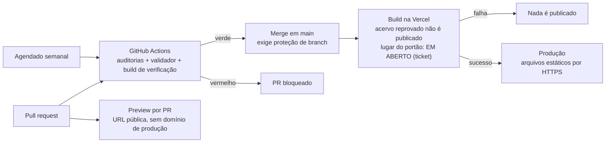

# ADR-0006 — Integração contínua, previews e publicação

- **Status:** proposed
- **Data:** 2026-08-01
- **Decisores:** proposta do `platform-architect` (TCK-0011); **aceite pendente** de Douglas
  Silva
- **Relacionados:** ADR-0003 (stack aceita), ADR-0007 (esqueleto da aplicação, `proposed`),
  TCK-0011, TCK-0003, `docs/specs/minimum-learning-slice/` (task 11)

> **Este ADR está `proposed`.** Enquanto não for aceito, nenhum ticket pode criar ou alterar
> pipeline com base nele. O workflow que já existe (`.github/workflows/ai-surface-audit.yml`)
> continua valendo como está — este ADR **descreve o que ele é** e propõe o restante.

## Contexto

Hoje o repositório tem **um** workflow, `.github/workflows/ai-surface-audit.yml`, que roda em
PR, no push para `main` e semanalmente, executando `audit-ai-surface.sh`,
`sync-ai-adapters.py --check`, `audit-content.sh` e `tools/context-watch-test.sh`. Ele existe
há tempo suficiente para ser fato consumado, mas **nenhum ADR o cobre**: o `c4-context.md`
marcava CI e previews como `PROPOSTO` sem ADR nomeado, e desenho em desacordo com a realidade
é o que produz decisão implícita na hora de implementar (origem: `TCK-0003/log.md` `[014]`,
`[015]`).

Forças em jogo:

- **Custo zero** é requisito de arquitetura (`ADR-0003`), e o projeto é gratuito e sem
  monetização — o público inclui menores, e não há orçamento a alocar.
- **Portabilidade**: a saída da build é um diretório estático servível por qualquer host
  (`ADR-0003`); o pipeline não pode criar dependência que quebre isso.
- **Privacidade**: nenhuma telemetria identificável (`ADR-0003`); recursos de analytics do
  host são coleta e estão fora sem ADR próprio.
- **O acervo é o núcleo**: conteúdo inválido não pode chegar ao aluno (RF-18 da spec da fatia
  mínima), e o acervo cresce muito antes de a aplicação existir.
- **A aplicação ainda não existe**: o pipeline precisa ser útil hoje (só auditorias) e
  continuar válido quando houver build.

## Alternativas consideradas

### A. Só GitHub Actions — auditoria, build e publicação
- **Prós:** um lugar só; portabilidade máxima (o mesmo job publicaria em qualquer host);
  nenhuma dependência de integração proprietária.
- **Contras:** publicar exige **segredo** no repositório (token do host) ou trocar de host
  para GitHub Pages; reimplementa à mão preview por PR, cache de build e rollback, que o host
  já dá de graça.

### B. Só Vercel — integração Git nativa, sem Actions
- **Prós:** zero configuração; preview por PR e deploy de produção automáticos; sem segredo no
  repositório.
- **Contras:** a Vercel constrói o que já foi empurrado — ela não é portão de merge. As
  auditorias em Bash/Python do repositório (superfície de IA, acervo, ferramentas internas)
  ficariam sem gate, e um PR poderia ser mesclado com adapter desatualizado ou acervo quebrado.

### C. Ambos, com papéis separados (escolhida)
- **Prós:** o Actions é o **portão de mérito** (nada entra em `main` sem auditoria verde) e a
  Vercel é o **construtor e publicador**; cada um faz o que o outro faz mal; nenhum segredo
  no repositório; o Actions sobrevive a uma troca de host.
- **Contras:** duas configurações para manter e duas fontes de "vermelho" para interpretar; a
  build roda duas vezes (verificação no Actions, publicação na Vercel).

### Previews por branch
1. **Ativos por PR** (padrão da Vercel) — revisão visual real; expõe conteúdo `draft` em URL
   pública não listada.
2. **Ativos, protegidos por autenticação do host** — exige que o revisor tenha acesso à conta
   Vercel; atrapalha revisão por terceiros e por agentes.
3. **Desligados** — revisão só em `localhost`; nada é exposto; perde-se a verificação de
   a11y/PWA no ambiente real de entrega.

### Gatilho de produção
1. **Automático no push/merge em `main`** (padrão da Vercel).
2. **Manual por tag ou promoção** — mais controle, mais cerimônia, e a regressão fica no ar
   até alguém promover.

## Decisão

**(i) Onde o CI roda: nos dois, com papéis separados (alternativa C).** GitHub Actions é o
portão de mérito do repositório; a Vercel é o construtor e publicador do site estático, por
integração Git, sem token guardado no repositório.

**(ii) O que executa a cada push e PR.** Um único job, idêntico em PR e em push para `main`:
`bash scripts/audit-ai-surface.sh` · `python3 scripts/sync-ai-adapters.py --check` ·
`bash scripts/audit-content.sh` · `bash tools/context-watch-test.sh` — os quatro já existem — e,
assim que existirem, **o validador do contrato de conteúdo** (TCK-0014) e **a build da
aplicação** como verificação (build que quebra reprova o PR). A execução semanal agendada
permanece: ela detecta deriva sem commit. Nenhuma etapa nova exige serviço externo.

**(iii) Previews por branch: ativos por PR (alternativa 1), sem autenticação.** Justificativa
falseável: o repositório é **público** e o acervo é licenciado CC BY-SA 4.0 (`ADR-0005`) — o
conteúdo `draft` já é legível por qualquer pessoa no GitHub, então o preview não amplia a
exposição; ele apenas a torna navegável. Salvaguardas: preview nunca recebe o domínio de
produção, e nó sem paridade de idioma continua fora das rotas publicadas (`ADR-0002`). **A
pergunta segue aberta ao usuário no aceite** — se a resposta for "não expor rascunho
navegável", a decisão vira a alternativa 3 (previews desligados) e o restante do ADR não muda.

**(iv) Gatilho do deploy em produção: push/merge em `main` (alternativa 1)**, com a regra
complementar de que `main` só recebe merge com o job do Actions verde. Essa regra depende de
**proteção de branch no GitHub, que é ato do usuário** — sem ela, a checagem é informativa e a
decisão fica pela metade; a pendência está declarada abaixo.

Alternativas descartadas, uma linha cada:

- **A. Só GitHub Actions:** publicar de dentro do CI exigiria segredo no repositório ou trocar
  de host, para reimplementar à mão preview, cache e rollback que a integração Git já dá.
- **B. Só Vercel:** a Vercel constrói o que já foi empurrado — não serve de portão de merge
  para as auditorias em Bash/Python que hoje seguram a consistência do repositório.
- **Preview 2 (protegido por autenticação):** trancaria a revisão atrás de uma conta na Vercel
  justo quando revisor e agente precisam abrir a URL.
- **Preview 3 (desligado):** economiza uma exposição que o repositório público já faz e
  elimina a única chance de auditar a11y e PWA no ambiente real de entrega.
- **Gatilho 2 (deploy manual por tag):** cerimônia sem ganho num site estático com rollback de
  um clique; a regressão ficaria publicada até alguém promover a correção.

**Leitura:** há dois caminhos até o aluno e o ADR exige um portão em cada um — o Actions barra
o merge; o caminho de publicação barra o acervo reprovado, porque um push direto em `main` não
passa pelo PR. Isso é **resultado exigido**, não desenho de mecanismo: o diagrama **não** diz
qual comando implementa cada caixa, **onde** o portão de publicação roda (script do projeto,
job de CI ou ambos) nem em que runtime — os três são do ticket de implementação (task 11 da
spec da fatia mínima; `plan.md`, item 5).

**Estado atual × proposta:** apenas a caixa "GitHub Actions" existe hoje, e parcialmente — sem
validador e sem build, porque a aplicação não existe. **Todo o resto é proposta**, incluindo o
bloqueio de merge, o preview e o deploy de produção.

**Fontes:** `.github/workflows/ai-surface-audit.yml`; `ADR-0003`; `ADR-0005`;
`docs/specs/minimum-learning-slice/tasks.md` (task 11).

## Custo — plano gratuito, com fonte

Consultas feitas em **2026-08-01**:

| Recurso | Limite gratuito | Fonte |
|---|---|---|
| GitHub Actions em repositório **público**, runner padrão | "GitHub Actions usage is free … for public repositories that use standard GitHub-hosted runners" — sem cota de minutos | <https://docs.github.com/en/billing/managing-billing-for-your-products/about-billing-for-github-actions> |
| Vercel Hobby — elegibilidade | Plano gratuito, **restrito a uso pessoal não comercial** (fair use) | <https://vercel.com/docs/plans/hobby> |
| Vercel Hobby — deployments | 100 por dia · 100 builds por hora | <https://vercel.com/docs/limits> |
| Vercel Hobby — build | 45 minutos por deployment; cache de build de até 1 GB | <https://vercel.com/docs/limits> |
| Vercel Hobby — entrega | 100 GB de Fast Data Transfer por mês | <https://vercel.com/docs/limits> |
| Vercel Hobby — projeto Git | Projeto de conta Hobby **não pode** conectar a repositório pertencente a uma **organização** do Git | <https://vercel.com/docs/limits> (seção *Connecting a project to a Git repository*) |
| Vercel Hobby — excedente | Sem cobrança de excedente: o recurso **pausa** até o ciclo de 30 dias virar | <https://vercel.com/docs/plans/hobby> (*Hobby billing cycle*) |

O repositório é público — verificado em 2026-08-01 com
`gh repo view --json isPrivate,visibility` → `{"isPrivate":false,"visibility":"PUBLIC"}` — e
pertence a uma **conta pessoal** (`dougmotshell`), não a uma organização. As duas condições são
o que torna esta decisão gratuita; ambas são falseáveis por inspeção.

**Consequência de custo, explícita:** estourar o limite do Hobby não gera fatura, gera
**indisponibilidade** até o ciclo virar. O risco de custo zero está preservado; o risco de
disponibilidade é assumido e aceito para um projeto sem receita.

## Consequências

**Positivas**

- **PR com adapter desatualizado não pode ser mesclado** — desde que a proteção de branch
  exista; sem ela, a checagem aparece vermelha e **não** impede o merge (falseável: abrir PR
  com `.claude/agents/` editado e adapter não regenerado).
- **Push direto em `main` com acervo inválido não publica**, porque o caminho de publicação
  também tem portão (falseável: introduzir fixture inválida e observar a publicação falhar) —
  **condicionado à pendência 1**: o validador é Python e a build é Node; se a imagem de build
  do host não tiver os dois, o portão muda de lugar, e é o ticket que decide qual lugar.
- **Nenhum segredo no repositório**: a publicação usa a integração Git do host, não token
  (falseável: `grep -rn "secrets\." .github/workflows/` → vazio).
- **Nenhuma coleta**: Vercel Web Analytics e Speed Insights ficam **desligados**; ligar
  qualquer um dos dois é telemetria de visitante e exige ADR próprio, com LGPD/COPPA
  (`ADR-0003`).
- O Actions continua válido se o host mudar: ele não conhece a Vercel.

**Negativas / custos assumidos**

- **A build roda duas vezes** por mudança que chega em `main` (verificação no Actions,
  publicação na Vercel). É desperdício consciente: são dois portões diferentes.
- **Todo PR publica uma URL pública** com o estado daquele branch, conteúdo `draft` incluído.
- **Duas superfícies de configuração** — uma versionada (`.github/workflows/`) e outra no
  painel do host, que **não** está no Git. Toda configuração feita no painel precisa ser
  registrada em `memory/context/devops.md`, ou some da memória do projeto.
- A regra "só mescla com verde" **não é executável por agente**: depende de configuração
  humana no GitHub.

**O que fica mais difícil depois desta decisão**

- Mover o repositório para uma **organização** do GitHub quebra a elegibilidade do plano Hobby
  para deploy por integração Git (fonte acima) — exigiria plano Pro (US$ 20 por usuário/mês) e
  **ADR novo**.
- Monetizar o projeto de qualquer forma torna o Hobby inelegível (uso não comercial) — **ADR
  novo**.
- Qualquer etapa de pipeline que precise de segredo (publicar pacote, chamar API paga, enviar
  telemetria) passa a exigir ADR: hoje a promessa é "nenhum segredo".

## Pendências desta decisão

1. **Runtime do validador no caminho de publicação.** O portão que impede publicar acervo
   reprovado só existe se o validador for executável **onde a publicação acontece** — o que
   torna a escolha do lugar (script do projeto × job de CI) uma decisão do ticket, e não deste
   ADR (`plan.md`, item 5). O TCK-0014 o entregou em **Python 3**
   (`scripts/validate-content.sh`), enquanto a build da aplicação roda em Node — a imagem de
   build do host precisa ter os dois. Se não tiver, a alternativa é rodar o gate no Actions e
   publicar artefato já validado. **Verificação obrigatória no ticket de implementação**, com
   evidência no log; até lá, a consequência "push direto em `main` com acervo inválido não
   publica" é **hipótese**, não fato.
2. **Proteção de branch em `main`** — ato do usuário no GitHub; sem ela, a consequência "não
   pode ser mesclado" é falsa.
3. **Resposta do usuário sobre previews** (item iii).

## Impacto

- **Conteúdo (`content/`):** nenhum — nenhuma URL pública muda, nenhum arquivo é tocado.
- **Plataforma:** define onde a validação do acervo roda e o que impede uma publicação ruim;
  não altera a stack decidida em `ADR-0003`.
- **Processo/agentes:** o `devops-engineer` ganha um ticket de implementação **após o aceite**;
  até lá, nenhum agente cria ou altera `.github/workflows/` com base neste ADR. Ao ser aceito,
  este ADR precisa ser propagado para `memory/context/devops.md` e para o
  `docs/architecture/c4-context.md` (L-010).

## Como reverter

Barato nos dois sentidos. Desligar o CI é apagar o workflow; desligar a publicação automática é
desconectar o projeto no painel do host — o site continua publicável por upload manual do
diretório da build em qualquer host estático (`ADR-0003`). Nenhum dado é perdido: o pipeline não
guarda estado. Trocar de host é reescrever um arquivo de configuração, porque o artefato é um
diretório de arquivos estáticos.
