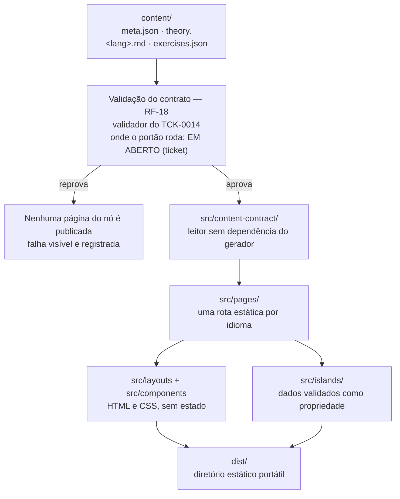

# ADR-0007 — Esqueleto da aplicação: gerador concreto, diretórios e leitura do acervo

- **Status:** accepted
- **Data:** 2026-08-01 (proposto e aceito no mesmo dia)
- **Decisores:** Douglas Silva (aceite em 2026-08-01, registrado no TCK-0016); proposta do
  `platform-architect` (TCK-0011)
- **Relacionados:** ADR-0003 (stack aceita), ADR-0002 (bilinguismo), ADR-0005 (licença),
  ADR-0006 (CI/CD, `accepted`), TCK-0011, TCK-0014, TCK-0015 (implementação), TCK-0016
  (aceite), `docs/specs/minimum-learning-slice/` (tasks 5–11)

> **Este ADR está `accepted` desde 2026-08-01.** As duas perguntas que ele levava ao aceite
> foram respondidas pelo usuário: **URL com prefixo de idioma em minúsculas** (`/pt-br/`,
> `/en-us/`) e **projeto na raiz** do repositório. Ticket pode criar `package.json`, `src/` e
> dependências com base nele. O que este ADR **não** decide continua não decidido: biblioteca
> de UI, ferramenta de teste, mecanismo da camada offline, momento em que a matemática vira
> HTML e **onde** o portão de validação do acervo roda.

## Contexto

O `ADR-0003` foi aceito em 2026-08-01 e decidiu a direção: **gerador de site estático orientado
a conteúdo (opção C, Astro) com ilhas de interatividade**, progresso local-first sem conta,
deploy estático. O que ele deliberadamente **não** decidiu — biblioteca de UI, ferramenta de
teste, estratégia da camada offline, momento em que a matemática vira HTML — continua fora de
qualquer ADR, por escolha.

Falta, porém, a peça entre a direção e o teclado: **não existe `package.json`, estrutura de
projeto nem dependência instalada**, e `docs/specs/minimum-learning-slice/tasks.md` não tem
task de bootstrap (constatação do `task-router` em
`.dev-loop/start-implementation/briefings/01-route.md`). As tasks 3 e 4 não dependem disso; a
task 5 — o índice de navegação — depende. Sem esta decisão, o primeiro ticket de aplicação
escolheria diretórios, forma de URL e modo de ler `content/` por conta própria, no meio de um
ticket de interface. Uma dessas escolhas — a **forma da URL** — é contrato público e
permanente; as outras duas são pré-requisito de coordenação entre tickets (e, no caso de onde
mora o projeto, também de configuração do host, que não está no Git — `ADR-0006`). Nenhuma
delas deveria nascer como efeito colateral de um ticket de interface, mas só a primeira é cara
de desfazer.

O critério usado para separar o que entra aqui do que fica com o ticket:

- **Vai para o ADR** o que é observável de fora e caro de mudar depois: a URL pública, o
  formato do dado, a fronteira entre acervo e aplicação, o custo.
- **Fica com o ticket** o que pode ser trocado sem que nada externo perceba: biblioteca dentro
  da ilha, ferramenta de teste, mecanismo de cache, momento em que a fórmula vira HTML.

## Alternativas consideradas

### A. Confirmar Astro como gerador concreto (escolhida)
- **Prós:** é o gerador nomeado na decisão do `ADR-0003`; HTML sem JavaScript por padrão;
  ilhas de interatividade como conceito de primeira classe, com fronteira explícita; rotas
  estáticas por arquivo, o que casa com "uma rota real por idioma"; saída é um diretório
  estático portátil.
- **Contras:** ecossistema menor; a build precisa de Node ≥ 22.12.0, o que amarra o ambiente
  de build a uma versão razoavelmente recente.

### B. Eleventy (11ty)
- **Prós:** ainda mais leve; zero JavaScript por padrão; excelente com Markdown volumoso;
  dependência mínima.
- **Contras:** não tem ilha de interatividade de fábrica — o player de exercícios viraria
  JavaScript solto, e a fronteira que o `ADR-0003` exige teria de ser mantida por disciplina,
  não pela ferramenta.

### C. Vite + Preact com pré-geração (opção B do `ADR-0003`)
- **Prós:** portabilidade alta; um só modelo mental para conteúdo e interatividade.
- **Contras:** já descartada no `ADR-0003` — envia JavaScript em páginas que são só texto e
  fórmula, e paga à mão pré-geração, roteamento e i18n.

### D. Gerador próprio (script Node + templates)
- **Prós:** zero dependência de terceiros e zero lock-in; nada que a gente não entenda.
- **Contras:** reimplementar roteamento, i18n, bundling, cache e otimização de ativos é um
  projeto paralelo — e o núcleo estável do produto é o acervo, não o gerador.

### Onde mora o projeto
1. **Raiz do repositório** (escolhida) — `content/` fica a um caminho relativo estável do
   projeto; host estático sem configuração de subdiretório; um só lugar para scripts.
2. `app/` como subdiretório — repositório mais arrumado, mas duplica configuração, exige apontar
   o host para o subdiretório e transforma `../content` em caminho frágil.

### Forma da URL bilíngue (a spec deixou em aberto — `spec.md:277`)
1. **Prefixo de idioma em minúsculas** (escolhida): `/pt-br/<stage>/<area>/<topic>/`.
2. Prefixo com região em caixa mista: `/pt-BR/…` — grafia idêntica à dos arquivos, mas cria URL
   sensível a maiúsculas para sempre.
3. Parâmetro de consulta (`?lang=`) — não gera rota estática indexável; contraria `ADR-0003`.
4. Domínio ou subdomínio por idioma — exige domínio pago e configuração de host; contraria o
   custo zero e a portabilidade.

## Decisão

**1. O gerador concreto é o Astro**, confirmando o nome já registrado na decisão do
`ADR-0003`. Piso de ambiente: **Node.js ≥ 22.12.0** (requisito publicado do Astro, consultado
em 2026-08-01: <https://docs.astro.build/en/install-and-setup/>); o ambiente local tem
v24.14.1, verificado no mesmo dia.

**2. O projeto vive na raiz do repositório** — proposta confirmada por **Douglas Silva em
2026-08-01**, no aceite. `package.json`, `astro.config.mjs` e `src/` na raiz; `content/`,
`docs/`, `scripts/`, `tools/`, `memory/` e `tickets/` seguem exatamente como estão.

**3. Estrutura de diretórios** (o que não está listado não é criado por este ADR):

```
package.json          # manifesto do projeto (conteúdo abaixo)
package-lock.json     # versionado — build reproduzível no host
astro.config.mjs      # configuração do gerador
public/               # ativos servidos como estão (ícones, manifesto do PWA, fontes próprias)
src/
  content-contract/   # leitor do acervo — NÃO importa nada do gerador
  pages/              # rotas estáticas: uma por idioma, taxonomia intacta
  layouts/            # esqueleto de página (cabeçalho, alternador de idioma, rodapé)
  components/         # apresentação estática, sem estado
  islands/            # interatividade — cada ilha com fronteira explícita
  styles/             # CSS
dist/                 # saída da build — gitignored
```

Também gitignored: `node_modules/` e o diretório de cache do gerador (`.astro/`).

**4. `package.json` — o que entra:**

- `"name": "mathematics-studies"`, `"private": true` (impede publicação acidental no registro),
  `"type": "module"`, `"license": "MIT"` (`ADR-0005`);
- `"engines": { "node": ">=22.12.0" }`;
- `scripts`: `dev`, `build`, `preview` (do gerador) e `validate:content` como **ponto de
  entrada nomeado** do validador entregue pelo TCK-0014 (`bash scripts/validate-content.sh`,
  Python 3 — ticket fechado, nome confirmado). O **resultado exigido**
  é o do RF-18: nó que viole o contrato **não vira página publicada**, e a falha é visível e
  registrada. **Onde o portão roda — script `prebuild`, job de CI, ou os dois — é decisão do
  ticket de pipeline**, não deste ADR (`docs/specs/minimum-learning-slice/plan.md`, item 5 das
  decisões de implementação; `ADR-0006`, pendência 1). Ter o alias nomeado é justamente o que
  torna as três formas equivalentes de configurar;
- `dependencies`: **apenas `astro`**;
- `devDependencies`: **vazio**.

**O que deliberadamente não entra**, para não roubar decisão do ticket: biblioteca de UI,
ferramenta de teste, ferramenta de service worker/PWA e as dependências de renderização
matemática — cada uma entra no `package.json` **pelo ticket que decidir o assunto**, com
justificativa no log. Gerenciador de pacotes: **npm** (já disponível no ambiente), com
`package-lock.json` versionado.

**Regra de dependência (dura):** toda dependência que chegue ao navegador exige justificativa
no log do ticket e revisão do `security-auditor` — RNF-7 proíbe recurso de terceiro que
registre o visitante. Fontes e ativos são servidos da **própria origem**; nada de CDN de
terceiros.

**5. Como `content/` é lido na build.** Um módulo próprio, `src/content-contract/`, escrito em
ESM puro, é o **único** ponto que conhece o formato do acervo. Ele:

- percorre `content/<stage>/<area>/<topic>[/<subtopic>]/` e considera nó todo diretório que
  contenha `meta.json`;
- devolve, por nó: metadados (`meta.json`), o **Markdown bruto** de `theory.<lang>.md` e os
  itens de `exercises.json`;
- **não importa nada do gerador** e não usa o mecanismo de coleções de conteúdo do Astro:
  coleções pediriam frontmatter e esquema no formato da ferramenta, e o acervo não tem
  frontmatter — os metadados vivem em `meta.json`, por decisão do `ADR-0001`;
- é consumido pelas rotas na build (uma chamada por página gerada), nunca em tempo de execução
  no navegador;
- **assume acervo já validado**: a validação normativa é o executável do TCK-0014, invocado
  pelo portão que o ticket de pipeline definir. Independentemente de onde esse portão esteja, o
  módulo **falha alto** (erro que interrompe a build) se encontrar chave ausente, em vez de
  emitir página incompleta — é a rede de segurança, não o portão.

Transformar Markdown em HTML é etapa de **apresentação**, não do contrato: a ferramenta que faz
isso — e o momento em que a matemática vira HTML — são decisão do ticket.

**6. Onde as ilhas se encaixam.** Página é HTML estático; ilha é o único lugar com
interatividade. Regras:

- uma ilha por unidade interativa (o player de exercícios é a primeira; o alternador de idioma
  **não** é ilha — é link entre rotas estáticas);
- a ilha recebe **dados já validados como propriedade**, serializados na build; ela **não faz
  requisição de rede** — o que precisa estar lá já veio no payload (é o que torna o exercício
  utilizável offline, e é a mesma razão pela qual o gabarito viaja no cliente — L-008);
- página de teoria sem exercício não carrega ilha nenhuma;
- recurso que exija hidratar a página inteira está mal desenhado e volta para redesenho
  (`ADR-0003`).

**7. Forma da URL bilíngue: prefixo de idioma em minúsculas** — proposta confirmada por
**Douglas Silva em 2026-08-01**, no aceite —, com o caminho da taxonomia intacto:

```
/pt-br/high-school/algebra/quadratic-equations/
/en-us/high-school/algebra/quadratic-equations/
```

Motivo: URL servida por host estático é sensível a maiúsculas, e canonicalizar `/pt-BR/`
exigiria regra de redirect configurada **no host** — recurso específico do fornecedor, contra a
portabilidade exigida pelo `ADR-0003`. O par idioma ↔ segmento de URL fica num mapa único
dentro de `src/content-contract/`; nos arquivos, nos campos localizados e no atributo `lang` do
documento continua valendo a grafia canônica `pt-BR` / `en-US`. A raiz `/` é uma **página
estática de escolha de idioma**: detectar idioma por cabeçalho exigiria execução no servidor,
que esta arquitetura não tem.

**Fechado no aceite:** a grafia em caixa mista deixa de ser opção viva — nenhum documento,
diagrama ou rota deve apresentá-la como alternativa disponível. Ela permanece apenas onde é
registro histórico da decisão (as listas de alternativas acima). Voltar atrás exige ADR novo e,
depois da primeira publicação, também redirect (L-003).

Alternativas descartadas, uma linha cada:

- **B. Eleventy:** sem ilha de fábrica, a fronteira da interatividade viraria disciplina em vez
  de propriedade da ferramenta.
- **C. Vite + Preact:** já descartada no `ADR-0003` por enviar JavaScript a páginas que são só
  texto e fórmula.
- **D. Gerador próprio:** reimplementar roteamento, i18n e bundling é um projeto paralelo ao
  produto.
- **Projeto em `app/`:** duplica configuração e torna `../content` um caminho frágil, em troca
  de arrumação estética.
- **URL `/pt-BR/`:** grafia única com os arquivos, mas cria URL sensível a maiúsculas para
  sempre e empurra a canonicalização para um recurso do host.
- **URL por parâmetro `?lang=`:** não produz rota estática indexável — contraria `ADR-0003` e
  `ADR-0002`.
- **URL por domínio/subdomínio:** exige domínio pago e configuração de host; contraria custo
  zero e portabilidade.



**Leitura:** o acervo só entra na aplicação depois do portão de validação, e só atravessa um
módulo que desconhece o gerador — é isso que mantém verdadeiro o teste de conformidade do
`ADR-0003` (um leitor escrito do zero reconstrói taxonomia, rotas e exercícios sem a
aplicação). As ilhas são folhas do desenho: recebem dado, não vão buscá-lo. O diagrama **não**
mostra biblioteca de UI, ferramenta de teste, camada offline nem o momento em que a matemática
vira HTML — nada disso é decidido aqui.

**Estado no aceite (2026-08-01):** este ADR continua sendo **especificação, não instalação** —
ele não cria arquivo nenhum. Quem cria é o **TCK-0015**, que estava em revisão quando o ADR foi
aceito; o aceite autoriza aquele trabalho e dá o critério de conformidade contra o qual ele é
julgado, mas não atesta que a entrega esteja correta. Antes do TCK-0015 só existia a caixa
`content/`.

**Fontes:** `ADR-0003`; `ADR-0001` (metadados em `meta.json`);
`docs/specs/minimum-learning-slice/plan.md` (camadas e decisões deixadas ao ticket);
`tickets/TCK-0014-content-contract-validator/ticket.md` (validador autônomo);
<https://docs.astro.build/en/install-and-setup/> e
<https://docs.astro.build/en/reference/configuration-reference/> (consultados em 2026-08-01).

## Custo

Zero. Astro e npm são gratuitos e de código aberto; a build roda no plano gratuito descrito no
`ADR-0006`; a saída é um diretório estático. Nenhuma dependência proposta aqui é paga ou exige
serviço externo. `dependencies` com um único pacote é também uma decisão de **segurança e
privacidade**: menos terceiros no navegador, menos superfície para rastreio (RNF-7).

## Consequências

**O que passa a valer com o aceite (2026-08-01)**

- **`/pt-br/` e `/en-us/` são a forma da URL pública**, com o caminho da taxonomia intacto. É
  contrato público: link de terceiro, rota emitida, `sitemap`, alternador de idioma e `hreflang`
  usam essa grafia. A grafia canônica `pt-BR` / `en-US` continua valendo nos arquivos, nos campos
  localizados e no atributo `lang` — a tradução entre as duas vive em **um** mapa, em
  `src/content-contract/`.
- **O projeto mora na raiz**: `package.json`, `astro.config.mjs`, `src/` e `public/` na raiz;
  ticket não cria variante em `app/`.
- **`src/content-contract/` é a única fronteira com o acervo** e não importa nada do gerador.
- **Ticket pode instalar dependência**, sob a regra dura: tudo que chega ao navegador precisa de
  justificativa no log e revisão do `security-auditor`; ativos servidos da própria origem.

**O que fica proibido sem ADR novo**

- **URL em caixa mista, sufixo de idioma, `?lang=` ou domínio por idioma** — a forma está
  fechada; mudar depois da primeira publicação exige também redirect (L-003).
- **CDN de terceiro** para fonte, ativo ou biblioteca (RNF-7).
- **Usar as coleções de conteúdo do gerador** para ler `content/`: quebra a independência do
  contrato de dados exigida pelo `ADR-0003`.
- **Renderização por requisição** e qualquer estado no servidor (`ADR-0003`).
- **Trocar o gerador** (Astro) ou baixar o piso de Node abaixo de 22.12.0.

**O que continua sendo decisão de ticket, apesar do aceite**

- Biblioteca de UI dentro da ilha, ferramenta de teste, mecanismo da camada offline/service
  worker e o momento em que a matemática vira HTML (build × execução).
- A ferramenta que converte Markdown em HTML — apresentação, não contrato.
- **Onde** o portão de validação do acervo roda (`ADR-0006`, pendência 1).
- Cada dependência nova, uma a uma, com a justificativa no log do ticket que a introduz.

**Positivas**

- O ticket da task 5 deixa de ter decisões abertas: diretórios, manifesto, forma da URL e modo
  de ler o acervo estão fixados; ele instala, cria as rotas e prova o critério.
- **O acervo continua independente da aplicação** — falseável: `grep -rn "astro" src/content-contract/`
  deve sair **vazio**; se não sair, o contrato de dados foi contaminado (`ADR-0003`).
- **Acervo inválido não vira página publicada** — falseável: com fixture inválida em
  `content/`, o caminho de publicação termina em erro e a rota do nó não aparece em `dist/`.
  **Onde** esse portão roda é do ticket (`ADR-0006`, pendência 1); enquanto ele não existir, a
  consequência é **exigência**, não fato observado.
- **Nenhuma URL pública em caixa mista** — falseável: nenhuma rota emitida em `dist/` contém
  letra maiúscula.
- **Página de teoria sem exercício não carrega JavaScript de ilha** — falseável: inspeção do
  HTML emitido para um nó sem `exercises.json`.

**Negativas / custos assumidos**

- **Duas grafias de idioma no projeto**: `pt-br` na URL, `pt-BR` no arquivo, no dado e no
  atributo `lang`. O custo é um mapa único; o risco é alguém duplicá-lo — por isso ele mora em
  um só módulo.
- **Node ≥ 22.12.0** vira requisito de qualquer ambiente de build, inclusive do host.
- Escolher o gerador concreto acopla a **camada de apresentação** a ele; trocar de gerador
  custa reescrever `src/`, mas não o acervo — que é exatamente o custo que o `ADR-0003` aceitou.
- `package.json` nasce quase vazio de propósito: a primeira leva de tickets vai acrescentar
  dependências, e cada acréscimo precisa de justificativa. Isso é atrito consciente.

**O que fica mais difícil depois desta decisão**

- **Mudar a forma da URL depois da primeira publicação** exige ADR + redirect (L-003, `ADR-0001`).
  Enquanto não houver publicação, é trocar uma linha do mapa — foi por isso que a pergunta foi
  feita antes do primeiro deploy, e não depois.
- Renderização por requisição continua fora: o que não cabe na build cabe na ilha, ou não cabe.
- Usar as coleções de conteúdo do gerador passa a exigir ADR que revise a restrição de
  independência do contrato de dados.

## Respostas do usuário no aceite (Douglas Silva, 2026-08-01)

1. **URL:** prefixo de idioma **em minúsculas** — `/pt-br/`, `/en-us/`. A pergunta está
   encerrada; a caixa mista deixa de ser opção (item 7 da Decisão).
2. **Onde mora o projeto:** **raiz** do repositório (item 2 da Decisão).

Nenhuma pergunta deste ADR segue aberta. O que permanece aberto é o que ele decidiu **não**
decidir — a lista está em "O que continua sendo decisão de ticket".

## Impacto

- **Conteúdo (`content/`):** nenhum arquivo é tocado e nenhum slug muda. A URL pública passa a
  ter um prefixo de idioma **antes** do caminho da taxonomia, que permanece intacto (RNF-5,
  RF-17).
- **Plataforma:** cria o esqueleto sobre o qual todas as tasks 5–11 acontecem; fixa a fronteira
  entre acervo, leitor, páginas e ilhas.
- **Processo/agentes:** com o aceite, o `frontend-developer` e o `devops-engineer` passam a ter
  fundamento para o bootstrap (ticket TCK-0015; a task 5 depende dele). A propagação exigida por
  L-010 foi feita no TCK-0016: `memory/context/frontend.md`, `memory/context/devops.md`,
  `memory/context/project-context.md`, `docs/architecture/c4-context.md` e `c4-container.md`,
  `AGENTS.md`, `README.md`, `prompts/bootstrap-session.md` e `.github/instructions/`.

## Como reverter

O esqueleto é código, não dado: apagar `package.json`, `astro.config.mjs`, `src/` e `dist/`
devolve o repositório ao estado atual, sem perda — o acervo nunca dependeu deles. Trocar o
gerador depois custa reescrever `src/` mantendo `src/content-contract/` quase intacto, que é o
que a independência do contrato de dados compra. A decisão cara de reverter é a **forma da
URL**, e só depois da primeira publicação.
