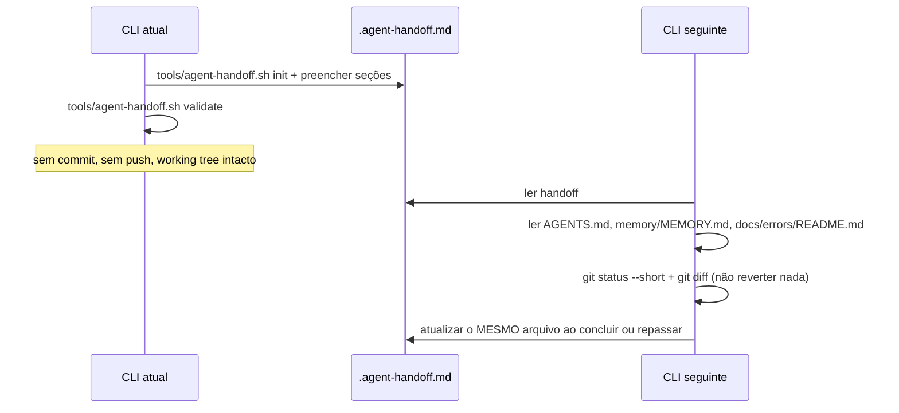

# Handoff entre CLIs (Claude · Codex · Copilot · Gemini)

Cada CLI tem sessão e memória próprias. O contrato de transferência é um **arquivo no
repositório** — nunca a expectativa de que a outra ferramenta "lembre".

Para transferência **dentro de um ticket**, entre agentes da mesma ferramenta, use
[`ticket-protocol.md`](ticket-protocol.md). Este documento trata da troca de **ferramenta**.

## Ao entregar

1. `bash tools/agent-handoff.sh init` (não sobrescreve handoff existente).
2. Preencher **todas** as seções obrigatórias de `.agent-handoff.md`:
   Objetivo · Estado atual · Arquivos alterados · Decisões técnicas · Testes ·
   Problemas ou riscos · Próxima ação exata · Restrições · Última atualização.
3. `bash tools/agent-handoff.sh validate`.
4. Não fazer commit, push ou stash. Deixar o working tree como está.

## Ao receber

1. Ler nesta ordem: `.agent-handoff.md` → `AGENTS.md` (+ o adaptador da sua ferramenta) →
   `memory/MEMORY.md` → `docs/errors/README.md`.
2. Inspecionar `git status --short` e `git diff` — **não reverter** trabalho alheio.
3. Se a "Próxima ação exata" estiver ambígua, perguntar ao usuário antes de agir.
4. Ao concluir ou repassar, **atualizar o mesmo arquivo**.

## Regras

- Apenas **um agente** edita o working tree por vez.
- Se a tarefa faz parte de um ticket, cite `tickets/TCK-NNNN-<slug>/log.md` na "Próxima ação
  exata"; o log continua sendo a trilha de auditoria.
- Se faz parte de um `/dev-loop`, cite `.dev-loop/<task-slug>/loop.md`.
- `.agent-handoff.md` é efêmero e gitignored: nada durável pode viver só nele — o que
  permanece vai para `memory/` ou `docs/`.

## Particularidades por ferramenta

| Ferramenta | Carrega instruções de | Papéis de agente | Comandos |
|---|---|---|---|
| **Claude Code** | `CLAUDE.md` → `AGENTS.md` | Subagentes nativos (`.claude/agents/`) | `.claude/commands/` + skills |
| **Codex** | `AGENTS.md` | Colar o arquivo do agente como instrução | `~/.codex/prompts/` (via `--codex`) |
| **Copilot** | `.github/copilot-instructions.md` → `AGENTS.md` | Chat modes (`.github/chatmodes/`) | Prompt files (`.github/prompts/`) |
| **Gemini CLI** | `GEMINI.md` → `AGENTS.md` | `/agent:<nome>` (assume o papel) | `.gemini/commands/*.toml` |
| **Outros (GPT etc.)** | `AGENTS.md` manualmente | Colar o arquivo do agente | Seguir o Markdown da skill |
