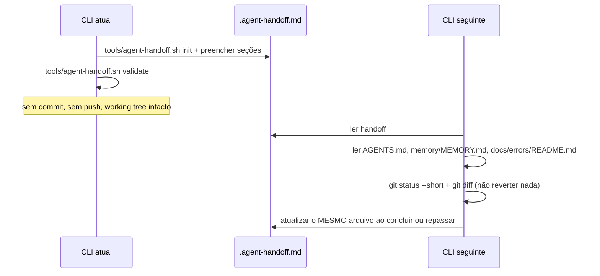
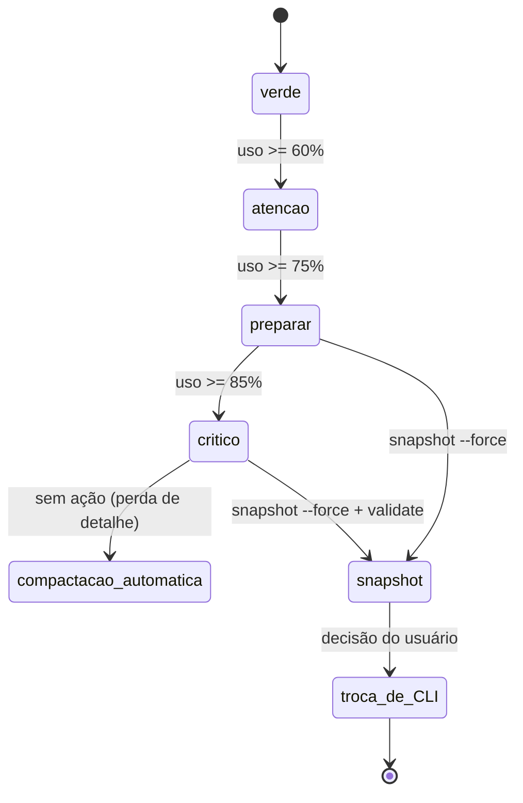

# Handoff entre CLIs (Claude · Codex · Copilot · Gemini)

Cada CLI tem sessão e memória próprias. O contrato de transferência é um **arquivo no
repositório** — nunca a expectativa de que a outra ferramenta "lembre".

Para transferência **dentro de um ticket**, entre agentes da mesma ferramenta, use
[`ticket-protocol.md`](ticket-protocol.md). Este documento trata da troca de **ferramenta**.



## Quando entregar: medir o contexto antes de perdê-lo

O handoff só serve se for escrito **antes** de o contexto acabar. No Claude Code a
compactação automática é *lossy*: quando dispara, o detalhe que o próximo agente precisa já
se perdeu. `tools/context-watch.py` mede o consumo real da sessão e classifica em zonas.



Leitura: o gatilho **escreve e avisa**; quem troca de ferramenta é o usuário. A única saída
ruim do diagrama é chegar à compactação automática sem snapshot.

| Zona | Uso da janela | Exit code | Exigência |
|---|---|---|---|
| `verde` | < 60% | `0` | nada |
| `atencao` | < 75% | `10` | evitar releitura de arquivos grandes; preferir trechos |
| `preparar` | < 85% | `20` | gerar o snapshot: `bash tools/agent-handoff.sh snapshot --force` |
| `critico` | ≥ 85% | `30` | snapshot + `validate` e trocar de CLI |
| `sem-telemetria` | — | `40` | a ferramenta não expõe uso de contexto; **não** estimar |

```bash
python3 tools/context-watch.py          # zona, barra, percentual e ação
python3 tools/context-watch.py --json   # objeto de uma linha, para script
python3 tools/context-watch.py --quiet; case $? in 20|30) : handoff ;; esac
```

**Como o número é obtido:** soma de `input_tokens + cache_creation_input_tokens +
cache_read_input_tokens` da última mensagem `assistant` não-sidechain do transcript da
sessão (`~/.claude/projects/<slug>/<session>.jsonl`). O script lê **apenas contagens e
metadados** — o transcript contém a conversa inteira e nada dele é impresso ou enviado para
fora da máquina.

**Janela de contexto** (`janela_origem` no `--json`): `CONTEXT_WINDOW` →
`autoCompactWindow` de `.claude/settings.local.json`, `.claude/settings.json` ou
`~/.claude/settings.json` → padrão por modelo. O padrão por modelo é **presumido**
(`janela_confiavel: false`): o transcript grava `claude-opus-5` sem distinguir a variante de
200k da de 1M. A regra tem duas metades, e as duas importam:

1. **Enquanto a presunção couber** (`usado ≤ janela`), o id ambíguo resolve para a **menor**
   janela plausível (200k, origem `modelo-ambiguo:<id>`): errar avisando cedo é recuperável;
   errar calando ("20% VERDE" com o contexto cheio) é a falha que este mecanismo existe para
   impedir.
2. **Quando a medição refuta a presunção** (`usado > janela`), ela é abandonada: não existe
   sessão viva com mais tokens do que a janela comporta, então o número seria autorrefutável
   e, pior, congelaria o alarme no topo da escala — a partir de `critico` nada sobe, e o hook
   nunca mais falaria. O script sobe **um** degrau plausível (origem `refutado:<origem>`),
   continua `janela_confiavel: false` e **é obrigado** a anunciar isso no hook. Se a medida
   não couber em nenhum degrau conhecido, a saída é `40` com o motivo — nunca um percentual
   inventado.

Enquanto a janela for presumida (com ou sem refutação), o hook diz isso **uma vez por
sessão** e todo aviso de zona carrega a ressalva. Trocar a régua (janela ou origem diferente
da anterior) zera o estado da sessão: zona registrada sob janela errada não trava o alarme.

> **Declare a janela da sua máquina e o palpite acaba** — crie `.claude/settings.local.json`
> (gitignored, por máquina):
>
> ```json
> { "autoCompactWindow": 1000000 }
> ```
>
> Vale para os três canais ao mesmo tempo: terminal, hook e `snapshot`. **Não** use
> `export CONTEXT_WINDOW=…` como solução: o hook é lançado pelo Claude Code, não pelo seu
> shell interativo, então a variável não chega nele e a mesma sessão passaria a reportar
> números diferentes em canais diferentes. `CONTEXT_WINDOW` serve para teste pontual de um
> comando. Limiares ajustáveis por `CONTEXT_WATCH_THRESHOLDS="0.60,0.75,0.85"`.

**Automação (só Claude Code)**, em `.claude/settings.json`:

- `PostToolBatch` → `python3 tools/context-watch.py --hook`: avisa **quando a zona sobe** e,
  no máximo uma vez por sessão, quando a janela é presumida — nunca a cada chamada de
  ferramenta (o estado por sessão fica em
  `${XDG_STATE_HOME:-~/.local/state}/mathematics-studies/`, fora do repositório). Sai `0`
  em **todos** os caminhos, inclusive com o stdout fechado (`| head`) ou cheio: exit code de
  hook tem semântica de bloqueio, e um watcher não pode bloquear a sessão.
- `PreCompact` (matcher `auto`) → `bash tools/precompact-snapshot.sh`: grava o snapshot
  antes da compactação automática.
- Edição de `.claude/settings.json` **não** recarrega hooks de forma garantida na sessão em
  curso: o watcher só observa diretórios que já tinham arquivo de settings no início da
  sessão. Para valer com certeza, abra `/hooks` uma vez (recarrega) ou reinicie a sessão.
- Reforço opcional, **nunca** fundamento: `totalTokensReminder: "countdown"` nos settings
  injeta `<total_tokens>N tokens left</total_tokens>` no contexto. O schema marca esse campo
  como interno; ele pode mudar sem aviso.

### Fora do Claude Code (Codex, Copilot, Gemini, ferramentas web)

Nenhuma dessas ferramentas expõe telemetria de contexto. O script sai com `40` e **não
inventa estimativa** — número falso sobre quanto contexto resta é pior que número nenhum.
O procedimento honesto é por *proxy*, e é disciplina, não medição:

1. Fazer o snapshot em **marcos**: fim de cada etapa do trabalho, antes de ler qualquer
   arquivo grande e a cada ~10 trocas de mensagem.
2. Tratar como sinal de esgotamento os **sintomas**: a ferramenta esquece decisão já tomada,
   repete pergunta já respondida, ignora restrição declarada no início, ou passa a reler
   arquivos que já tinha lido.
3. Ao primeiro sintoma, escrever o handoff **antes** de continuar a tarefa.
4. Registrar no `log.md` do ticket que a troca foi por contexto, não por escopo.

## Ao entregar

1. `bash tools/agent-handoff.sh snapshot` — preenche com o estado real do repositório:
   branch, HEAD, `git status --short`, `git diff --stat`, tickets com status diferente de
   `done` (id, título, status, owner) com a última entrada do `log.md` de cada um, dev-loops
   ativos, comandos de verificação e a medição de contexto. Não sobrescreve sem `--force`
   (o handoff anterior vira `.agent-handoff.prev.md`). Para começar do template em branco:
   `bash tools/agent-handoff.sh init`.
2. Preencher **todas** as seções obrigatórias de `.agent-handoff.md`, inclusive as marcadas
   `<preencher>` (o snapshot não infere intenção): Objetivo · Estado atual · Arquivos
   alterados · Decisões técnicas · Testes · Problemas ou riscos · Próxima ação exata ·
   Restrições · Última atualização.
3. `bash tools/agent-handoff.sh validate`.
4. Não fazer commit, push ou stash. Deixar o working tree como está.

## Ao receber

1. Ler nesta ordem: `.agent-handoff.md` → `AGENTS.md` (+ o adaptador da sua ferramenta) →
   `memory/MEMORY.md` → `docs/errors/README.md`.
2. Inspecionar `git status --short` e `git diff` — **não reverter** trabalho alheio.
3. Se a "Próxima ação exata" estiver ambígua, perguntar ao usuário antes de agir.
4. Ao concluir ou repassar, **atualizar o mesmo arquivo**.

## Regras

- Apenas **um agente** edita o working tree por vez.
- Se a tarefa faz parte de um ticket, cite `tickets/TCK-NNNN-<slug>/log.md` na "Próxima ação
  exata"; o log continua sendo a trilha de auditoria.
- Se faz parte de um `/dev-loop`, cite `.dev-loop/<task-slug>/loop.md`.
- `.agent-handoff.md` é efêmero e gitignored: nada durável pode viver só nele — o que
  permanece vai para `memory/` ou `docs/`.

## Particularidades por ferramenta

| Ferramenta | Carrega instruções de | Papéis de agente | Comandos |
|---|---|---|---|
| **Claude Code** | `CLAUDE.md` → `AGENTS.md` | Subagentes nativos (`.claude/agents/`) | `.claude/commands/` + skills |
| **Codex** | `AGENTS.md` | Colar o arquivo do agente como instrução | `~/.codex/prompts/` (via `--codex`) |
| **Copilot** | `.github/copilot-instructions.md` → `AGENTS.md` | Chat modes (`.github/chatmodes/`) | Prompt files (`.github/prompts/`) |
| **Gemini CLI** | `GEMINI.md` → `AGENTS.md` | `/agent:<nome>` (assume o papel) | `.gemini/commands/*.toml` |
| **Outros (GPT etc.)** | `AGENTS.md` manualmente | Colar o arquivo do agente | Seguir o Markdown da skill |
