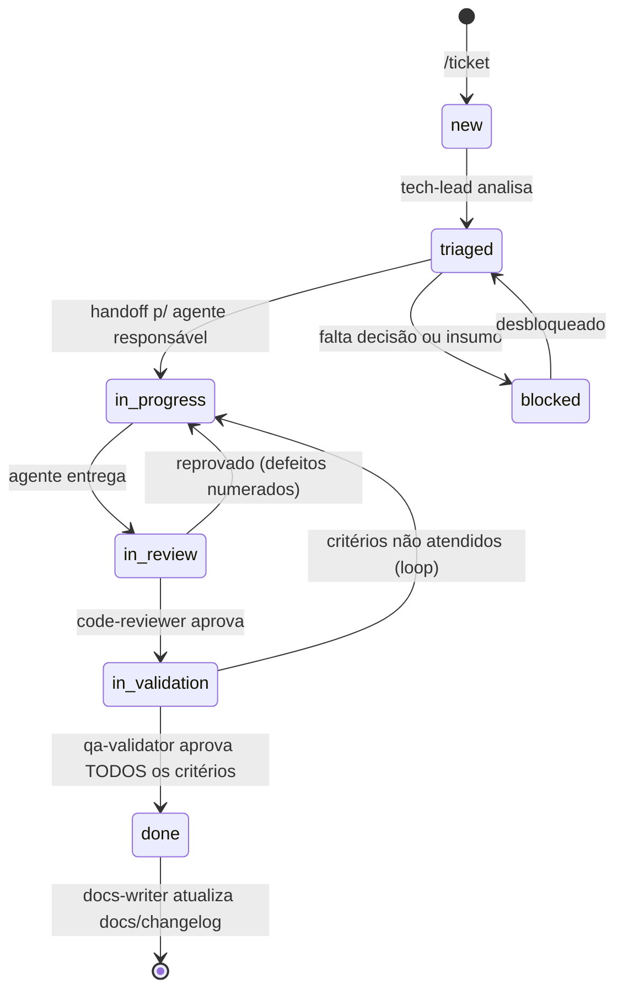

# Protocolo de Tickets, Handoff e Loop de Validação

> Contrato entre agentes. Objetivo: qualquer ferramenta de IA (Claude Code, Codex, Copilot,
> Gemini, GPT) consegue pegar um ticket no meio do fluxo e saber exatamente o estado, o que
> falta e quem fez o quê.

Toda tarefa de desenvolvimento, manutenção, correção de bug ou produção de conteúdo de porte
entra por um **ticket** em `tickets/TCK-NNNN-<slug>/`. Tickets são criados com `/ticket`,
movidos com `/handoff` e executados em loop por `/ticket-loop`.

## Ciclo de vida do ticket



**Regra do loop:** reprovação sempre volta para **quem produziu** o artefato, com lista
numerada de defeitos. Após **3 loops** no mesmo par, o `tech-lead` assume a decisão
(redesenha, divide o ticket ou escala ao usuário).

## Cadeias por tipo de ticket

| Tipo | Cadeia |
|---|---|
| `feature` (interface) | tech-lead → product-analyst* → ui-ux-designer → frontend-developer → code-reviewer → qa-validator → docs-writer |
| `feature` (dados/serviços) | tech-lead → product-analyst* → platform-architect* → backend-developer → code-reviewer → qa-validator → docs-writer |
| `bug` | tech-lead → agente da área (reprodução → causa raiz → correção + teste de regressão) → code-reviewer → qa-validator |
| `content` | tech-lead → curriculum-architect* → content-author / exercise-designer → math-reviewer ‖ i18n-steward → qa-validator |
| `infra` | tech-lead → devops-engineer → code-reviewer → qa-validator |
| `security` | tech-lead → security-auditor → agente da área → code-reviewer → qa-validator |
| `docs` | tech-lead → docs-writer → code-reviewer |
| `research` | tech-lead → researcher → tech-lead |

`*` etapa opcional, decidida na triagem e justificada em uma linha no log.

## Execução automática (sem invocação manual)

Handoff registrado = próximo agente **executa imediatamente**, no mesmo fluxo. O ciclo criado
por `/ticket` corre sozinho e só para em três condições:

1. **`done`** — `qa-validator` aprovou todos os critérios; `docs-writer` é acionado se a
   entrega muda interface, comportamento ou documentação; relatório final ao usuário.
2. **`blocked: human-input`** — falta decisão ou insumo que só o usuário tem; a entrada no
   log lista as perguntas objetivas.
3. **Escalada por 3 loops** — o `tech-lead` assume; se nem ele resolve, vira
   `blocked: human-input` com resumo do impasse e opções.

Ações fora do fluxo automático (exigem pedido explícito do usuário): `git commit`, `git push`,
deploy em produção, exclusão de dados e qualquer gasto financeiro.

## Subagentes (delegação e paralelismo)

Todo agente pode **invocar subagentes** para não virar gargalo. Caso principal: o agente está
ocupado e chega um ticket novo da sua área — em vez de enfileirar, spawna uma instância de si
mesmo que assume o novo ticket.

**Identidade:** a instância principal usa o nome puro (`frontend-developer`); subagentes são
numerados (`frontend-developer#2`). A identidade completa aparece em toda entrada de log e no
`owner:` do ticket — cada ticket tem exatamente **um** dono por vez.

| Situação | Ação |
|---|---|
| Agente ocupado + ticket novo da **mesma área** | Spawnar subagente do próprio tipo; ele assume o novo ticket como dono pleno |
| Subtarefas divisíveis dentro de um ticket | Spawnar subagentes para as partes; o agente-pai consolida e responde pelo resultado |
| Apoio de leitura/pesquisa (ler código, buscar referência) | Subagente read-only livre — não altera artefatos, dispensa entrada de log |
| Trabalho da área de **outro** agente | **Nunca** subagente — handoff normal (escopo exclusivo continua valendo) |

**Regras duras:**

1. Subagente **herda todas as regras** do agente-pai — é o mesmo papel em outra instância.
2. Independência de validação vale **pela cadeia**: quem produziu um artefato — a instância ou
   qualquer subagente que ela spawnou — jamais o revisa ou valida.
3. `STOP` em um ticket para o dono **e** todos os subagentes atuando nele.
4. O limite de **3 loops** conta por ticket, independentemente de quantas instâncias
   participaram.
5. Todo spawn que altera artefatos gera entrada `SPAWN` no log do ticket.

## Memória persistente (lições e contexto)

Sessões de agente são efêmeras; **o repositório é a memória**.

- **`memory/lessons/<slug>.md`** — uma lição por arquivo (`**Tipo:**`, `**Contexto:**`,
  `**Lição:**`, `**Como aplicar:**`), indexada em `memory/LESSONS.md` com identificador
  `L-NNN` para poder ser citada nos logs.
- **`memory/context/<área>.md`** — documento **vivo** por área (`process`, `frontend`,
  `backend`, `devops`, `qa`, `security`, `content`, `curriculum`): pegadinhas do ambiente,
  estado atual, decisões operacionais em vigor.
- **`memory/agents/<name>.md`** — memória individual do agente.

**Gatilhos de registro de lição:**

1. `REJECT` resolvido cuja causa raiz pode se repetir — a `ACTION` que resolve o defeito
   **termina com a linha** `Lição: L-NNN` (ou `Lição: n/a — erro pontual`, justificado).
2. Escalada por 3 loops — o `tech-lead` registra a lição do impasse.
3. CI, build ou deploy quebrado por comportamento não óbvio de ferramenta ou ambiente.
4. Retrabalho causado por falta de contexto que um documento teria evitado.
5. **Erro matemático** que passou pela revisão — lição obrigatória + verificação dos nós
   irmãos.

**Regras:** ler antes de trabalhar (contexto da área + lições relevantes; lição que mudou a
abordagem é citada no log como `aplicada L-NNN`); lição superada vira **nova** lição
referenciando a antiga; **repetir erro que já tem lição registrada é defeito bloqueante** em
review/QA, assim como resolver `REJECT` sem a linha `Lição:`.

## Formatos de log (append em `tickets/TCK-NNNN-<slug>/log.md`)

### HANDOFF — troca de dono

```markdown
## [SEQ] HANDOFF — AAAA-MM-DD HH:MM
- De: <agente> → Para: <agente>
- Status novo: <triaged|in_progress|in_review|in_validation|done|blocked>
- O que foi feito: <resumo objetivo, 2–5 linhas>
- Artefatos: <arquivos tocados, commits (hash), screenshots>
- Como validar: <comandos/passos para reproduzir e conferir>
- Pendências e riscos: <o que NÃO foi feito, dívidas assumidas>
- Critérios de aceite: [x] atendidos / [ ] restantes (copiar checklist do ticket)
```

### ACTION — trabalho sem troca de dono

```markdown
## [SEQ] ACTION — AAAA-MM-DD HH:MM — <agente>
- Ação: <o que fez>
- Motivo: <por quê>
- Resultado: <ok|falha + evidência (saída de teste, link, hash)>
- Lição: <L-NNN | n/a — erro pontual>   (obrigatório quando resolve um REJECT)
```

### REJECT — reprovação

```markdown
## [SEQ] REJECT — AAAA-MM-DD HH:MM
- De: <validador> → Para: <autor> · Loop nº: <n>/3
- Defeitos (numerados, cada um com evidência e critério violado):
  1. ...
  2. ...
- O que já está bom (não refazer): ...
```

### SPAWN — criação de subagente

```markdown
## [SEQ] SPAWN — AAAA-MM-DD HH:MM
- Por: <agente> (ocupado com TCK-XXXX) → Subagente: <agente>#N
- Motivo: <novo ticket com o dono ocupado | paralelizar subtarefa | apoio>
- Escopo delegado: <ticket inteiro | subtarefa específica, com limites claros>
```

### STOP — parada decidida pelo usuário

```markdown
## [SEQ] STOP — AAAA-MM-DD HH:MM — <quem parou>
- Ação: PARADA SOLICITADA — nenhum agente continua este ticket até novo handoff
- Motivo: <por quê>
- Resultado: status alterado para blocked: human-input
```

### CORRECTION — correção de registro anterior

```markdown
## [SEQ] CORRECTION — AAAA-MM-DD HH:MM — <agente>
- Corrige: [SEQ-original]
- O que estava errado: ...
- Registro correto: ...
```

## Regras de auditoria

1. `log.md` é **append-only** — corrigir registro errado = entrada `CORRECTION`, nunca edição.
2. Toda entrada tem `[SEQ]` incremental — buraco na sequência indica ação não logada
   (violação).
3. **Evidência > afirmação:** "os testes passam" exige a saída do comando; "a tela está
   pronta" exige screenshot; "o cálculo está certo" exige a verificação (`/math-verify`).
4. Quem detectar erro de outro agente registra `ACTION` com o diagnóstico e faz handoff ao
   `tech-lead` — **não** conserta silenciosamente na área do outro.
5. Commits usam prefixo `TCK-NNNN:`; nenhum commit sem ticket (exceto hotfix documentado a
   posteriori). Commit e push só com pedido explícito do usuário.
6. Ticket `done` nunca reabre — regressão vira ticket novo referenciando o original.

## Relação com os outros loops

| Mecanismo | Quando usar |
|---|---|
| `/ticket-loop` | Desenvolvimento auditado de feature, bug, infra ou conteúdo de porte. Entrada = ticket. |
| `/dev-loop` | Tarefa pontual sem ticket, com handoff por briefing compacto (≤ 40 linhas). |
| `/agent-handoff` | Trocar de **CLI** (Claude ↔ Codex ↔ Copilot ↔ Gemini) no meio do trabalho. |
