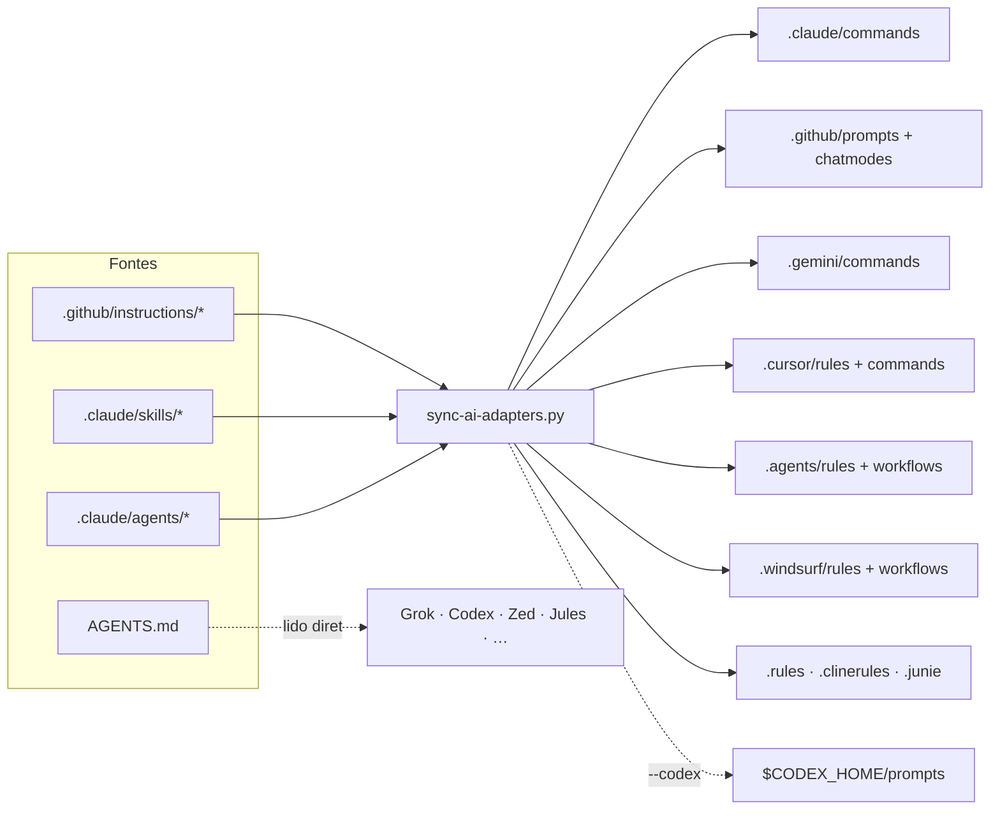

# Suporte por ferramenta de IA

Este repositório é operável por qualquer assistente de código. A estratégia é ter **fontes
canônicas únicas** e **gerar** os adapters de cada ferramenta — nada é escrito duas vezes à
mão.

## Fontes canônicas (escritas uma vez)

| Fonte | O que é | Consumida por |
|---|---|---|
| `AGENTS.md` | Regras completas do projeto | Todas as ferramentas |
| `.github/instructions/*.instructions.md` | Regras por escopo (`applyTo` = glob) | Gera as regras de Cursor, Windsurf, Antigravity, Zed, Cline, Junie |
| `.claude/skills/<nome>/SKILL.md` | Capacidades (procedimentos) | Gera comandos/prompts/workflows |
| `.claude/agents/<nome>.md` | Papéis (escopo, limites, memória) | Gera subagentes/chatmodes/comandos |

Tudo o mais é gerado por `python3 scripts/sync-ai-adapters.py`.



## Matriz de suporte

Legenda: **nativo** = a ferramenta carrega sozinha · **gerado** = adapter neste repositório ·
**assistido** = funciona, mas o modelo executa os papéis em sequência, sem isolamento real ·
**manual** = abrir o arquivo Markdown e seguir.

| Ferramenta | Regras | Capacidades | Papéis | Loop multi-agente | Setup |
|---|---|---|---|---|---|
| **Claude Code** | nativo (`CLAUDE.md` → `AGENTS.md`) | nativo `/<skill>` | subagentes reais, paralelos | completo (workflows `.js`) | nenhum |
| **Grok CLI** | nativo (`AGENTS.md`, `CLAUDE.md`, `.claude/`) | nativo (lê `.claude/skills/`) | nativo (lê `.claude/agents/`) | assistido | nenhum |
| **Cursor** | gerado (`.cursor/rules/*.mdc`) + `AGENTS.md` | gerado `/<skill>` | gerado `/agent-<nome>` | assistido | nenhum |
| **GitHub Copilot** | nativo (`.github/instructions/`) | gerado `/<skill>` | chat modes | assistido | nenhum |
| **Gemini CLI** | nativo (`GEMINI.md` → `AGENTS.md`) | gerado `/<skill>` | gerado `/agent:<nome>` | assistido | nenhum |
| **Google Antigravity** | gerado (`.agents/rules/`) + `AGENTS.md` | gerado `/<skill>` | gerado `/agent-<nome>` | assistido | ativar as rules na UI |
| **Windsurf** | gerado (`.windsurf/rules/`) | gerado `/<skill>` | gerado `/agent-<nome>` | assistido | nenhum |
| **OpenAI Codex** | nativo (`AGENTS.md`) | prompts globais | prompts globais | assistido | `--codex` (ver abaixo) |
| **Zed** | gerado (`.rules`) + `AGENTS.md` | manual | manual | assistido | nenhum |
| **Cline / Roo Code** | gerado (`.clinerules`) | manual | manual | assistido | nenhum |
| **JetBrains Junie** | gerado (`.junie/guidelines.md`) | manual | manual | assistido | nenhum |
| **ChatGPT / Grok / Claude (web)** | manual | manual | manual | assistido | colar `prompts/bootstrap-session.md` |

### O que só o Claude Code faz

Subagentes com contexto isolado rodando em paralelo e os 5 workflows determinísticos
(`.claude/workflows/*.js`). Nas demais ferramentas, o mesmo trabalho acontece **em
sequência**, com o modelo assumindo um papel de cada vez.

Consequência prática que importa: a regra "quem produz não valida" deixa de ser garantida
por isolamento técnico e passa a depender de disciplina. Por isso o
[`ticket-protocol.md`](ticket-protocol.md) exige que, nesses casos, o agente releia o
artefato como terceiro e **declare isso no `log.md`**.

## Instalação

```bash
# Gera os adapters de todas as ferramentas baseadas em repositório
python3 scripts/sync-ai-adapters.py

# Verifica se está tudo atualizado (é o que o CI roda)
python3 scripts/sync-ai-adapters.py --check

# Atalho que faz o acima e imprime as instruções por ferramenta
bash scripts/setup-ai-tools.sh
```

### Codex — atenção à colisão de nomes

O Codex descobre prompts apenas em `$CODEX_HOME/prompts`, que é **global por usuário, não por
repositório**. Se você usa o Codex em mais de um projeto que instala prompts, nomes como
`create-adr` colidem e o último a instalar vence.

Três formas de conviver:

```bash
# 1. CODEX_HOME por projeto (isolamento real — recomendado)
export CODEX_HOME="$HOME/.codex-mathematics-studies"
python3 scripts/sync-ai-adapters.py --codex
#    …e use sempre `CODEX_HOME=$HOME/.codex-mathematics-studies codex` neste repositório
#    (um alias no shell, ou direnv com .envrc, resolvem)

# 2. Prefixo nos nomes (convive com outros repos no mesmo CODEX_HOME)
python3 scripts/sync-ai-adapters.py --codex --codex-prefix ms
#    → /ms-create-adr, /ms-ticket, /ms-tech-lead …

# 3. Não instalar nada: o Codex já lê AGENTS.md nativamente; abra o SKILL.md quando precisar
```

Todo prompt gerado leva `[mathematics-studies]` no início da descrição, para você distinguir
a origem na lista do Codex.

### Antigravity

`AGENTS.md` é lido automaticamente. As regras em `.agents/rules/` precisam ter o modo de
ativação escolhido na interface — cada arquivo gerado traz a sugestão no comentário do topo
(`Always On` para a regra-núcleo, `Glob` para as demais). Os workflows em `.agents/workflows/`
aparecem como `/<nome>`.

> Confirmar na primeira sessão: a documentação do Antigravity define `.agents/rules/` para as
> regras e descreve workflows como Markdown invocável por `/nome`, mas não fixa
> explicitamente o diretório de workflows do workspace. Se a sua versão usar outro caminho,
> ajuste `D["ag_flows"]` em `scripts/sync-ai-adapters.py` — é uma linha.

### Limite de tamanho

Antigravity e Windsurf truncam arquivos de regra acima de **12.000 caracteres**. Por isso o
`AGENTS.md` (≈ 25 mil) **não** é copiado para dentro das regras: a fonte
`.github/instructions/core.instructions.md` é um resumo enxuto, sempre ativo, que aponta para
o `AGENTS.md` completo. O gerador falha se qualquer regra passar do limite.

## Adicionando uma ferramenta nova

1. Descubra os caminhos que ela lê (arquivo de regras, diretório de comandos).
2. Se ela lê `AGENTS.md`, **já funciona** — só registre na matriz acima.
3. Caso contrário, adicione um renderizador em `scripts/sync-ai-adapters.py` (há um por
   ferramenta, todos curtos) e inclua os caminhos no dicionário `D` do `main()`.
4. Acrescente as verificações em `scripts/audit-ai-surface.sh`.
5. Rode `python3 scripts/sync-ai-adapters.py` e atualize esta matriz.

## Adapters escritos à mão

Todo arquivo gerado carrega o marcador `managed-by:mathematics-studies/sync-ai-adapters`.
Um arquivo **sem** esse marcador é considerado escrito à mão: o gerador o preserva e informa
quantos foram preservados. É assim que você personaliza um adapter específico sem perdê-lo
na próxima geração.
