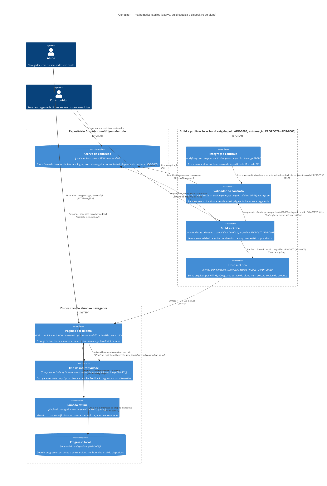

# C4 — Nível 2: Container

**Estado:** o desenho decorre do `ADR-0003` (aceito em 2026-08-01) e detalha o que o
`c4-context.md` mostra como uma caixa só. **Nada aqui está implementado** — a aplicação não
existe em código. Dois grupos de elementos ainda **não** têm ADR aceito e estão marcados como
tais no diagrama, no texto e nas relações:

- `PROPOSTO (ADR-0006)` — o papel de portão de merge da integração contínua, os previews e o
  gatilho do deploy;
- `PROPOSTO (ADR-0007)` — esqueleto concreto da aplicação (gerador, diretórios, forma da URL
  bilíngue).

Um terceiro marcador, `EM ABERTO (ticket)`, indica o que nenhum ADR decide **de propósito** e
que **não** vira ADR: é escolha do ticket de implementação — mecanismo da camada offline e
**lugar** do portão de validação do acervo, entre outros.

**Como ler a ausência de marcador:** elemento sem marcador está sustentado por **ADR aceito ou
spec aprovada**, e a fonte aparece no próprio rótulo (`ADR-0003`, `RF-18`, …). Marcador posto
num contêiner **vale para as relações que decorrem dele** — a camada offline é marcada uma vez,
no contêiner, e as duas relações de cache herdam esse marcador em vez de repeti-lo.

## Leitura

O caminho é de mão única: o acervo em `content/` entra na build, passa por uma verificação que
impede o nó reprovado de virar página, e sai como arquivos estáticos; do host para o
dispositivo só descem HTML, CSS e ativos. Nenhuma seta volta do aluno para o servidor — não há
backend, conta nem telemetria, e a ausência é decisão do `ADR-0003`, não omissão do desenho. O
progresso e o cache do conteúdo visitado nascem e morrem no dispositivo.

O diagrama **não decide** mecanismo: em que momento a matemática vira HTML (build × execução no
navegador), com que estratégia a camada offline guarda o conteúdo visitado, que biblioteca roda
dentro da ilha, com que ferramenta se testa e **onde exatamente roda o portão que reprova
acervo inválido** — script do projeto, job de CI ou os dois. Este último é decisão de
implementação por definição da própria spec aprovada
(`docs/specs/minimum-learning-slice/plan.md`, item 5), e por isso aparece como
`EM ABERTO (ticket)` na relação `build → validador`, e não como `PROPOSTO`: nenhum ADR deve
fechá-lo. O que **exige ADR** antes de existir está marcado `PROPOSTO` com o número do ADR
pendente: `ADR-0006` para o papel de portão de merge da CI, o gatilho de deploy e os previews;
`ADR-0007` para o gerador concreto, os diretórios e a forma exata da URL bilíngue. O que já
existe e funciona hoje — o workflow de auditorias — aparece como fato, com a parte proposta
separada no mesmo rótulo. O diagrama também **não** mostra fóruns, certificados nem
sincronização entre dispositivos: os três exigem estado compartilhado e ADR próprio.

## Contrato das fronteiras

| Fronteira | O que atravessa | O que nunca atravessa |
|---|---|---|
| `content/` → build | Arquivos do acervo lidos como dado: `meta.json`, `theory.<lang>.md`, `exercises.json` | Componente de framework, frontmatter proprietário ou lógica de aprendizagem — o acervo não conhece a aplicação (`ADR-0003`, independência do contrato de dados) |
| Validador → build | Aprovação ou reprovação do acervo, com arquivo, item e regra violada | Objeto inválido: nó reprovado não vira página (RF-18) |
| Build → host | Um diretório de arquivos estáticos, servível por qualquer host | Segredo, variável de ambiente com dado pessoal, função executada por requisição |
| Host → dispositivo | HTML, CSS, ativos e o payload do exercício — **incluindo o gabarito** | Identificador de usuário, cookie de sessão, resposta do aluno em qualquer direção |
| Página → ilha | Dados do exercício **já validados**, entregues na fronteira do componente — o *como* é decisão do ticket (`ADR-0007`, `proposed`, propõe propriedade serializada na build) | Hidratação da página inteira: recurso que a exija está mal desenhado (`ADR-0003`); e requisição de rede feita pela ilha — o payload já traz o que ela precisa (`ADR-0003`: offline do conteúdo visitado, sem backend) |
| Ilha → progresso local | Eventos de progresso do próprio dispositivo | Qualquer coisa que saia do dispositivo — sem rede, sem servidor, sem telemetria |

Consequência que atravessa todas as linhas: **o gabarito viaja no cliente** (L-008). Nada pode
depender do segredo da resposta — sem prova valendo nota, sem ranking, sem certificado
verificável.

## Fontes

- `docs/adr/ADR-0003-platform-stack.md` (`accepted`, 2026-08-01) — site estático com ilhas,
  local-first sem conta, portabilidade do host, independência do contrato de dados.
- `docs/adr/ADR-0006-continuous-integration-and-publication.md` (`proposed`) — integração
  contínua, previews e gatilho do deploy.
- `docs/adr/ADR-0007-application-skeleton.md` (`proposed`) — gerador concreto, diretórios,
  leitura de `content/` na build e lugar das ilhas.
- `docs/adr/ADR-0002-bilingual-content.md` — paridade obrigatória por idioma.
- `docs/architecture/c4-context.md` — nível acima; `docs/specs/minimum-learning-slice/`
  (RF-18, RNF-3, RNF-5) — comportamento exigido da primeira fatia.
- `tickets/TCK-0014-content-contract-validator/` — validador do contrato em execução.
