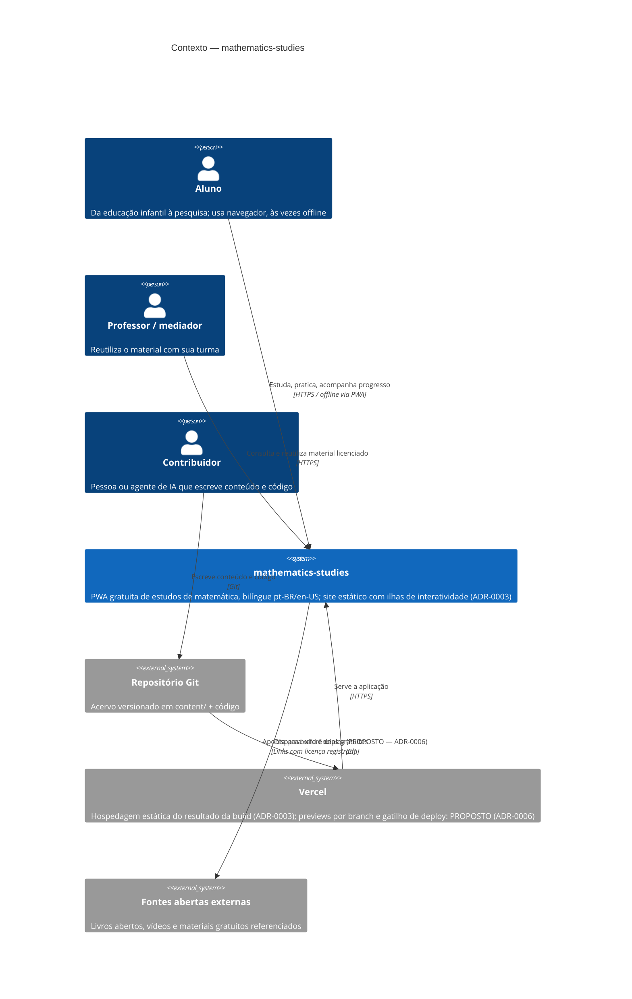

# C4 — Nível 1: Contexto

**Estado:** majoritariamente decidido. Acervo e pipeline de conteúdo por ADR-0001 e ADR-0002;
a aplicação web por ADR-0003 (aceito em 2026-08-01: site estático com ilhas de
interatividade, progresso local-first em IndexedDB, deploy estático) — nenhum desses é
hipótese; o que falta neles é **implementação**. Continuam **propostos** o pipeline de CI/CD,
os previews por branch e o gatilho do deploy: estão em `ADR-0006`, com status `proposed`, e
aparecem marcados `PROPOSTO (ADR-0006)` no diagrama. O detalhamento interno está em
[`c4-container.md`](c4-container.md).

## Leitura

O sistema é essencialmente um **acervo versionado** publicado como aplicação estática. O aluno
é o ator central e pode operar sem conta e sem rede depois da primeira visita. O contribuidor
— humano ou agente de IA — atua sobre o repositório, não sobre a aplicação em execução. A
Vercel é infraestrutura de publicação, não guardiã de estado.

O diagrama **não** mostra: a persistência de progresso, que por ADR-0003 é **local ao
dispositivo do aluno** (IndexedDB) e portanto não aparece como sistema externo; nem fóruns e
certificados (fases 5–6 do roadmap), que exigem estado compartilhado e ADR próprio. Também
não há backend, conta ou telemetria — a ausência é decisão, não omissão. O detalhamento
interno (acervo, build, páginas por idioma, ilha, camada offline, progresso local) está no
nível **Container**, em [`c4-container.md`](c4-container.md).

**Estado atual × proposta:** atores, acervo, aplicação estática e hospedagem decorrem de ADRs
aceitos (0001, 0002, 0003). O **pipeline de CI/CD, os previews por branch e o gatilho do
deploy são proposta**, registrada em `ADR-0006` (`proposed`) — enquanto ele não for aceito,
nenhum ticket implementa pipeline com base nele. O **esqueleto concreto da aplicação**
(gerador, diretórios, forma da URL bilíngue) também é proposta, em `ADR-0007` (`proposed`).
Nenhum elemento do diagrama está implementado: a aplicação ainda não existe em código.

## Fontes

- `docs/adr/ADR-0001-content-taxonomy.md`
- `docs/adr/ADR-0002-bilingual-content.md`
- `docs/adr/ADR-0003-platform-stack.md` (status `accepted`, 2026-08-01)
- `docs/adr/ADR-0006-continuous-integration-and-publication.md` (status `proposed`)
- `docs/adr/ADR-0007-application-skeleton.md` (status `proposed`)
- `docs/product/vision.md`, `docs/product/roadmap.md`
