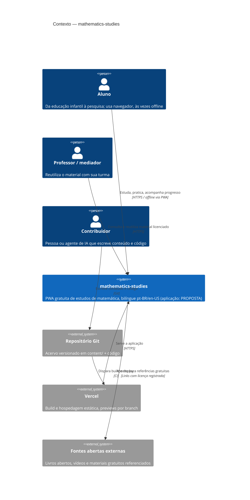

# C4 — Nível 1: Contexto

**Estado:** o acervo e o pipeline de conteúdo são **decididos** (ADR-0001, ADR-0002); a
aplicação web é **proposta** (ADR-0003 `proposed`).

## Leitura

O sistema é essencialmente um **acervo versionado** publicado como aplicação estática. O aluno
é o ator central e pode operar sem conta e sem rede depois da primeira visita. O contribuidor
— humano ou agente de IA — atua sobre o repositório, não sobre a aplicação em execução. A
Vercel é infraestrutura de publicação, não guardiã de estado.

O diagrama **não** mostra: persistência de progresso (indefinida — depende de ADR-0003 e de um
ADR de privacidade futuro), fóruns e certificados (fases 5–6 do roadmap).

## Fontes

- `docs/adr/ADR-0001-content-taxonomy.md`
- `docs/adr/ADR-0002-bilingual-content.md`
- `docs/adr/ADR-0003-platform-stack.md` (status `proposed`)
- `docs/product/vision.md`, `docs/product/roadmap.md`
