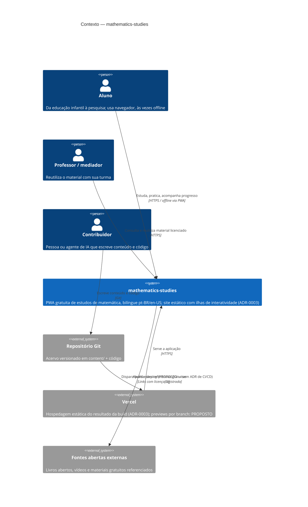

# C4 — Nível 1: Contexto

**Estado:** majoritariamente decidido. Acervo e pipeline de conteúdo por ADR-0001 e ADR-0002;
a aplicação web por ADR-0003 (aceito em 2026-08-01: site estático com ilhas de
interatividade, progresso local-first em IndexedDB, deploy estático) — nenhum desses é
hipótese; o que falta neles é **implementação**. Continua **proposto** (sem ADR aceito) o
pipeline de CI/CD e o uso de previews por branch, marcado como tal no diagrama.

## Leitura

O sistema é essencialmente um **acervo versionado** publicado como aplicação estática. O aluno
é o ator central e pode operar sem conta e sem rede depois da primeira visita. O contribuidor
— humano ou agente de IA — atua sobre o repositório, não sobre a aplicação em execução. A
Vercel é infraestrutura de publicação, não guardiã de estado.

O diagrama **não** mostra: a persistência de progresso, que por ADR-0003 é **local ao
dispositivo do aluno** (IndexedDB) e portanto não aparece como sistema externo; nem fóruns e
certificados (fases 5–6 do roadmap), que exigem estado compartilhado e ADR próprio. Também
não há backend, conta ou telemetria — a ausência é decisão, não omissão. O detalhamento
interno (build estática, ilhas, service worker) pertence ao nível **Container**, ainda não
desenhado.

**Estado atual × proposta:** atores, acervo, aplicação estática e hospedagem decorrem de ADRs
aceitos (0001, 0002, 0003). O **pipeline de CI/CD e os previews por branch são proposta** —
nenhum ADR aceito os cobre; quem os implementar precisa de ADR próprio (`devops-engineer`).
Nenhum elemento do diagrama está implementado: a aplicação ainda não existe em código.

## Fontes

- `docs/adr/ADR-0001-content-taxonomy.md`
- `docs/adr/ADR-0002-bilingual-content.md`
- `docs/adr/ADR-0003-platform-stack.md` (status `accepted`, 2026-08-01)
- `docs/product/vision.md`, `docs/product/roadmap.md`
