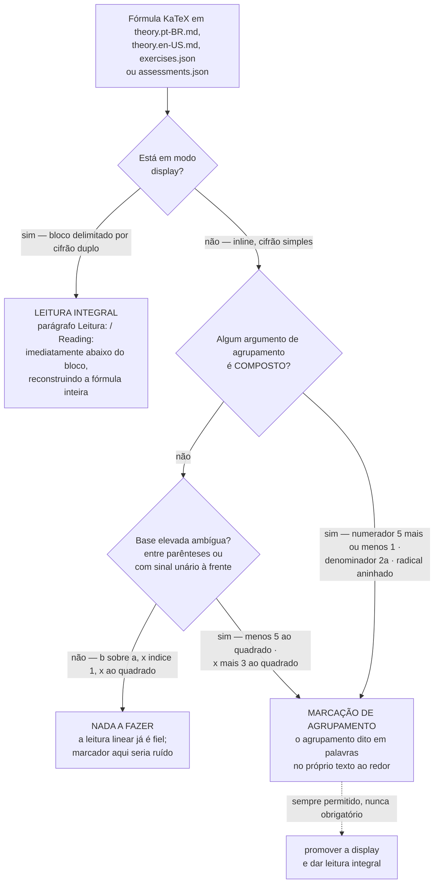

# Acessibilidade do conteúdo e da plataforma

Meta: **WCAG 2.2 nível AA** como piso, com atenção extra à acessibilidade da **matemática**.
Acessibilidade é requisito de entrada, não correção posterior.

## Matemática acessível

| Regra | Por quê |
|---|---|
| Fórmula sempre em **KaTeX**, nunca só imagem | Imagem é opaca para leitor de tela, zoom e busca |
| Toda equação em **display** tem **leitura integral** próxima | Leitor de tela lê a descrição; quem tem dificuldade de leitura simbólica se apoia nela |
| Fórmula **inline** com argumento composto **ou base elevada ambígua** tem o **agrupamento dito em palavras** | Na fala, o fim de um numerador, de um radicando ou de uma base elevada não existe; sem marcador, a expressão se reagrupa errado |
| Notação não óbvia declarada na primeira ocorrência | Evita interpretação errada na leitura linear |
| Passo a passo em lista, não em imagem única | Permite navegação item a item |
| Gráficos com `alt` descrevendo o **conteúdo matemático** | "Parábola com vértice em $(2,-1)$, concavidade para cima" — não "gráfico 3" |
| Tabelas com cabeçalho semântico | Leitura linear compreensível |

Exemplo de descrição aceitável para uma equação em display:

> $$x = \frac{-b \pm \sqrt{b^2 - 4ac}}{2a}$$
> *Leitura:* x é igual a menos b, mais ou menos a raiz quadrada de b ao quadrado menos quatro
> a c, tudo dividido por dois a.

## Display × inline: qual é a obrigação de cada uma

A regra dura de `AGENTS.md` §9.2 nomeia a fórmula em **display**. Isso deixava de fora as
fórmulas **inline**, e o levantamento do nó piloto mostrou que a lacuna é real: o Resumo de
`quadratic-equations` usa `\dfrac` inline e `exercises.json` tem 10 `\frac` inline, nenhum
com tratamento. Os dois extremos são ruins — exigir leitura integral de *toda* fórmula
inline tornaria o texto ilegível por repetição; não exigir nada deixa muda justamente a
fórmula cujo sentido **é** o agrupamento. A fronteira abaixo separa os dois casos por
**obrigações diferentes**, não por "tem descrição / não tem".

**Leitura.** O diagrama tem duas perguntas, e nenhuma delas é de julgamento: as duas são
respondidas pelo teste mecânico da seção seguinte, por inspeção do LaTeX, sem interpretar o
sentido da expressão. A segunda existe porque a potência é o único ponto em que a exceção do
sinal unário não vale — na fração, reagrupar dá o mesmo valor; na potência, $-(5^2)$ e
$(-5)^2$ são números diferentes. Display continua com a obrigação máxima e **sem exceção**: leitura
integral, na ordem escrita (lição `L-012`). Inline nunca pede parágrafo `*Leitura:*` — pede
uma frase que feche o grupo ("…, tudo dividido por $2a$"), o que custa poucas palavras e não
duplica a fórmula. O diagrama **não** cobre: gráficos e imagens (regra própria, `alt` com o
conteúdo matemático), notação declarada na primeira ocorrência, nem a duplicação
fórmula + descrição que o MathML do KaTeX pode causar no áudio — isso é decisão de
renderização, não de conteúdo. Fontes: `AGENTS.md` §9.2;
`tickets/TCK-0005-pilot-node-math-accessibility/log.md` `[008]` §2, §7.2, §7.3 e §7.5.
Estado atual desde 2026-08-01 (antes disso, só display era exigido).

### Teste de marcação de agrupamento

O teste tem **duas partes**, e a fórmula exige marcação se **qualquer uma** delas disparar:
(a) o **teste do argumento composto** e (b) os **gatilhos de base elevada**. Citar só (a) —
como "fórmula inline com argumento composto" — deixa `$-x^2$` passar, porque ele não tem
argumento composto nenhum. Ao repetir esta regra em outro documento, repita as duas partes.

#### (a) Teste do argumento composto

**Argumentos de agrupamento** de uma fórmula são: numerador e denominador de `\frac`,
`\dfrac`, `\tfrac`, `\cfrac`; radicando e índice de `\sqrt`; expoente e subscrito; a base
elevada a um expoente; e o corpo de `\sum`, `\prod`, `\int`, `\lim`.

Um argumento é **simples** quando é um único símbolo — um número, uma letra ou uma constante
nomeada (`\pi`, `\Delta`, `e`) — com ou sem sinal unário à frente. É **composto** em
qualquer outro caso, isto é, quando contém pelo menos um destes, no seu nível mais externo:

- operador binário: `+`, `-`, `\pm`, `\mp`, `\cdot`, `\times`, `\div`, `/`. **`-` no início
  do argumento, sem termo à esquerda, é unário e não conta** — em `\frac{-7}{2}` o numerador
  é simples;
- relação: `=`, `<`, `>`, `\le`, `\ge`, `\neq`, `\approx`;
- **dois ou mais fatores justapostos**: `2a`, `4ac`, `ab`;
- outra construção de agrupamento aninhada: `\frac`, `\sqrt`, `^{…}` ou `_{…}` com mais de
  um símbolo;
- **parênteses ou colchetes** dentro do argumento. As **chaves que delimitam** o argumento em
  LaTeX **não contam** — o que se inspeciona é o *conteúdo* do argumento, então `$x^{2}$` e
  `$\sqrt{\Delta}$` são simples, e `$x^{n+1}$` é composto pelo `+`, não pelas chaves.

**Parte (a) dispara quando pelo menos um argumento de agrupamento for composto.** O teste se
aplica por inspeção do LaTeX, tem resposta única e não depende da intenção do autor.

#### (b) Gatilhos de base elevada

Independem dos argumentos: em ambos, a fala perde o escopo da potência e as duas
reconstruções dão **resultados diferentes**.

1. **Base entre parênteses ou colchetes** — `$(-5)^2$`, `$(x+3)^2$`: "menos cinco ao
   quadrado" serve para $(-5)^2 = 25$ e para $-5^2 = -25$; "x mais três ao quadrado" serve
   para $(x+3)^2$ e para $x + 3^2$.
2. **Sinal unário imediatamente à frente de uma base elevada** — `$-5^2$`, `$-x^2$`,
   `$-b^2$`, `$y = -x^2 + 4$`.

   **Critério de unário para este gatilho** (mesmo princípio da parte (a), enunciado aqui
   porque o gatilho é independente dela): o sinal é **unário** quando **não há termo à sua
   esquerda** — está no início da fórmula ou logo depois de `=`, `<`, `>`, `(`, `[`, `,` ou de
   outro operador. Havendo termo à esquerda, o sinal é **binário** e o gatilho **não**
   dispara: `$x^2 - y^2$` e `$\Delta = b^2 - 4ac$` **não exigem** — o `-` separa dois termos e
   nenhuma base fica ambígua; `$-x^2$` e `$\Delta = -b^2$` **exigem**.

   Aqui a exceção do sinal unário da parte (a) **não** se aplica. Ela vale para fração e
   radicando, onde reagrupar dá o **mesmo** valor ($-(7/2) = (-7)/2$); na potência,
   $-(5^2) = -25$ e $(-5)^2 = 25$ são números distintos.

| Inline | Argumentos | Veredito |
|---|---|---|
| `$\dfrac{b}{a}$` | `b`, `a` — simples | **não exige** |
| `$-\dfrac{c}{a}$` | `c`, `a` — simples (o `-` é unário, fora da fração) | **não exige** |
| `$\frac{-7}{2}$` | `-7` (sinal unário + número), `2` — simples | **não exige** |
| `$x_1$`, `$\sqrt{\Delta}$`, `$x^{2}$` | `1`, `\Delta`, `2` — simples; as chaves só delimitam | **não exige** |
| `$ax^2 + bx + c = 0$` | base `x`, expoente `2` — simples; `ax^2` é justaposição de **nível externo**, não argumento | **não exige** |
| `$\frac{5 \pm 1}{2}$` | numerador tem `\pm` — composto | **exige** |
| `$\dfrac{-b \pm \sqrt{\Delta}}{2a}$` | numerador com `\pm` e radical aninhado; denominador `2a` justaposto | **exige** |
| `$\sqrt{b^2 - 4ac}$` | radicando com `-` | **exige** |
| `$x^{n+1}$` | expoente com `+` | **exige** |
| `$x^2 - y^2$`, `$\Delta = b^2 - 4ac$` | argumentos simples; o `-` é **binário** (há termo à esquerda) — gatilho (b)2 não dispara | **não exige** |
| `$(-5)^2$`, `$(x+3)^2$` | gatilho (b)1 — base entre parênteses | **exige** |
| `$-5^2$`, `$-x^2$`, `$\Delta = -b^2$` | gatilho (b)2 — sinal **unário** (sem termo à esquerda) à frente de base elevada | **exige** |

**Como cumprir.** Diga o agrupamento no próprio texto: em vez de "as raízes são
$x = \dfrac{-b \pm \sqrt{\Delta}}{2a}$", escreva "as raízes são
$x = \dfrac{-b \pm \sqrt{\Delta}}{2a}$ — menos b mais ou menos a raiz de delta, **tudo
dividido por** $2a$". Em `exercises.json` e `assessments.json` **não existe** parágrafo de
leitura: a marcação tem de estar dentro do próprio campo de texto (`stem`, `hints`,
`solution`, `feedback` — nomes em `docs/content/exercise-schema.md`), nos dois idiomas. Promover a fórmula a display e dar-lhe leitura
integral é sempre permitido e nunca obrigatório.

**Orientação de redação (não é gatilho de conformidade):** quando o ponto matemático da frase
é a diferença entre dois agrupamentos — a tabela "Erros comuns" contrastando
$\frac{-b \pm \sqrt{\Delta}}{2a}$ com $-b \pm \frac{\sqrt{\Delta}}{2a}$ —, enunciar a
distinção **em palavras** costuma ser a única forma de a lição sobreviver à leitura linear;
sem isso, a linha vira "leia a fração como a fração". Isto **não** é item de checklist e não
deve virar achado de revisão: a conformidade é decidida só pelo teste acima, que já alcança
esse caso pelo lado do agrupamento. Fica aqui como conselho ao autor, porque depende de
julgamento sobre o assunto da frase.

## Convenções de leitura de fórmula

Vocabulário fixo para as construções recorrentes. Não é sugestão: usar dois vocabulários
para a mesma construção é achado de revisão. A leitura descreve a **estrutura na ordem
escrita** — não nomeia a fórmula ("relações de Girard") nem interpreta o resultado.

| Construção | pt-BR | en-US |
|---|---|---|
| Subscrito `x_1` | "x índice 1" | "x subscript 1" |
| Índice de radical `\sqrt[n]{a}` | "raiz de índice n de a" | "n-th root of a" |
| Fração de numerador composto | "… tudo dividido por …" | "… all divided by …" |
| Fração de numerador de um token | "b dividido por a" | "b divided by a" |
| Parênteses | "abre/fecha parênteses" | "open/close parenthesis" |
| `\cdot` × justaposição | "vezes" × justaposição | "times" × juxtaposition |
| `\Longrightarrow` | "o que implica" | "which implies" |
| Relação encadeada `= 1 > 0` | "igual a um, que é maior que zero" | "equals one, which is greater than zero" |
| Números | por extenso | por extenso |

Origem: `tickets/TCK-0005-pilot-node-math-accessibility/log.md` `[008]` §6
(`a11y-ux-reviewer`) e `[007]` (`i18n-steward`), 2026-08-01 — convenções decididas na prática
pelo nó piloto `high-school/algebra/quadratic-equations` e transcritas aqui como norma.

**A regra de fração é operacional, não exemplo.** O gatilho é o mesmo teste do argumento
composto, aplicado ao numerador:

- numerador **composto** → "tudo dividido por" / "all divided by". Em
  $x = \frac{-(-5) \pm \sqrt{1}}{2 \cdot 1}$: "menos, abre parênteses menos cinco fecha
  parênteses, mais ou menos a raiz quadrada de um, **tudo dividido por** dois vezes um".
  Sem o marcador, o ouvinte reconstrói $-(-5) \pm \frac{\sqrt{1}}{2 \cdot 1}$.
- numerador **simples** → "dividido por" / "divided by". Em $-\frac{b}{a}$: "menos b
  **dividido por** a". Aqui "tudo dividido por" seria ruído: as duas reconstruções possíveis,
  $-(b/a)$ e $(-b)/a$, são a mesma expressão.

**Cuidado com "índice" em pt-BR.** O termo nomeia duas coisas: o subscrito de uma variável
indexada ("x índice 1") e o índice do radical ($\sqrt[n]{a}$). A convenção só é segura se o
radical for **sempre** lido como "raiz de índice n de …", nunca com "índice n" solto. Em
en-US não há colisão: *subscript* × *n-th root*. Ver o glossário de `i18n.md`.

## Interface

- **Teclado**: toda ação possível sem mouse; ordem de foco lógica; sem armadilha de foco.
- **Foco visível** em todos os elementos interativos.
- **Contraste**: ≥ 4.5:1 para texto; ≥ 3:1 para componentes e elementos gráficos.
- **Alvos de toque** ≥ 24×24 px (WCAG 2.2 – 2.5.8).
- **Zoom** até 200% sem perda de conteúdo nem scroll horizontal do corpo da página.
- **Sem informação só por cor** (nunca "a curva vermelha" como única referência).
- **Erros de formulário** anunciados e associados ao campo.
- `prefers-reduced-motion` respeitado; nada pisca mais de 3×/s.
- Idioma declarado por documento (`lang`) e trocado corretamente na alternância pt-BR/en-US.

## Público específico

O acervo atende crianças e pessoas neurodivergentes. Portanto:

- instruções curtas, antes da tarefa, em linguagem clara;
- **sem dependência de tempo** para responder;
- feedback **não punitivo** — erro é informação, não derrota;
- possibilidade de repetir a instrução e de pausar;
- sem animação intrusiva, som automático ou elemento que roube o foco.

## Verificação

| Camada | Como |
|---|---|
| Conteúdo | `/a11y-audit` (parte 1) — descrições, `alt`, cor, clareza |
| Interface | `/a11y-audit` (parte 2) com MCP `chrome-devtools`; Lighthouse/axe como piso |
| Regressão | `qa-validator` inclui navegação por teclado e leitura de fórmulas nos casos hostis |

Ferramenta automatizada detecta uma fração dos problemas: aprovação no Lighthouse **não** é
prova de acessibilidade. Sempre declarar o que não foi verificado.

`scripts/audit-content.sh` **não** verifica leitura de fórmula (lição `L-012`): a
correspondência display → `*Leitura:*` se confere pela **ordem** das ocorrências
(`grep -n '^\$\$\|^\*Leitura:\*'` deve alternar bloco → descrição, sem órfão), e a marcação
de agrupamento inline se confere aplicando o **teste de marcação de agrupamento — as duas
partes** — a cada `\frac`, `\dfrac`, `\sqrt` e `^` fora de `$$…$$`. Padrão de busca útil para
a parte (b): `grep -nF ')^'` (base entre parênteses) e `grep -nE '(^|[=<>(,[+*/-])[ ]*-[ ]*[A-Za-z0-9\\]+[ ]*\^'`
(sinal unário à frente de base elevada). Contagem igual não é prova.
