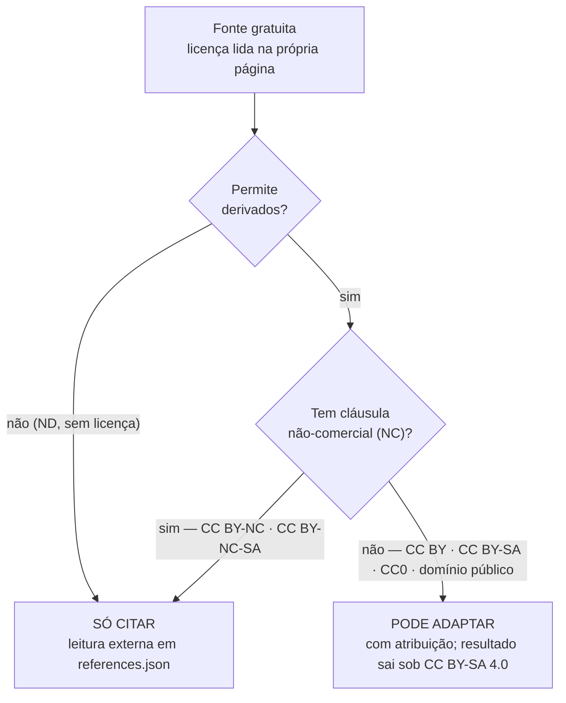

# Padrões de conteúdo didático

Aplica-se a todo `theory.<lang>.md`. Complementa `taxonomy.md` (onde o conteúdo mora) e
`exercise-schema.md` (como a prática é descrita).

## Estrutura mínima obrigatória

1. **Objetivo de aprendizagem** — "ao final, você será capaz de…", observável.
2. **Pré-requisitos** — com link para os nós; se o aluno não os tem, ele deve saber antes de
   gastar tempo.
3. **Intuição** — a ideia antes do formalismo: analogia, caso concreto, visual.
4. **Definição formal** — enunciados precisos, **hipóteses explícitas**, notação declarada.
5. **Exemplos resolvidos** — do típico ao não rotineiro, com o raciocínio visível (por que
   este passo, não só qual passo).
6. **Erros comuns** — o equívoco típico **e a razão** dele acontecer.
7. **Resumo** — o que levar; 3–6 itens.

Seções opcionais: demonstração, aplicações, curiosidade histórica, conexões com outros nós.

## Calibragem por estágio

| Estágio | Linguagem | Formalismo | Exemplo típico |
|---|---|---|---|
| `early-childhood` | Concreta, frases curtas, apoio visual | Nenhum | Contar objetos reais |
| `elementary` | Concreta com vocabulário crescente | Regras, sem demonstração | Situações do cotidiano |
| `middle-school` | Ponte concreto → abstrato | Justificativa informal | Generalização de padrão |
| `high-school` | Abstrata com apoio concreto | Enunciados precisos; demonstrações simples | Problema aplicado |
| `undergraduate` | Técnica | Rigor pleno; demonstrações | Caso-limite, contraexemplo |
| `graduate` / `research` | Técnica e concisa | Rigor pleno; referência à literatura | Generalizações, condições fracas |

Simplificar é permitido; **mentir não é**. Simplificação legítima é sinalizada: "esta é uma
formulação informal; a versão completa aparece em <nó>".

## Notação e formatação

- Matemática em **KaTeX**: `$…$` (inline) e `$$…$$` (display). Nada de imagem de fórmula.
- Toda equação em **display** tem descrição textual próxima (acessibilidade — ver
  `accessibility.md`).
- Declare a notação não óbvia na primeira ocorrência (intervalos, conjuntos, `log`,
  vetores).
- Um conceito por parágrafo; parágrafos curtos.
- Tabelas para comparações e casos; listas para procedimentos.
- Títulos em `##`/`###`, na mesma ordem nos dois idiomas.

## Qualidade

- **Correção antes de tudo**: hipóteses completas, casos-limite mencionados. Resultado não
  trivial passa por `/math-verify` (lição L-002).
- **Sem plágio**: conteúdo autoral. Ao adaptar material licenciado, atribuir e respeitar a
  licença (inclusive share-alike).
- **Fontes gratuitas** em `references.json`, com autor, ano, URL, idioma e licença — e
  compatíveis com a nossa licença (ver seção abaixo).
- **Um exemplo bem explicado vale mais que cinco rasos.**
- Evitar contexto culturalmente restrito ou que exija conhecimento externo à matemática.

## Licença e compatibilidade de fontes

O conteúdo de `content/` é publicado sob **CC BY-SA 4.0** (`ADR-0005`, `LICENSE-CONTENT`).
Isso decide, antes de qualquer julgamento didático, o que pode entrar no texto:

**Leitura.** Duas perguntas separam "posso adaptar" de "só posso citar". Material **NC é
mais restritivo que a nossa licença**: absorvê-lo obrigaria o nó inteiro a virar NC, o que
contradiz o que declaramos — por isso NC é leitura, nunca matéria-prima. O diagrama **não**
trata de direito de imagem, marcas, nem da checagem prévia de gratuidade e de licença legível
sem JavaScript (lição `L-007`); e **domínio público é territorial** — o prazo no Brasil não
coincide com o dos EUA e a etiqueta de agregadores erra com frequência, então confirme a
situação nas duas jurisdições antes de adaptar. Fontes: `ADR-0005`, `AGENTS.md` §9.6–9.7.
Estado atual desde 2026-08-01.

Regra prática: **"NC = leitura, não matéria-prima"**. Citar uma fonte NC é sempre legítimo —
link, autor, ano, idioma e licença em `references.json`. O que não se pode é copiar ou
traduzir trecho, exemplo, figura, enunciado ou sequência didática dela para dentro de
`theory.<lang>.md` ou `exercises.json`. Hoje **todas** as referências do nó piloto
(`high-school/algebra/quadratic-equations`) são tratadas como CC BY-NC-SA: OpenStax (2 itens)
e *Livro Aberto de Matemática* — logo, todas são apenas leitura externa. No caso do *Livro
Aberto*, a declaração é divergente (página do projeto: BY-NC-SA; colofão do PDF: BY-SA) e
vale a leitura mais restritiva até que se esclareça — ver a nota no `ADR-0005`.

Ao adaptar fonte compatível (CC BY, CC BY-SA, CC0, domínio público), a atribuição traz título,
autoria, URL, licença com link e o que foi alterado — modelos em `LICENSE-CONTENT`.

## Checklist antes de marcar `published`

- [ ] As sete seções obrigatórias existem nos dois idiomas
- [ ] `theory.pt-BR.md` e `theory.en-US.md` equivalentes (mesmas seções e exemplos)
- [ ] Toda equação em display tem descrição textual
- [ ] Hipóteses explícitas; casos-limite tratados
- [ ] Resultados não triviais verificados (`/math-verify`)
- [ ] Exercícios cobrem todas as `skills[]` declaradas
- [ ] Referências gratuitas, com licença
- [ ] Nenhum trecho de fonte **NC** (CC BY-NC / CC BY-NC-SA) incorporado ou traduzido no texto
      — fonte NC só como leitura externa (`ADR-0005`)
- [ ] `scripts/audit-content.sh` sem erro
- [ ] Revisado por `math-reviewer` e `i18n-steward`
