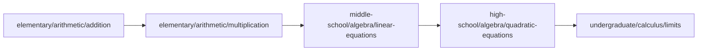

# Taxonomia do conteúdo

Endereço canônico de todo conteúdo (ADR-0001):

```
content/<stage>/<area>/<topic>/[<subtopic>/]
```

Slugs en-US kebab-case, **estáveis** — fazem parte da URL pública (lição L-003). Renomear
exige ADR + redirect permanente.

## Estágios (`stage`)

| Slug | pt-BR | Equivalência aproximada | Faixa típica |
|---|---|---|---|
| `early-childhood` | Educação infantil | Pre-K / Kindergarten | 3–5 anos |
| `elementary` | Ensino fundamental — anos iniciais | Elementary (1st–5th) | 6–10 anos |
| `middle-school` | Ensino fundamental — anos finais | Middle school (6th–9th) | 11–14 anos |
| `high-school` | Ensino médio | High school | 15–17 anos |
| `undergraduate` | Ensino superior | Undergraduate | graduação |
| `graduate` | Pós-graduação | Graduate | mestrado/doutorado |
| `research` | Pesquisa | Research | fronteira/consulta |

O mapeamento é **orientativo**, não normativo: o que define o estágio de um nó é o
pré-requisito cognitivo real, não a série escolar. Quando um assunto aparece em mais de um
estágio, cria-se um nó por estágio com **abordagem distinta** e referência cruzada — nunca
cópia (ADR-0001).

## Áreas (`area`) — lista canônica

| Slug | pt-BR | Observação |
|---|---|---|
| `arithmetic` | Aritmética | Contagem, operações, frações, decimais, porcentagem |
| `algebra` | Álgebra | Expressões, equações, funções, polinômios |
| `geometry` | Geometria | Plana, espacial, analítica |
| `trigonometry` | Trigonometria | Razões, identidades, funções trigonométricas |
| `precalculus` | Pré-cálculo | Funções, limites informais, sequências |
| `calculus` | Cálculo | Limites, derivadas, integrais, séries, multivariável |
| `linear-algebra` | Álgebra linear | Vetores, matrizes, espaços, autovalores |
| `analysis` | Análise | Real, complexa, funcional |
| `abstract-algebra` | Álgebra abstrata | Grupos, anéis, corpos |
| `topology` | Topologia | Geral, métrica, algébrica |
| `probability` | Probabilidade | Espaços, variáveis aleatórias, distribuições |
| `statistics` | Estatística | Descritiva, inferência, regressão |
| `discrete-math` | Matemática discreta | Combinatória, grafos, recorrências |
| `number-theory` | Teoria dos números | Divisibilidade, congruências, primos |
| `logic-foundations` | Lógica e fundamentos | Lógica, conjuntos, demonstração |
| `differential-equations` | Equações diferenciais | EDO, EDP, sistemas |
| `numerical-methods` | Métodos numéricos | Aproximação, erro, algoritmos |
| `optimization` | Otimização | Linear, não linear, convexa |

**Critério para incluir uma área nova:** só quando existirem ao menos 3 tópicos que não
caibam honestamente em nenhuma área existente, e mediante ADR. Preferir subtópico a área nova.

## Contrato do `meta.json`

```json
{
  "id": "high-school/algebra/quadratic-equations",
  "stage": "high-school",
  "area": "algebra",
  "title":   { "pt-BR": "Equações do segundo grau", "en-US": "Quadratic equations" },
  "summary": { "pt-BR": "…", "en-US": "…" },
  "prerequisites": ["middle-school/algebra/linear-equations"],
  "difficulty": 3,
  "estimatedMinutes": 45,
  "tags": ["equations", "polynomials"],
  "skills": ["solve-quadratic", "interpret-discriminant"],
  "status": "draft",
  "languages": ["pt-BR", "en-US"],
  "updatedAt": "2026-08-01"
}
```

| Campo | Regra |
|---|---|
| `id` | Igual ao caminho relativo dentro de `content/`. Imutável. |
| `prerequisites` | IDs existentes, dificuldade ≤ à deste nó, **grafo acíclico**. |
| `difficulty` | 1–5, **relativo ao estágio** (um `5` de `elementary` não é um `5` de `graduate`). |
| `skills` | Habilidades verificáveis; são a chave do diagnóstico e das recomendações. |
| `status` | `draft` (padrão) → `review` → `published`. Só publica com os dois idiomas completos. |
| `languages` | Deve refletir os arquivos realmente presentes. |
| `updatedAt` | Data absoluta `AAAA-MM-DD`. |

## Estrutura de um nó

```
content/<stage>/<area>/<topic>/[<subtopic>/]
├── meta.json          # obrigatório
├── theory.pt-BR.md    # obrigatório
├── theory.en-US.md    # obrigatório
├── exercises.json     # obrigatório para publicar
├── assessments.json   # opcional (avaliação somativa)
├── references.json    # obrigatório para publicar
└── assets/            # opcional
```

Trilhas ficam fora da hierarquia, em `content/paths/<slug>.json` (ver `/learning-path`).

## Grafo de pré-requisitos



Exemplo ilustrativo da progressão esperada. `scripts/audit-content.sh` verifica que todo
`prerequisites` aponta para um nó existente e que não há ciclo.

## Antipadrões

| Antipadrão | Por quê | Faça em vez disso |
|---|---|---|
| Slug com `part-1`, `v2`, `new` | Envelhece e quebra URL | Slug descritivo do assunto |
| Copiar um nó para outro estágio | Duplicação divergente | Nó novo com abordagem própria + referência cruzada |
| Encher `prerequisites` "por segurança" | Bloqueia o aluno sem necessidade | Só o que é realmente necessário |
| Área nova para um único tópico | Fragmenta a navegação | Subtópico dentro de área existente |
| Publicar com um idioma | Viola ADR-0002 | Manter `draft` até a paridade |
