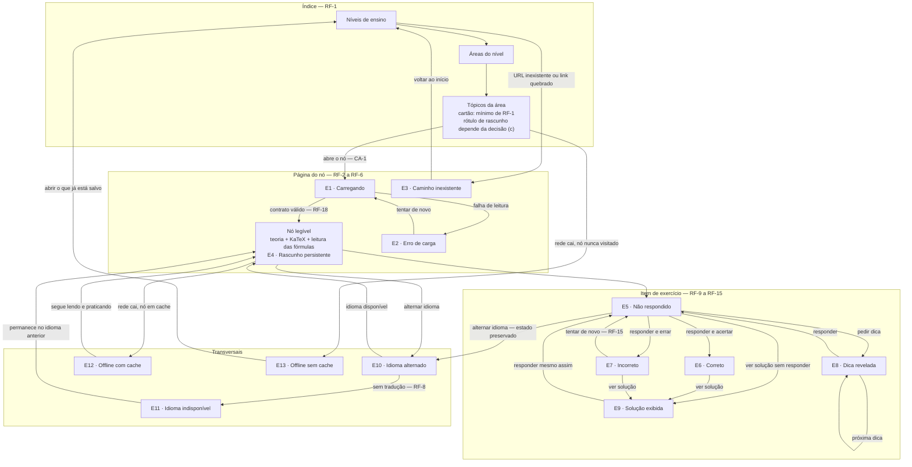

# Estados de tela e fluxo — Fatia mínima de aprendizagem

- **Spec:** [`docs/specs/minimum-learning-slice/spec.md`](../../specs/minimum-learning-slice/spec.md) (`approved`)
- **Plano:** [`plan.md`](../../specs/minimum-learning-slice/plan.md)
- **Ticket:** `TCK-0013` · **Autor:** `ui-ux-designer` · **Data:** 2026-08-01
- **Nó de referência:** `content/high-school/algebra/quadratic-equations/`
- **Status:** proposta de desenho — **nada disto está implementado**

## 1. O que este documento decide e o que não decide

**Decide:** o que aparece em cada um dos 13 estados da tabela de estados da spec, com que
palavras nos dois idiomas, em que ordem o teclado percorre a tela, qual elemento recebe foco
ao entrar no estado e o que é anunciado a quem usa leitor de tela quando o estado muda sem
navegação.

**Não decide** (e nenhuma frase aqui deve ser lida como decisão):

- framework, biblioteca de UI, componente concreto, ferramenta de build, de teste ou de
  service worker — `ADR-0003` decidiu *site estático orientado a conteúdo com ilhas de
  interatividade* e deixou tudo abaixo disso para os tickets de implementação;
- as três decisões humanas herdadas da spec (§12);
- valores de pixel, paleta, tipografia concreta e grade — o desenho fixa **comportamento,
  semântica e texto**, não aparência.

Onde se lê "controle", entenda *elemento interativo com papel, nome acessível e estado
declarados* — botão, rádio, campo. A escolha do elemento concreto é da implementação, desde
que papel, nome e estado sejam os descritos.

### Convenção de origem dos textos

A spec não traz redação de interface: define **quais textos precisam existir**, não como são
escritos. Portanto **todo texto de interface deste documento é proposta**, e a coluna
*Origem* indica o requisito que **obriga a existência** daquele texto. Três textos não são
exigidos por requisito nenhum; estão marcados com **proposta sem requisito** e justificados na
própria linha — o `tech-lead` pode cortá-los sem quebrar nenhum critério de aceite.

Texto **de conteúdo** (enunciado, opções, feedback, dicas, solução, título e resumo do nó) não
é proposta: vem literalmente de `meta.json`, `theory.<lang>.md` e `exercises.json`, na chave do
idioma ativo, sem reescrita.

Chaves e **tokens de interpolação são identificadores em en-US**, iguais nos dois idiomas
(`{n}`, `{total}`, `{title}`, `{value}`); só o texto ao redor muda. Token traduzido é chave
quebrada. As duas frases de um par dizem **a mesma regra**; só variam quando o próprio dado
varia por idioma — o separador decimal citado em `exercise.decimal-hint` e
`exercise.invalid-number` (§7.1, §9), o nome do idioma faltante em `language.unavailable`
(§10.2) e o termo corrente em `network.offline-badge` (§11.1). Variação de exemplo é isso;
**regra diferente em cada idioma é defeito** — foi assim que a assimetria decimal entrou e
precisou ser corrigida.

## 2. Princípios que restringem todos os estados

1. **Teclado primeiro.** Toda ação é alcançável e operável por teclado, com foco visível e
   ordem de foco igual à ordem de leitura (RNF-6). Nada rouba o foco sem ação do aluno.
2. **Resultado nunca só por cor nem só por posição.** Todo resultado, estado e rótulo tem
   texto próprio; cor e ícone são reforço (RNF-6, `docs/content/accessibility.md`).
3. **Sem tempo.** Nenhum estado expira, nenhum contador regressivo, nenhuma animação
   obrigatória. `prefers-reduced-motion` suprime transição de aparecimento de dica, resultado
   e solução — o conteúdo aparece, sem movimento.
4. **Erro é informação.** Feedback não punitivo, sem pontuação, streak, ranking, comparação,
   badge, som ou confete (RNF-10).
5. **Nada é coletado.** Nenhum estado tem conta, login, e-mail, identificador, cookie de
   rastreio ou requisição com resposta do aluno (RNF-7, RF-16). O estado do exercício vive em
   memória de sessão e morre **com a sessão** — nada é persistido entre visitas. Dentro da
   mesma sessão ele **sobrevive à alternância de idioma**, que é obrigação de CA-3 e RF-7:
   opção selecionada, valor digitado, dicas reveladas, resultado e solução continuam valendo
   depois da troca (§10.1). "Morrer com a sessão" nunca autoriza descartar o estado numa
   troca de idioma.
6. **Os dois idiomas nascem juntos.** Nenhuma chave de interface existe em um idioma só; falta
   de chave é falha de carga visível, nunca texto no outro idioma (RNF-1, RF-8).
7. **Texto expande.** pt-BR ocupa em média ~20% mais que en-US: nenhum rótulo pode depender de
   largura fixa, nenhum controle trunca com reticências, tudo quebra em mais de uma linha sem
   sobrepor. Alvo de toque ≥ 24×24 px mesmo com o rótulo em duas linhas (WCAG 2.5.8).
8. **Carga cognitiva baixa.** Uma tarefa por vez, instrução curta antes da tarefa, vocabulário
   sem jargão de plataforma ("nó", "renderizar", "payload" não aparecem para o aluno).

## 3. Esqueleto da tela e ordem de foco base

A ordem de foco de todos os estados deriva deste esqueleto; cada estado só descreve o que
acrescenta, remove ou reordena.

Ordem de tabulação da página do nó, do início ao fim do documento:

1. `chrome.skip-to-content` — primeiro elemento focável, visível ao receber foco.
2. `chrome.home` — volta ao início do índice.
3. Trilha de navegação (região de navegação nomeada): `Ensino médio` → `Álgebra` → nó atual
   (o último item é texto, não link).
4. Controle de idioma (§10).
5. `node.skip-to-exercises` — ponto de entrada direto na seção de exercícios.
6. Links dentro da teoria, na ordem do texto.
7. Lista de pré-requisitos, **quando `prerequisites[]` não for vazio** — no nó piloto é vazio,
   então a seção inteira não existe: sem título, sem placeholder, sem espaço reservado (RF-6).
8. Seção de exercícios: itens `qe-001` … `qe-005` na ordem do arquivo (RF-9); dentro de cada
   item, a ordem de §7.

O indicador de rede e o rótulo de rascunho são **texto não focável** — não entram na ordem de
tabulação, mas são lidos na ordem do documento e anunciados por região viva quando mudam.

**Os cinco itens ficam na mesma página, um após o outro.** Não há paginador nem "próximo
exercício": a alternativa (um item por vez) acrescentaria um estado de navegação que a spec
não pede, exigiria gestão de foco entre itens e esconderia do aluno o tamanho da tarefa. Como
efeito colateral desejado, a página de teoria continua sendo um documento legível sem
JavaScript, e a interatividade fica confinada a cada item (RNF-8).

### Regra de anúncio: mover foco **ou** anunciar, nunca os dois

Para **um mesmo evento**, a tela faz uma coisa só:

- **O foco não se move** → o texto novo entra numa região viva e é anunciado.
- **O foco se move** → **não há região viva para aquele evento**. O que precisa ser ouvido
  viaja junto do destino do foco: é o conteúdo do elemento que recebe foco, ou o nome ou a
  descrição acessível dele. Região viva educada é descartada ou embaralhada quando o foco muda
  no mesmo instante — o texto declarado como "anunciado" pode simplesmente nunca ser ouvido.

Três eventos movem o foco dentro da mesma tela: a solução exibida (E9), a nova tentativa (E5
via `exercise.retry`) e o erro na carga inicial (E2). Nenhum dos três usa região viva; todos os
demais eventos de tela mantêm o foco parado e anunciam.

**Navegação não é evento de tela** e nunca usa região viva: o anúncio é o novo documento, com
seu título e seu idioma. Vale para E3, para a alternância de idioma (E10, §10.1) e para E13
quando ele chega por navegação.

### Regiões vivas existentes na tela

Todas com anúncio **educado** (`role="status"` / `aria-live="polite"`). Nenhuma região
assertiva: interromper a leitura do aluno para dizer que ele errou é punitivo e desnecessário.

**Nenhuma região viva envolve a seção, o enunciado, as opções ou a solução.** O escopo de cada
uma é curto e esvaziável, e inclui o texto que precisa ser ouvido naquele evento — a dica
recém-revelada e o `feedback[lang]` da opção escolhida estão **dentro** da região, porque §7.2 e
§7.4 exigem anunciá-los; o corpo do item fica fora. Envolver a seção inteira faria o leitor de
tela despejar enunciado, opções e solução a cada mudança.

| Região | Escopo (o que está dentro dela) | Anuncia |
|---|---|---|
| Rede | Linha de estado da rede, no cabeçalho | Entrada e saída do modo offline (E12) |
| Idioma | Linha de aviso ao lado do controle de idioma | Idioma indisponível (E11) |
| Dicas (uma por item) | Lista de dicas reveladas do item | Dica revelada e fim das dicas (E8) |
| Resultado (uma por item) | Bloco de resultado do item (status + feedback) | Correto (E6) e incorreto (E7) |
| Carga da ilha | Linha de estado da seção de exercícios, esvaziada ao concluir | Carregando os exercícios (E1) |
| Erro de carga | Linha de estado dentro do bloco de erro | Nova falha depois de "tentar de novo" (E2) — vazia na carga inicial |

Sem região viva, por moverem o foco: E9, E5 via `exercise.retry` e E2 na carga inicial
(§7.5, §7.1, §6.2).

## 4. Fluxo `índice → nó → exercício`

**Leitura.** O caminho feliz é uma linha só: níveis → áreas → tópicos → nó → item respondido.
Todos os demais estados são desvios com **saída de volta ao caminho feliz** — nenhum é
terminal e nenhum obriga recarregar a página: erro tem "tentar de novo", caminho inexistente
tem volta ao início, errar devolve ao "não respondido", idioma indisponível devolve ao idioma
anterior e offline sem cache aponta o que já está salvo. Idioma e rede cortam o fluxo em
qualquer ponto porque não são etapas, são condições. O diagrama **não** mostra rotas, arquivos,
componentes, service worker nem o momento de renderização do KaTeX — nada disso está decidido.
Também não mostra persistência: não há (RF-16).

**Fontes.** Tabela de estados, RF-1…RF-18 e CA-1…CA-16 de `spec.md`; ciclo de vida do item em
`spec.md`; `plan.md` (camadas 3 e 4); `content/high-school/algebra/quadratic-equations/`.

**Marcação.** Só as caixas do acervo citadas nas fontes são **estado atual**. Todas as caixas
do diagrama são **proposta** — não existe uma linha de aplicação escrita.

## 5. Índice — tela de apoio (não é um dos 13 estados)

Necessária por RF-1 e CA-1, mas ausente da tabela de estados; descrita aqui só no que o fluxo
exige.

Três listas encadeadas (nível → área → tópico). Cada nível é uma lista de links; a página de
tópicos mostra, por nó, o que RF-1 exige: `title[lang]`, `summary[lang]`, `difficulty` e
`estimatedMinutes`. Ordem de foco: `chrome.skip-to-content` → `chrome.home` → trilha de
navegação → controle de idioma → itens da lista, na ordem exibida. Ao entrar, o foco fica no
início do documento; o título da página (`h1`) é a pergunta da etapa, o que dá contexto sem
exigir navegação extra.

> **Esta lista é o mínimo de RF-1, não o cartão fechado.** Se o rótulo de rascunho também
> aparece no cartão, e sob que forma, é a **decisão adiada (c)** (§12) — não decidida aqui. Em
> C1 o cartão ganha `node.draft-badge`; em C3 o aviso fica uma vez no topo da lista, fora do
> cartão; em C2 o cartão fica como enumerado acima. Nenhuma das três exige texto novo: as
> chaves `node.draft-badge` e `node.draft-note` de §6.4 atendem as três.

| Chave | pt-BR | en-US | Origem |
|---|---|---|---|
| `index.stage-heading` | Escolha um nível de ensino | Choose an educational stage | RF-1 |
| `index.area-heading` | Escolha uma área da matemática | Choose an area of mathematics | RF-1 |
| `index.topic-heading` | Escolha um tópico | Choose a topic | RF-1 |
| `index.difficulty` | Dificuldade {n} de 5 | Difficulty {n} of 5 | RF-1 |
| `index.duration` | {n} minutos | {n} minutes | RF-1 |
| `chrome.skip-to-content` | Ir para o conteúdo | Skip to content | RNF-6 (WCAG 2.4.1) |
| `chrome.home` | Início | Home | Tabela de estados (E3 exige link para o índice) |
| `chrome.breadcrumb-label` | Onde você está | Where you are | RNF-6 (nome da região de navegação) |

Rótulos de taxonomia usados no caminho até o nó piloto — a interface é dona deles porque
`meta.json` guarda só o slug:

| Chave | pt-BR | en-US | Origem |
|---|---|---|---|
| `stage.high-school` | Ensino médio | High school | RF-1, RF-4, CA-1 |
| `area.algebra` | Álgebra | Algebra | RF-1, RF-4, CA-1 |

Chave de taxonomia ausente **falha a carga de forma visível** (mesmo tratamento de RF-18) e
nunca cai para o slug cru nem para o outro idioma. Os demais níveis e áreas da taxonomia estão
fora desta fatia.

## 6. Estados do contexto **Nó**

### 6.1 · Nó → Carregando (E1)

> *Comportamento exigido pela spec:* indicação acessível de carregamento
> (`aria-busy`/`role=status`), sem salto de layout ao concluir.

**Estrutura.** A página do nó é um documento: teoria, metadados e enunciados chegam prontos, e
o carregamento do documento é do navegador — não há estado próprio para ele, e é isso que
mantém a teoria legível em rede lenta (RNF-8). O estado E1 cobre **a seção de exercícios**
enquanto a parte interativa não está pronta: no lugar dos controles aparece uma linha de
estado com o texto `node.loading`, e a seção reserva **a mesma altura** que terá depois, para
que nada salte quando terminar.

A linha de estado é o **único** elemento vivo, e ela fica **fora** do lugar onde o conteúdo
será inserido. A seção inteira não é região viva: se fosse, concluir a carga despejaria
enunciado e opções dos cinco itens na fila de fala do leitor de tela — o mesmo despejo que
§11.2 recusa. A marca de "ocupado" fica na seção, para que a tecnologia assistiva saiba que
aquilo ainda está mudando, mas o que é **falado** é só a linha de estado.

| Chave | pt-BR | en-US | Origem |
|---|---|---|---|
| `node.loading` | Carregando os exercícios… | Loading the exercises… | Tabela de estados (Nó · Carregando) |

**Foco.** Nenhum foco é movido. Ao entrar na página, o foco está no início do documento, como
em qualquer navegação. Enquanto E1 dura, a seção de exercícios não contém elemento focável —
tabular por ela não prende ninguém; ao concluir, os controles entram **depois** do ponto onde o
foco estiver, então nenhuma posição de tabulação já percorrida muda de sentido.

**Região viva.** A linha de estado anuncia `node.loading` ao entrar em E1. Ao concluir, ela é
**esvaziada** e os itens são inseridos fora dela: nada é falado no fim — nem "pronto", que
seria ruído, nem o conteúdo inteiro, que seria despejo. Quem usa leitor de tela ouve
"carregando os exercícios" uma vez e, quando quiser, encontra os itens navegando por títulos,
onde eles estavam prometidos. Esvaziar a linha também impede que "carregando" continue na tela
depois de pronto.

### 6.2 · Nó → Erro de carga (E2)

> *Comportamento exigido:* mensagem no idioma ativo, motivo distinguível (não encontrado ×
> falha de leitura) e ação de tentar de novo.

**Estrutura.** O bloco de erro substitui **apenas** a parte que falhou (teoria ou exercícios),
nunca a página inteira: se a teoria carregou e os exercícios falharam, o aluno continua lendo.
Contém, nesta ordem: título do erro, uma linha dizendo o que falhou, e o controle
`node.load-error.retry`. O motivo "não encontrado" é o estado E3, tela própria — E2 é
exclusivamente falha de leitura (arquivo ilegível, contrato inválido em RF-18, rede caída
durante a carga), e os dois nunca compartilham texto.

| Chave | pt-BR | en-US | Origem |
|---|---|---|---|
| `node.load-error.title` | Não foi possível carregar esta parte | This part could not be loaded | Tabela de estados (Nó · Erro de carga) |
| `node.load-error.theory` | A teoria deste tópico não pôde ser lida. | The theory for this topic could not be read. | idem (motivo distinguível) |
| `node.load-error.exercises` | Os exercícios deste tópico não puderam ser lidos. | The exercises for this topic could not be read. | idem |
| `node.load-error.retry` | Tentar de novo | Try again | idem (ação de tentar de novo) |

**Foco.** Os dois caminhos de entrada em E2 são tratados de forma diferente, e cada um usa
**um** mecanismo de anúncio (§3):

- **Erro na carga inicial** — o foco vai para o **bloco de erro**, que recebe foco
  programático e contém título, motivo e o controle de tentar de novo. O aluno precisa saber
  que a parte esperada não existe sem varrer a tela. Como o foco se move, **não há região
  viva**: o leitor de tela lê o bloco ao recebê-lo, e uma região viva no mesmo instante faria o
  título ser falado duas vezes ou nenhuma.
- **Erro depois de acionar `node.load-error.retry`** — o foco **permanece no controle**, para
  que a ação possa ser repetida com a mesma tecla, e o resultado da tentativa é anunciado pela
  região viva do bloco.

Ordem interna: título (não focável) → texto do motivo (não focável) → `node.load-error.retry`.

**Região viva.** A região viva de E2 é a **linha de estado dentro do bloco**, não o bloco
inteiro — mesma escolha de E1. Na carga inicial ela nasce vazia e nada é anunciado por ela: o
anúncio é o movimento de foco. Depois de uma nova falha vinda de `node.load-error.retry`, ela
recebe o motivo (`node.load-error.theory` ou `node.load-error.exercises`) e o anuncia, com o
foco parado no controle. Educada, nunca assertiva e nunca em diálogo — falha de carga não
justifica prender o foco.

### 6.3 · Nó → Caminho inexistente (E3)

> *Comportamento exigido:* estado "nó não encontrado" com link para o índice; a URL não é
> reescrita silenciosamente.

**Estrutura.** Documento próprio, com a URL pedida preservada na barra de endereço — sem
redirecionamento, sem reescrita, sem tentativa de "adivinhar" o nó parecido. Conteúdo, na
ordem: título, uma linha explicando, e o controle de volta ao início. Não há campo de busca
(fora de escopo) nem lista de sugestões.

| Chave | pt-BR | en-US | Origem |
|---|---|---|---|
| `node.not-found.title` | Não encontramos esta página | We could not find this page | Tabela de estados (Nó · Caminho inexistente) |
| `node.not-found.body` | O endereço pode ter mudado ou o conteúdo ainda não existe. | The address may have changed, or the content does not exist yet. | idem |
| `node.not-found.back` | Voltar ao início | Back to home | idem (link para o índice) |

**Foco.** Início do documento, como em qualquer navegação. Ordem: `chrome.skip-to-content` →
`chrome.home` → controle de idioma → `node.not-found.back`. O título é o `h1` da página, então
quem usa leitor de tela chega a ele pela navegação por títulos sem tabular.

**Região viva.** Nenhuma: E3 é uma navegação, não uma mudança dentro da tela. O anúncio é o
próprio título do documento.

### 6.4 · Nó → Rascunho (E4)

> *Comportamento exigido:* rótulo persistente de `draft` enquanto `meta.json.status !=
> "published"`. O nó piloto está `draft` (CA-16).

**Estrutura.** Rótulo de texto imediatamente **depois do título do nó** e antes dos metadados,
dentro do mesmo bloco de cabeçalho — posição fixa, presente em toda a sessão, sem botão de
fechar e sem virar aviso flutuante. É texto com contorno próprio, não apenas uma cor de fundo,
e não é focável.

**Como CA-16 se lê.** "Visível nos dois idiomas" significa que o rótulo **existe** em pt-BR e
en-US e é exibido no idioma ativo — não que os dois textos apareçam juntos na mesma tela, o que
violaria RF-7 ("idiomas nunca se misturam"). Em pt-BR aparece só a coluna pt-BR; ao alternar
para en-US, só a en-US.

| Chave | pt-BR | en-US | Origem |
|---|---|---|---|
| `node.draft-badge` | Rascunho | Draft | RF-5, CA-16 |
| `node.draft-note` | Este conteúdo ainda está em revisão. | This content is still under review. | RF-5 (o rótulo sozinho não diz ao aluno o que significa "rascunho") |
| `node.draft-title-prefix` | [Rascunho] {title} | [Draft] {title} | **proposta sem requisito** — leva o aviso ao título do documento (aba, histórico, favorito); descartável sem quebrar CA-16 |

**Metadados do nó (RF-4).** Exibidos logo abaixo do rótulo, como pares rótulo/valor:

| Chave | pt-BR | en-US | Origem |
|---|---|---|---|
| `node.meta.stage` | Nível de ensino | Educational stage | RF-4 |
| `node.meta.area` | Área | Area | RF-4 |
| `node.meta.difficulty` | Dificuldade | Difficulty | RF-4 |
| `node.meta.difficulty-value` | {n} de 5 | {n} of 5 | RF-4 (dificuldade não pode ser só cor ou estrela) |
| `node.meta.duration` | Tempo estimado | Estimated time | RF-4 |
| `node.meta.duration-value` | {n} minutos | {n} minutes | RF-4 |
| `node.meta.tags` | Etiquetas | Tags | RF-4 |
| `node.meta.skills` | Habilidades | Skills | RF-4 |
| `node.skip-to-exercises` | Ir para os exercícios | Go to the exercises | **proposta sem requisito** — evita que quem usa teclado atravesse a teoria inteira para praticar; descartável |

`tags[]` e `skills[]` chegam do acervo como slugs em en-US, **sem tradução** — exibi-los crus
quebraria RF-4 em pt-BR. Até que exista um registro de habilidades no acervo, a interface é
dona deste catálogo (só os valores do nó piloto; chave ausente falha a carga, não cai para o
slug):

| Chave | pt-BR | en-US |
|---|---|---|
| `tag.equations` | equações | equations |
| `tag.polynomials` | polinômios | polynomials |
| `tag.discriminant` | discriminante | discriminant |
| `skill.identify-quadratic-coefficients` | identificar os coeficientes | identify the coefficients |
| `skill.solve-quadratic` | resolver equações do segundo grau | solve quadratic equations |
| `skill.interpret-discriminant` | interpretar o discriminante | interpret the discriminant |

> **Fronteira a resolver depois:** rótulo de habilidade é conhecimento de currículo, não de
> interface — o lugar natural dele é `content/`. RNF-9 proíbe tocar no acervo nesta fatia,
> então o catálogo fica na interface **como dívida declarada**, e a migração vira ticket de
> conteúdo/schema. Handoff registrado para o `tech-lead`.

**Foco.** E4 não muda foco algum: é rótulo permanente, não evento.

**Região viva.** Nenhuma — o rótulo já está na tela desde a carga e é lido na ordem do
documento, junto ao título.

## 7. Estados do contexto **Exercício**

Estrutura fixa de um item, na ordem do documento e da tabulação:

1. Título do item (`h3`): `exercise.item-heading` + `exercise.item-difficulty`.
2. Enunciado — `stem[lang]` com KaTeX (não focável).
3. Área de resposta:
   - `multiple-choice`: grupo de opções de escolha única, nomeado pelo enunciado; **uma única
     parada de tabulação** para o grupo, setas percorrem as opções; cada opção mostra
     `options[].text[lang]` com KaTeX, e o alvo clicável inclui o texto inteiro, não só o
     círculo.
   - `numeric`: um campo com rótulo `exercise.answer-label` e texto de apoio
     `exercise.decimal-hint` associado ao campo. Sem unidade quando `unit` é nulo ou ausente
     (RF-11) — nenhum sufixo, nenhum espaço reservado.
4. Grupo de ações, sempre nesta ordem: `exercise.submit` → `exercise.hint` →
   `exercise.solution` (e `exercise.retry` no lugar de `exercise.submit` quando E7 estiver
   ativo).
5. Região de dicas (viva) — só existe quando há dica revelada.
6. Região de resultado (viva) — só existe quando há resultado.
7. Bloco da solução — só existe depois de exibida.

A ordem 5–7 mantém os botões parados: revelar dica ou resultado insere conteúdo **abaixo** do
grupo de ações, então nada do que já foi tabulado se desloca.

| Chave | pt-BR | en-US | Origem |
|---|---|---|---|
| `exercise.section-heading` | Exercícios | Exercises | RF-9 |
| `exercise.item-heading` | Exercício {n} de {total} | Exercise {n} of {total} | RF-9 (item endereçável e em ordem) |
| `exercise.item-difficulty` | Dificuldade {n} de 5 | Difficulty {n} of 5 | RF-9 (cada item mostra `difficulty`) |
| `exercise.answer-label` | Sua resposta | Your answer | RF-11, RNF-6 (campo precisa de rótulo) |
| `exercise.decimal-hint` | Use vírgula para decimais — por exemplo, 3,5. | Use a period for decimals — for example, 3.5. | RF-12 |
| `exercise.submit` | Responder | Answer | Tabela de estados (Exercício · Não respondido) |

### 7.1 · Exercício → Não respondido (E5)

> *Comportamento exigido:* enunciado e opções/campo ativos; sem dica, sem solução, sem
> resultado. Ação de responder desabilitada até haver seleção/valor.

**Estrutura.** Só os itens 1–4 da estrutura acima. Nada de `solution` no documento — nem
oculto por CSS, nem em atributo, nem em comentário (CA-9): o texto da solução **não existe na
tela** antes de ser pedido.

**"Desabilitada" sem armadilha.** O controle `exercise.submit` fica marcado como
indisponível, mas **continua focável**: quem chega a ele por teclado precisa descobrir por que
não funciona. Ao ser acionado sem seleção ou sem valor, nada é submetido e a região de
resultado anuncia o motivo. Um controle removido da ordem de foco só diria "não estou aqui".

| Chave | pt-BR | en-US | Origem |
|---|---|---|---|
| `exercise.submit-blocked.choice` | Escolha uma opção para responder. | Choose an option to answer. | Tabela de estados (ação desabilitada até haver seleção) |
| `exercise.submit-blocked.number` | Digite um número para responder. | Enter a number to answer. | idem (…até haver valor) |
| `exercise.invalid-number` | Digite o número com vírgula para decimais e sem separador de milhar — por exemplo, 3,5. | Enter the number with a period for decimals and no thousands separator — for example, 3.5. | RF-12 (entrada válida do idioma nunca é rejeitada; a inválida precisa de mensagem associada ao campo) |

As duas frases dizem **a mesma regra**, cada uma com o separador do seu idioma (§9): aceita-se
o separador decimal do idioma ativo e nenhum separador de milhar. Nenhuma das duas ensina a
convenção do outro idioma como se fosse válida aqui.

**Recusar por formato não é errar.** A mensagem é de formato de entrada, associada ao campo: o
item continua em E5, nada é submetido, nenhum resultado é registrado e o aluno não recebe marca
de resposta incorreta. Formatação nunca vira diagnóstico de erro matemático.

**Foco ao entrar.** Estado inicial da página: nenhum foco é movido. Quando E5 é reentrado por
"tentar de novo" (E7) ou por "responder mesmo assim" (E9), o foco vai para a **área de
resposta** — primeira opção do grupo, ou o campo numérico com o valor selecionado para
substituição —, porque a intenção declarada do aluno é mudar a resposta.

**Região viva.** Nenhuma na reentrada: o foco se move, e pela regra de §3 o anúncio não pode
ser duplicado. `exercise.retry-notice` continua sendo dito — mas **viaja com o destino do
foco**, como descrição acessível da área de resposta, e por isso é lido no mesmo instante em
que o grupo de opções (ou o campo) recebe o foco, junto do rótulo e da opção que continua
selecionada. A região de resultado é esvaziada em silêncio: quem usa leitor de tela ouve
"você pode responder de novo" ao chegar onde precisa agir, e não fica achando que o resultado
anterior ainda vale. A descrição deixa de acompanhar a área de resposta assim que o aluno
submete de novo, para não repetir o aviso em toda visita ao campo.

### 7.2 · Exercício → Correto (E6)

> *Comportamento exigido:* marca de acerto não dependente só de cor + `feedback` da opção
> escolhida + acesso à solução; anunciado por região viva.

**Estrutura.** A região de resultado passa a conter, nesta ordem: `exercise.result.correct`,
depois o `feedback[lang]` **da opção escolhida** — inclusive quando ela é a correta (RF-10, CA-5)
— e, no item `numeric`, `exercise.your-answer` com o valor na convenção do idioma (RF-12). A
opção escolhida continua visivelmente marcada como escolhida; nenhuma outra opção ganha marca
de "certa/errada", para não transformar o item em gabarito antes que o aluno pense nas outras.
O grupo de ações mantém `exercise.solution` disponível; `exercise.submit` sai de cena
substituído por nada — responder de novo depois de acertar não é exigido por nenhum requisito.

| Chave | pt-BR | en-US | Origem |
|---|---|---|---|
| `exercise.result.correct` | Correto. | Correct. | Tabela de estados (marca não dependente só de cor) |
| `exercise.your-answer` | Sua resposta: {value} | Your answer: {value} | RF-12 (valor devolvido na convenção do idioma) |

**Foco.** Permanece no controle acionado (`exercise.submit`). Não se move o foco para o
resultado: o aluno acabou de agir, e roubar o foco depois de uma ação previsível desorienta.
O resultado entra logo depois do grupo de ações, então a próxima tabulação já o atravessa na
ordem de leitura.

**Região viva.** Anuncia o bloco inteiro: `exercise.result.correct` + feedback da opção. O
texto de status vem **antes** do feedback para que a primeira palavra ouvida já resolva a
dúvida "acertei?". Cor, ícone e posição são reforço.

### 7.3 · Exercício → Incorreto (E7)

> *Comportamento exigido:* feedback diagnóstico da opção escolhida (ou da resposta numérica),
> opção de tentar de novo, dica seguinte e solução disponíveis.

**Estrutura.** Igual a E6, com três diferenças: o texto de status é `exercise.result.incorrect`;
`exercise.submit` é substituído por `exercise.retry`; e o feedback exibido é o
`options[].feedback[lang]` da opção escolhida (CA-4). No item `numeric` não há feedback por
opção no acervo — mostra-se `exercise.your-answer` com o valor digitado, e o diagnóstico
disponível é a próxima dica e a solução; nenhuma mensagem inventa uma explicação que o dado não
tem.

| Chave | pt-BR | en-US | Origem |
|---|---|---|---|
| `exercise.result.incorrect` | Ainda não está certo. | Not correct yet. | Tabela de estados (resultado não só por cor) + `accessibility.md` (feedback não punitivo) |
| `exercise.retry` | Tentar de novo | Try again | RF-15 |
| `exercise.retry-notice` | Você pode responder de novo. | You can answer again. | RF-15 (a volta a "não respondido" precisa ser perceptível sem ver a tela) |

"Ainda não está certo" diz o resultado sem ambiguidade e sem veredito sobre o aluno; "errado"
e "você errou" foram descartados por serem punitivos com o público infantil, e "quase" foi
descartado por ser falso quando a resposta está longe.

**Nova tentativa (RF-15).** Ao acionar `exercise.retry`: a região de resultado é esvaziada, as
dicas já reveladas permanecem, a solução permanece se já exibida, e a resposta anterior
**continua selecionada ou digitada** — para que o aluno mude o que quiser em vez de recomeçar
do zero. O item volta a E5.

**Foco.** Ao entrar em E7, permanece no controle acionado. Ao acionar `exercise.retry`, vai
para a área de resposta (§7.1).

**Região viva.** Ao entrar em E7 (foco parado): `exercise.result.incorrect` + feedback da opção
escolhida. Na nova tentativa **não há região viva** — o foco se move, e `exercise.retry-notice`
é lido como descrição da área de resposta que recebe o foco (§7.1).

### 7.4 · Exercício → Dica revelada (E8)

> *Comportamento exigido:* dicas visíveis acumuladas na ordem; controle indisponível após a
> última.

**Estrutura.** A região de dicas aparece na primeira revelação, com o título
`exercise.hints-heading` e uma lista numerada; cada pedido acrescenta **a próxima entrada de
`hints[]`**, na ordem do arquivo, sem remover as anteriores (RF-13, CA-8). Nenhuma dica está no
documento antes de pedida. Esgotadas as dicas (duas em todos os itens do nó piloto), o controle
`exercise.hint` fica marcado como indisponível — **sem sair do documento**, porque remover o
elemento que está com o foco faz o foco cair para o corpo da página — e a mensagem
`exercise.hints-exhausted` entra na região de dicas.

| Chave | pt-BR | en-US | Origem |
|---|---|---|---|
| `exercise.hint` | Ver uma dica | Show a hint | RF-13 |
| `exercise.hints-heading` | Dicas | Hints | RF-13 (dicas acumuladas precisam de agrupamento nomeado) |
| `exercise.hints-exhausted` | Esta foi a última dica. | That was the last hint. | RF-13 ("é anunciada como tal") |

**Foco.** Permanece em `exercise.hint`: o aluno costuma pedir a segunda dica logo depois da
primeira, e mover o foco a cada pedido obrigaria a voltar tabulando. A dica entra abaixo do
grupo de ações, sem deslocar o controle.

**Região viva.** Anuncia o texto **da dica recém-revelada** (não a lista inteira novamente) e,
quando for a última, também `exercise.hints-exhausted` — o aluno que não vê a tela precisa
saber que o controle deixou de valer sem ter que voltar até ele para descobrir.

### 7.5 · Exercício → Solução exibida (E9)

> *Comportamento exigido:* passo a passo completo; item marcado como resolvido com apoio.

**Estrutura.** Bloco com título `exercise.solution-heading` (nível `h4`, dentro do item) e o
`solution[lang]` renderizado com KaTeX, incluindo as fórmulas em display. Quando a solução foi
pedida **sem responder** (RF-14), o rótulo `exercise.solved-with-support` aparece junto ao
título do item — texto, sem pontuação e sem penalidade: o item deixa de contar como acerto,
mas nada é subtraído porque não há placar (RNF-10). `exercise.submit` continua disponível, e
responder depois é permitido (o item volta a E5, mantendo a solução visível).

| Chave | pt-BR | en-US | Origem |
|---|---|---|---|
| `exercise.solution` | Ver a solução | Show the solution | RF-14 |
| `exercise.solution-heading` | Solução | Solution | RF-14 |
| `exercise.solved-with-support` | Resolvido com a ajuda da solução | Solved with the solution's help | RF-14 (item marcado como resolvido com apoio) |

**Foco.** Este é o único estado do exercício que **move o foco**: vai para o título do bloco de
solução, porque o aluno pediu explicitamente para ler um texto longo e o passo a passo é o
começo natural da leitura. Sem isso, quem usa leitor de tela teria de tabular até o fim do item
para achar o que pediu.

**Região viva.** Nenhuma. O movimento de foco já faz o anúncio; somar uma região viva faria o
leitor de tela ler a solução duas vezes.

## 8. Regras de apresentação da matemática (valem em todos os estados)

Consequências de RF-2, RF-3, RNF-2 e `docs/content/accessibility.md` que o desenho fixa:

- **Nenhuma fórmula é imagem**, em nenhum estado — nem em enunciado, nem em opção, nem em dica,
  feedback ou solução. Nenhum `$` ou `$$` cru aparece na tela (CA-2).
- **Fórmula em display vem seguida do seu parágrafo de leitura**, na ordem do arquivo-fonte
  (padrão `*Leitura:* …`), **visível** — não escondido para leitor de tela, porque ele também
  serve a quem lê devagar ou tem dificuldade com notação simbólica (RF-3, `L-012`).
- **Fórmula larga rola na horizontal dentro do seu próprio bloco**, nunca empurrando a página.
  O bloco que rola é alcançável por teclado e tem nome acessível — caixa que rola sem ser
  focável é conteúdo inalcançável sem mouse (WCAG 2.1.1).
- **Zoom de 200% não corta fórmula** nem cria rolagem horizontal do corpo da página.
- Fórmula dentro de opção de escolha múltipla **não vira o alvo clicável sozinha**: o alvo é a
  opção inteira, com ao menos 24×24 px, mesmo quando o texto é curto como `$a = 1$`.

## 9. Convenções numéricas por idioma

A pergunta que esta seção responde, **para cada idioma**: qual caractere é separador decimal,
qual é separador de milhar, e o que acontece com **cada um deles** na entrada. As duas colunas
respondem às mesmas perguntas — assimetria aqui não é estilo, é defeito.

| Pergunta | pt-BR | en-US | Origem |
|---|---|---|---|
| Separador **decimal** do idioma | vírgula — `3,5` | ponto — `3.5` | `docs/content/i18n.md` |
| Separador de **milhar** do idioma | ponto e espaço — `1.000`, `1 000` | vírgula — `1,000` | `docs/content/i18n.md` |
| Entrada com o separador decimal do idioma | **aceita** — `3,5` vale 3,5 | **aceita** — `3.5` vale 3.5 | RF-12, CA-7 |
| Entrada com o separador de milhar do idioma | **recusada** — `3.000` e `3 000` param com `exercise.invalid-number` | **recusada** — `3,000` para com `exercise.invalid-number` | RF-11, RF-12, `i18n.md` |
| Entrada com o separador decimal **do outro** idioma | **recusada** — em pt-BR o ponto já é milhar | **recusada** — em en-US a vírgula já é milhar | idem |
| Entrada com dois ou mais separadores (`1.234,5`, `1,234.5`) | **recusada** | **recusada** | idem |
| Sinal e dígitos | `-` inicial opcional; nenhum outro caractere | idem | RF-11 |
| Valor devolvido na tela | `3,5` | `3.5` | RF-12, `i18n.md` |
| Comparação | diferença absoluta entre a resposta e `answer` menor ou igual a `tolerance`, sempre sobre o número que o aluno escreveu | idem | RF-11 |
| `tolerance: 0` (`qe-003`) | só o valor exato acerta | idem | CA-6 |
| Efeito da recusa | não é resposta incorreta: o item continua em E5 (§7.1) | idem | RF-15 |

**Regra única, sem exceção por idioma.** É aceita a entrada formada por dígitos, um `-` inicial
opcional e **no máximo um** separador — e esse separador tem de ser o **decimal do idioma
ativo**. Qualquer outro caractere de separação (o ponto em pt-BR, a vírgula em en-US, espaço,
apóstrofo) recusa a entrada com `exercise.invalid-number`. O gatilho é inspecionável na própria
string digitada: *qual caractere apareceu e quantas vezes* — nunca "o que o aluno quis dizer".

**Nada é descartado nem convertido em silêncio.** O separador de milhar não é removido para
"salvar" a entrada, e o separador do outro idioma não é reinterpretado como decimal. Os dois
atalhos produzem o mesmo desastre em espelho, e o pior deles é o falso positivo:

| Digitado | Em pt-BR significa | Se o ponto fosse lido como decimal | Efeito |
|---|---|---|---|
| `3.000` | três mil | 3,0 | marcaria **correto** em `qe-003` (`answer: 3`, `tolerance: 0`) |
| `3.500` | três mil e quinhentos | 3,5 | marcaria **correto** em `qe-005` (`answer: 3.5`) |

Marcar como certa uma resposta errada é pior do que recusar o formato: o aluno vai embora sem
saber que errou, e a plataforma existe para o contrário disso. Por isso a recusa vale nos dois
idiomas, e a mensagem sempre mostra o formato esperado em vez de julgar a matemática.

**Alternativa descartada:** aceitar o separador do outro idioma quando ele *não* estiver
seguido de exatamente três dígitos (`3.5` sim, `3.000` não). Reduz a recusa, mas mantém a
adivinhação — `3.500` continua sendo tanto "três e meio" quanto "três mil e quinhentos" — e
troca uma regra que o aluno consegue enunciar ("use vírgula") por uma que ninguém enuncia.

O campo aceita entrada numérica sem forçar teclado exclusivamente numérico: a vírgula precisa
estar disponível em teclado de celular no pt-BR. Sinal negativo é aceito, embora nenhum item do
nó piloto precise dele.

## 10. Estados do contexto **Idioma**

O controle de idioma fica no cabeçalho, na mesma posição em todas as telas, com nome acessível
`language.label` no idioma ativo. As duas opções são escritas **cada uma no próprio idioma** —
"Português (Brasil)" e "English" — marcadas com o respectivo idioma para que o leitor de tela
troque de pronúncia. Isso não fere RF-7: nome de idioma na própria língua é a única forma de
ser reconhecível por quem ainda não lê o idioma ativo, e não é conteúdo.

| Chave | pt-BR | en-US | Origem |
|---|---|---|---|
| `language.label` | Idioma | Language | RF-7 (o alternador precisa de nome acessível) |
| `language.option.pt-BR` | Português (Brasil) | Português (Brasil) | RF-7 |
| `language.option.en-US` | English | English | RF-7 |

### 10.1 · Idioma → Alternado (E10)

> *Comportamento exigido:* mesmo nó, mesma posição, estado do exercício preservado, todo o
> texto no novo idioma.

**A forma da URL está decidida pelo usuário** no `TCK-0011`, e o registro formal é o
`ADR-0007`, hoje **`proposed`** (aceite pendente): **prefixo de idioma em minúsculas no
caminho** — `/pt-br/high-school/algebra/quadratic-equations` e, pela mesma regra, `/en-us/…`.
Se o ADR for aceito com outra forma, esta seção, §11.2, §12(b) e o risco 1 de §14 caem juntos. O caminho da taxonomia continua idêntico ao do repositório (RF-17,
RNF-5), e o identificador do idioma no dado e nos campos localizados continua `pt-BR` / `en-US`
— minúsculo é a grafia **da URL**, não do dado. Consequência para este estado: **alternar
idioma é navegar**, e é assim que E10 está desenhado abaixo.

**Estrutura.** Depois de alternar: mesmo nó, idioma do documento declarado corretamente, título
do documento no novo idioma, todo o texto de conteúdo e de interface trocado ao mesmo tempo
(RF-7) e **nenhuma mistura**. O que precisa sobreviver **à navegação**, item por item (CA-3):
opção selecionada, valor digitado, dicas já reveladas (mesmo índice), resultado exibido e
solução exibida, se houver. Sobreviver à troca não é persistir: o estado continua sendo de
sessão, sem identificador e sem envio a servidor (RF-16, RNF-7), e desaparece quando a sessão
termina.

**Posição de leitura.** "Mesma posição aproximada" é ancorada no **último título percorrido**,
não em pixels: depois da troca, a página abre no título equivalente do outro idioma. Contagem
de rolagem em pixels não serve, porque o texto muda de tamanho entre idiomas.

**Foco.** Vai para o **controle de idioma** da tela nova. É o único ponto que garante três
coisas ao mesmo tempo: o aluno não perde a posição na ordem de tabulação, consegue desfazer a
troca com uma ação, e não é jogado ao topo do documento.

**Região viva.** Nenhuma. Com prefixo de idioma no caminho, alternar é navegar: o anúncio é o
**título do novo documento**, lido com o idioma correto declarado. Somar uma região viva a uma
navegação repetiria a informação — e o foco já se move (para o controle de idioma), o que pela
regra de §3 exclui o anúncio ao vivo. Nenhuma chave de texto é necessária para esta troca;
a chave `language.switched`, que existiria só na hipótese de troca sem navegação, foi
**descartada** com a decisão (b).

### 10.2 · Idioma → Indisponível (E11)

> *Comportamento exigido:* aviso explícito de que o objeto não existe naquele idioma, com
> retorno ao idioma anterior — nunca fallback silencioso.

**Estrutura.** A tela **não muda de idioma**: continua inteira no idioma anterior, com o mesmo
nó e o mesmo estado de exercício. Junto ao controle de idioma aparece um aviso persistente até
a próxima ação, e a opção indisponível fica marcada como **estado acessível do próprio
controle** (indisponível, à maneira de `exercise.submit` em §7.1) — sem texto novo: o que
explica a marcação é o aviso ao lado, e duplicá-lo dentro da lista de idiomas só faria o leitor
de tela repetir a frase a cada opção. Nenhum texto do idioma faltante é exibido no lugar
(RF-8, CA-14); se o que falta é apenas uma chave de campo (por exemplo, `title` sem `en-US`), o
objeto inteiro é tratado como indisponível naquele idioma, não parcialmente traduzido.

| Chave | pt-BR | en-US | Origem |
|---|---|---|---|
| `language.unavailable` | Este conteúdo ainda não existe em inglês (English). | This content is not available in Portuguese (Português) yet. | RF-8, CA-14, tabela de estados |
| `language.unavailable.stay` | Você continua lendo em português. | You are still reading in English. | idem ("com retorno ao idioma anterior") |

Note a inversão proposital: em cada coluna, o aviso fala do idioma **que falta** e do idioma
**que permanece**. O aviso é escrito no idioma que **permanece ativo** — o único que sabemos
que o aluno está lendo, e o único compatível com RF-7 ("idiomas nunca se misturam"). Para que
quem pediu o outro idioma reconheça o aviso, o **nome do idioma faltante aparece também na
própria língua**, entre parênteses e marcado com o idioma correspondente, como já acontece em
`language.option.*` — assim o leitor de tela troca de pronúncia nessas duas palavras e a frase
continua íntegra no idioma da tela.

**Foco.** Permanece no controle de idioma, que continua marcando o idioma antigo como ativo.
Nada é movido: a tela não trocou.

**Região viva.** Anuncia `language.unavailable` seguido de `language.unavailable.stay`. Este é
o caso em que o silêncio é pior: sem anúncio, quem usa leitor de tela concluiria que a troca
funcionou e que o conteúdo lido a seguir está no idioma pedido.

## 11. Estados do contexto **Rede**

O indicador de rede é texto no cabeçalho, presente **apenas** quando há algo a dizer. Nunca é
um diálogo, nunca prende o foco, nunca bloqueia a leitura.

### 11.1 · Rede → Offline com cache (E12)

> *Comportamento exigido:* conteúdo visitado abre normalmente, com indicador de modo offline.

**Estrutura.** Tudo funciona: teoria, exercícios, dicas, solução e alternância entre idiomas já
visitados. No cabeçalho entra `network.offline-badge`, com a explicação `network.offline-notice`
associada. Links para nós ainda não visitados continuam visíveis e clicáveis; quem os aciona
cai em E13 — esconder link por causa da rede tiraria do aluno a informação de que aquele
conteúdo existe.

| Chave | pt-BR | en-US | Origem |
|---|---|---|---|
| `network.offline-badge` | Sem internet | Offline | Tabela de estados (indicador de modo offline), CA-10 — pt-BR em linguagem clara para o público infantil (`accessibility.md`), en-US mantém o termo corrente |
| `network.offline-notice` | Você está sem internet. O que você já abriu continua disponível. | You are offline. What you already opened is still available. | idem (indicador precisa de texto, não só ícone) |
| `network.online-notice` | Você está online de novo. | You are back online. | **proposta sem requisito** — indicador que aparece anunciado e some em silêncio deixa informação velha na tela; descartável |

**Foco.** Não muda. Perda de rede não é ação do aluno; mover o foco por causa dela
interromperia leitura ou digitação — inclusive no meio de uma resposta.

**Região viva.** Anuncia `network.offline-notice` ao entrar em offline e
`network.online-notice` ao voltar. Educado, uma vez por transição, sem repetir enquanto o
estado durar.

### 11.2 · Rede → Offline sem cache (E13)

> *Comportamento exigido:* estado explícito "não disponível offline" e sugestão do que já está
> disponível.

**Estrutura.** Substitui o conteúdo pedido — nunca uma tela em branco e nunca o erro genérico
de E2, que diria a coisa errada. Contém, nesta ordem: título, explicação, e a sugestão do que
está salvo. A sugestão é a lista do que **já está no cache do próprio aparelho**; ela vem do
inventário do cache, não de histórico de navegação, não de identificador e não de servidor
(RNF-7). Se o inventário estiver vazio ou indisponível, no lugar da lista aparece
`network.offline-uncached.nothing`.

| Chave | pt-BR | en-US | Origem |
|---|---|---|---|
| `network.offline-uncached.title` | Não disponível offline | Not available offline | Tabela de estados, RNF-3, CA-11 |
| `network.offline-uncached.body` | Você está sem internet e esta parte ainda não foi salva no seu aparelho. | You are offline and this part has not been saved on your device yet. | idem |
| `network.offline-uncached.suggestion` | O que já está salvo: | Already saved: | idem ("sugestão do que já está disponível") |
| `network.offline-uncached.nothing` | Quando você voltar a ter internet, esta página abre normalmente. | When you are back online, this page will open normally. | idem (a sugestão pode ser vazia) |

**Idioma nunca visitado, estando offline (CA-11).** É este estado, não E11: o objeto existe no
idioma pedido, mas não está no aparelho. Como alternar idioma é navegar (§10.1, decisão (b)),
o pedido do outro idioma vira uma navegação que a camada offline responde com este estado —
não com uma troca parcial da tela. O aviso é `network.offline-uncached.*` e **em nenhuma
hipótese** o texto do outro idioma é exibido no lugar. Distinguir os dois casos é obrigatório:
"não existe tradução" (E11) e "existe mas não foi baixada" (E13) levam o aluno a ações
diferentes — e o segundo caso deixa de valer assim que a rede volta.

**Foco.** Quando E13 chega por navegação — link para nó não cacheado ou pedido de idioma não
cacheado —, o foco fica no início do documento e o título do estado é o `h1`; não há região
viva, porque o anúncio é o próprio documento. Quando E13 substitui só uma parte da tela já
aberta (a seção de exercícios que não estava no cache), o foco **permanece no controle
acionado** e o bloco é anunciado pela região viva.

**Região viva.** Existe apenas no segundo caso, e anuncia título + explicação. A lista do que
está salvo nunca é anunciada — é conteúdo navegável, e lê-la em voz alta seria despejo de
informação.

## 12. Decisões humanas — uma fechada, duas abertas

Uma das três foi decidida pelo usuário e está registrada como decisão, não como alternativa;
as outras duas continuam abertas e **não** são decididas aqui. Cada uma das abertas está
desenhada nas suas alternativas, com o custo **para o aluno**, para que o `tech-lead` leve ao
usuário.

### (a) Exibir o nó com `status: "draft"`?

| Alternativa | Como fica na tela | Custo para o aluno |
|---|---|---|
| **A1 — Exibir com rótulo** (é o que RF-5 e CA-16 assumem) | E4 como desenhado: rótulo permanente junto ao título | Lê conteúdo ainda em revisão, sabendo disso. É a única alternativa em que a fatia tem o que mostrar: o nó piloto é o único nó do acervo. |
| **A2 — Esconder do índice, alcançável só por URL** | Índice vazio; o nó abre se a URL for digitada | O aluno não chega ao conteúdo navegando — contradiz RF-1 e CA-1 como estão escritos; adotar A2 exige emenda na spec. |
| **A3 — Exibir com confirmação antes de entrar** | Tela intermediária "este conteúdo está em revisão, continuar?" | Um passo a mais entre querer estudar e estudar, com uma decisão que a criança não tem como avaliar; acrescenta uma tela e duas strings fora da spec. |

### (b) Forma da URL bilíngue — **DECIDIDA** (usuário, `TCK-0011`; registro em `ADR-0007`, `proposed`)

**Prefixo de idioma em minúsculas no caminho:**
`/pt-br/high-school/algebra/quadratic-equations`, e pela mesma regra `/en-us/…`. O caminho da
taxonomia continua idêntico ao do repositório (RF-17, RNF-5); o identificador do idioma no dado
e nos campos localizados continua `pt-BR` / `en-US`.

Efeito no desenho, já aplicado: **alternar idioma é navegar** (§10.1). O anúncio da troca é o
título do novo documento, não uma região viva; a chave `language.switched` foi descartada; e a
exigência de CA-3 passa a ser "o estado do exercício sobrevive a uma navegação", sem virar
persistência nem identificador (§14, risco 1). As alternativas por parâmetro, domínio e caminho
neutro deixam de estar em avaliação.

### (c) Rótulo de rascunho também no índice?

| Alternativa | Como fica na tela | Custo para o aluno |
|---|---|---|
| **C1 — Rótulo por nó, no índice e na página** | Cada cartão do índice carrega `node.draft-badge` | O aluno sabe antes de clicar; hoje, com um nó só, o rótulo aparece em 100% dos cartões e vira ruído constante. |
| **C2 — Só na página do nó** | Índice limpo; rótulo aparece ao abrir | Índice mais leve; o aluno descobre depois de investir a navegação. Com o acervo crescendo, é a alternativa que menos polui. |
| **C3 — Aviso único no topo do índice** | Uma frase para a coleção inteira, sem rótulo por cartão | Menor ruído hoje e mesma informação; deixa de funcionar assim que existirem nós `published` e `draft` lado a lado, quando o aviso passa a ser falso para parte da lista. |

Hoje C1 e C3 mostram a mesma coisa ao aluno; divergem no primeiro nó publicado. Nenhuma das
três exige texto novo: as chaves `node.draft-badge` e `node.draft-note` de §6.4 atendem as
três. **Enquanto (c) não for decidida**, o cartão do índice aparece apenas no mínimo que RF-1
obriga, com remissão explícita a esta seção **nos dois lugares em que ele é descrito**: a prosa
de §5 e o rótulo `I3` do diagrama de §4, que é normativo e vem antes dela. A ausência do rótulo
de rascunho nesses dois pontos **não** é escolha de C2.

## 13. Rastreabilidade

| Estado | Nome na spec | Requisitos | Critérios de aceite |
|---|---|---|---|
| E1 | Nó · Carregando | Tabela de estados (indicação acessível de carregamento), RNF-6, RNF-8 | — (sem CA próprio) |
| E2 | Nó · Erro de carga | Tabela de estados (motivo distinguível + tentar de novo), RF-18, RNF-6 | CA-13 (falha visível da validação de contrato, que é um dos motivos de E2) |
| E3 | Nó · Caminho inexistente | RF-17, RNF-5 | — |
| E4 | Nó · Rascunho | RF-4, RF-5, RF-6 | CA-16 |
| E5 | Exercício · Não respondido | RF-9, RF-10, RF-11, RF-12 | CA-9 |
| E6 | Exercício · Correto | RF-10, RF-11, RF-12, RNF-6 | CA-5, CA-7, CA-15 |
| E7 | Exercício · Incorreto | RF-10, RF-15, RNF-6, RNF-10 | CA-4, CA-6 |
| E8 | Exercício · Dica revelada | RF-13 | CA-8 |
| E9 | Exercício · Solução exibida | RF-14 | CA-9 |
| E10 | Idioma · Alternado | RF-7, RNF-1 | CA-3 |
| E11 | Idioma · Indisponível | RF-8, RNF-1 | CA-14 |
| E12 | Rede · Offline com cache | RNF-3 | CA-10 |
| E13 | Rede · Offline sem cache | RNF-3 | CA-11 |
| Todos | — | RNF-7, RF-16 | CA-12 (nenhum estado tem conta, identificador ou envio de resposta) |
| Índice (apoio) | — | RF-1 | CA-1 |
| Teoria | — | RF-2, RF-3, RNF-2 | CA-2 |

## 14. Riscos deste desenho

| Risco | Por que importa | Detecção precoce |
|---|---|---|
| Estado do exercício não sobreviver à troca de idioma | Com a decisão (b) fechada em prefixo de caminho, alternar **é navegar**: o estado precisa atravessar uma navegação sem virar persistência nem identificador (RF-16, RNF-7). É o ponto mais provável de quebra de CA-3 | Testar CA-3 com item respondido, dica revelada e solução exibida ao mesmo tempo; inspecionar o tráfego e o armazenamento no mesmo teste (CA-12) |
| Rótulos de `tags[]` e `skills[]` viverem na interface | É conhecimento de currículo fora de `content/` (§6.4); duplicação e divergência quando o acervo crescer | Ticket de conteúdo/schema para registro de habilidades; enquanto isso, chave ausente falha a carga |
| Dupla leitura da matemática por leitor de tela | Fórmula acessível **e** parágrafo de leitura são lidos em sequência; é intencional, mas pode soar repetitivo | `/a11y-audit` com leitor de tela real; a decisão de remover o parágrafo está proibida por RF-3 |
| "Desabilitado" implementado como controle não focável | Quem usa teclado não descobre por que não consegue responder (§7.1) | `/a11y-audit` e roteiro de teclado do `qa-validator` |
| Anúncio duplicado — ou perdido — quando foco e região viva coincidem | Região viva educada é descartada ou embaralhada se o foco muda no mesmo instante: o texto declarado como anunciado pode nunca ser ouvido. O desenho já caiu nessa armadilha em três estados (E2, E5 via `retry`, E10) antes da revisão | Regra normativa em §3, aplicada estado a estado; os três eventos que movem foco (E9, E5 via `retry`, E2 na carga inicial) não têm região viva, e o texto que precisa ser ouvido viaja com o destino do foco. Verificar com leitor de tela real em `/a11y-audit` |
| Região viva envolvendo conteúdo em vez de uma linha de estado | Ao concluir a carga (E1) ou trocar o bloco (E2), o leitor de tela despejaria enunciados e opções inteiros | §3 fixa o escopo de cada região como um texto curto e esvaziável, com o conteúdo fora dela; conferir na implementação que nenhuma seção inteira é marcada como viva |
| Entrada numérica marcar como certa uma resposta errada | O separador de milhar do idioma ativo lido como decimal (`3.000` → 3,0 em pt-BR) acerta `qe-003` e `qe-005` por acidente; o aluno vai embora sem saber que errou. A regra de §9 existe para isso e vale nos **dois** idiomas | Simular a regra contra `qe-003` e `qe-005` com `3`, `3,5`, `3.5`, `3.000`, `3.500`, `3,000`, `3,500` nos dois idiomas antes de fechar a task 7; nenhuma entrada pode acertar um valor que o aluno não escreveu |
| Confundir E11 com E13 na implementação | "Não existe tradução" e "não foi baixado" pedem ações diferentes do aluno (§11.2) | CA-11 executado offline com idioma nunca visitado |
