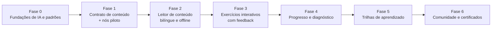

# Roadmap

> Ordem de construção, não cronograma. Cada fase termina com algo utilizável.
> Estado em 2026-08-01: **Fase 0 concluída**; Fase 1 não iniciada.

A ordem é deliberada: **o contrato de conteúdo vem antes da aplicação**, para que a interface
seja construída sobre dados reais em vez de suposições.

## Fase 0 — Fundações (concluída em 2026-08-01)

- Superfície de IA multi-CLI (agents, skills, workflows, tickets, memória).
- Padrões de documentação (C4 + ADR + SDD) e de conteúdo (taxonomia, i18n, exercícios, a11y).
- ADRs 0001, 0002 e 0004 aceitos.

## Fase 1 — Contrato de conteúdo e nós piloto

**Objetivo:** provar o formato com conteúdo real antes de escrever a aplicação.

- Stack e licença **decididas em 2026-08-01**: `ADR-0003` (site estático com ilhas de
  interatividade, progresso local-first em IndexedDB) e `ADR-0005` (conteúdo CC BY-SA 4.0,
  código MIT).
- Criar 3–5 nós piloto **em estágios distintos** (ex.: `elementary/arithmetic/addition`,
  `high-school/algebra/quadratic-equations`, `undergraduate/calculus/limits`), completos e
  bilíngues.
- Validar `meta.json`, `exercises.json` e `references.json` contra a realidade; ajustar os
  schemas se necessário.
- `scripts/audit-content.sh` verde.

## Fase 2 — Leitor de conteúdo

**Objetivo:** ler o acervo em qualquer dispositivo, offline, nos dois idiomas.

- Renderização Markdown + KaTeX com descrição textual das equações.
- Navegação por estágio/área/tópico; busca básica.
- PWA instalável, cache do conteúdo visitado.
- Acessibilidade validada (`/a11y-audit`) e performance (`/pwa-audit`).

## Fase 3 — Exercícios interativos

- Player de exercícios com os tipos do schema, verificação e **feedback diagnóstico**.
- Dicas progressivas e solução passo a passo.
- Histórico local de tentativas, funcionando offline.

## Fase 4 — Progresso e diagnóstico

- Modelo de domínio por habilidade (`learning-analytics`), local-first.
- Estatísticas de acerto/erro, pontos fracos e **recomendação do próximo passo**.
- Detecção de lacuna em pré-requisito.
- ADR de privacidade antes de qualquer sincronização com conta.

## Fase 5 — Trilhas de aprendizado

- Descritores em `content/paths/`, com módulos, marcos e avaliações diagnósticas.
- Caminhos de recuperação quando o aluno erra sistematicamente.
- Retomada do ponto exato.

## Fase 6 — Comunidade e certificados

- Fóruns de discussão por nó (com moderação e proteção de menores — exige ADR próprio).
- Certificados de conclusão de trilha, verificáveis.

## Fora do roadmap por ora

- Aplicativo nativo (o PWA cobre o caso).
- Terceiro idioma (novo ADR).
- Qualquer funcionalidade paga.
