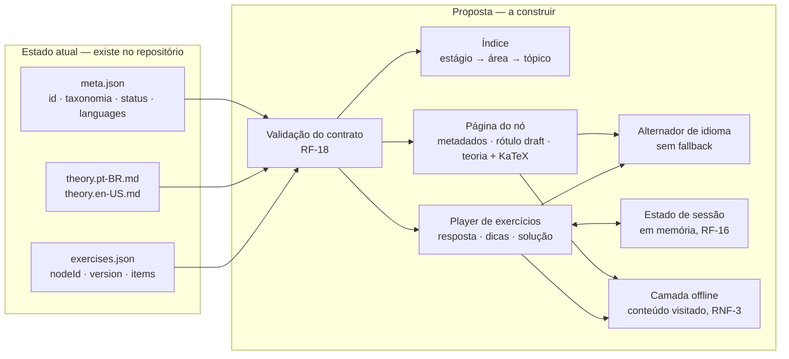

# PLAN — Fatia mínima de aprendizagem

- **Spec:** [`spec.md`](spec.md)
- **Status:** approved
- **Data:** 2026-08-01

## Abordagem escolhida

A fatia é organizada em **quatro camadas de comportamento**, independentes de framework, na
ordem em que o dado atravessa o sistema:

1. **Leitura do acervo.** `content/<stage>/<area>/<topic>/` é a única fonte: `meta.json`
   (identidade, taxonomia, `status`, `languages`, `prerequisites[]`), `theory.<lang>.md`
   (Markdown + LaTeX) e `exercises.json` (`nodeId` + `version` + `items[]`). A aplicação lê o
   acervo como está — RNF-9; nada em `content/` muda por causa desta fatia.
2. **Validação do contrato.** Antes de qualquer objeto chegar à tela, RF-18 é aplicado:
   exatamente uma opção `correct: true` por item `multiple-choice`; `answer` numérico e
   `tolerance` não negativa em item `numeric`; toda chave localizada com `pt-BR` **e** `en-US`;
   `nodeId` igual ao caminho do nó. Violação falha de forma visível e registrada, e o objeto
   inválido não é apresentado (CA-13, CA-14).
3. **Apresentação.** Índice `estágio → área → tópico`, página do nó com metadados, rótulo de
   rascunho (RF-5), teoria com LaTeX renderizado e parágrafos de leitura preservados (RF-2,
   RF-3), e a URL contendo o caminho da taxonomia intacto (RF-17, RNF-5).
4. **Interação.** Player de exercícios com seleção única ou entrada numérica, comparação por
   tolerância, separador decimal por idioma, dicas cumulativas sob demanda, solução e nova
   tentativa — tudo em memória de sessão, sem rede e sem identificador (RF-9…RF-16).

A alternância de idioma atravessa as camadas 3 e 4: troca conteúdo e interface ao mesmo tempo,
preserva nó, posição e estado do exercício, e nunca faz fallback silencioso (RF-7, RF-8).

**A escolha técnica não pertence a este plano.** O `ADR-0003` decidiu a direção — *site
estático orientado a conteúdo com ilhas de interatividade* e *persistência local-first sem
conta (IndexedDB)*, esta última fora desta fatia (RF-16 mantém o estado só em sessão). Tudo
abaixo do nível dessa decisão — biblioteca de UI, ferramenta de teste, estratégia de service
worker, momento de renderização do KaTeX, forma da URL bilíngue — é **decisão de
implementação**, tomada nos tickets, não nesta spec. A direção do ADR é compatível com a
abordagem: o acervo é estático, a página de teoria é conteúdo puro (RNF-8) e a interatividade
fica confinada ao player de exercícios.

## Alternativas descartadas

| Alternativa | Por que foi descartada |
|---|---|
| Backend que corrige as respostas e esconde o gabarito | Quebra RNF-4 (custo zero) e RNF-7 (zero coleta). O acervo é público: o gabarito já é visível de qualquer forma — a spec assume isso em RNF-11 (`L-008`). |
| Persistir progresso desde já (Fase 4) | Exige ADR de privacidade (LGPD/COPPA) antes de qualquer identificador. Adiado; o local-first do `ADR-0003` cobre a fase seguinte, não esta. |
| Exibir `references.json` na página do nó | Verificação de licença e disponibilidade das fontes é o `TCK-0001`; exibir antes arriscaria publicar link não verificado. |
| Incluir trilhas, busca e navegação entre nós irmãos | Amplia a fatia sem aumentar a prova de valor: um nó completo já demonstra ler + praticar + feedback. |
| Fallback de idioma quando falta tradução | Proibido por `ADR-0002` e `L-001`; produz página bilíngue misturada e esconde a dívida de tradução. |
| Renderizar fórmulas como imagem | Quebra RNF-2 (matemática acessível) e o peso de página de RNF-8. |
| Começar por um nó novo em vez do piloto | O nó piloto já tem os dois idiomas, cinco itens verificados e os dois tipos de exercício — cobre RF-10 a RF-12 sem produzir conteúdo. |

## Arquitetura afetada

**Leitura.** O fluxo vai do acervo em disco à tela, com a validação do contrato como único
portão: nada chega ao aluno sem passar por RF-18. Índice, página do nó e player consomem o
mesmo dado validado; o alternador de idioma age sobre a apresentação sem recarregar outro nó; o
estado do exercício só conversa com o player e morre com a sessão; a camada offline guarda o
que já foi visitado. O diagrama **não** mostra framework, rotas, arquivos de build, service
worker nem componentes — nada disso está decidido nesta spec.

**Fontes.** `docs/specs/minimum-learning-slice/spec.md` (RF-2, RF-3, RF-7…RF-18, RNF-3);
`content/high-school/algebra/quadratic-equations/{meta,theory.*,exercises}.json|md`;
`ADR-0003` (direção de renderização); `ADR-0002` (bilinguismo).

**Marcação.** A caixa `atual` já existe no repositório. Tudo em `proposta` é desenho a
construir — não há uma linha de aplicação escrita.

## Impacto

- **`content/`:** **nenhum.** RNF-9 é dura: a aplicação se adapta ao acervo. Se algo no
  conteúdo impedir a implementação, abre-se ticket de conteúdo/schema em vez de editar o nó
  dentro desta fatia. Slugs e URLs permanecem (RNF-5, `L-003`).
- **Aplicação:** cria a aplicação do zero — índice, página do nó, player de exercícios,
  alternador de idioma, validador do contrato e camada offline. Não existe código hoje.
- **Dados:** **nenhum schema novo, nenhuma persistência.** O estado do exercício é de sessão
  (RF-16); IndexedDB do `ADR-0003` é da Fase 4 e depende de ADR de privacidade.
- **Documentação:** ao término, atualizar `docs/architecture/` (C4 Container e Component da
  aplicação), `memory/context/frontend.md` e `memory/context/qa.md`, o índice
  `docs/specs/README.md` (status da spec) e `docs/product/roadmap.md` (Fases 2 e 3).

## Riscos

| Risco | Probabilidade | Impacto | Mitigação / detecção precoce |
|---|---|---|---|
| Detalhes de implementação (URL bilíngue, cache, KaTeX em build × runtime) reabrirem a discussão de arquitetura | Média | Alto | O `ADR-0003` fixa a direção; divergência abaixo dela vira ADR complementar, não emenda na spec. As perguntas em aberto da spec exigem decisão humana antes de `approved`. |
| Paridade pt-BR/en-US quebrar em manutenção futura | Alta | Alto | RF-18 falha na carga quando falta chave de idioma (CA-14); `/i18n-parity` e `bash scripts/audit-content.sh` no CI. `L-001`. |
| Acessibilidade da matemática ficar aquém do AA (KaTeX + leitor de tela) | Média | Alto | RF-3 exige os parágrafos de leitura; CA-2 e CA-15 são critérios de aceite; auditoria `/a11y-audit` antes de `done`. |
| Offline parcial: teoria em cache e exercícios não, ou um idioma só | Média | Médio | RNF-3 e os dois estados de rede tornam a indisponibilidade explícita; CA-10 e CA-11 testam o caso hostil (idioma nunca visitado, offline). |
| Vazamento de coleta de dados por dependência de terceiro (fonte, script, ícone) | Baixa | Alto | RNF-7 proíbe recurso de terceiro que registre o visitante; CA-12 inspeciona o tráfego; `security-auditor` revisa dependências. |
| Validador do contrato (RF-18) falhar em silêncio e o aluno ver item quebrado | Média | Alto | CA-13 usa fixture inválida deliberada; a falha precisa ser visível **e** registrada. |
| Escopo crescer para trilhas, busca ou progresso durante a implementação | Média | Médio | A seção "Fora de escopo" da spec é normativa; `qa-validator` reprova entrega que exceda CA-1…CA-16. |

## Dependências

Bloqueantes antes de implementar:

- **`ADR-0003` aceito** — direção decidida em 2026-08-01 (site estático + ilhas, local-first
  sem conta); o registro formal do aceite corre no `TCK-0003`.
- **Spec `approved`** — nenhuma implementação sem isso (AGENTS.md §11); quem escreveu não
  aprova.
- **Licença do projeto definida** (Fase 1 do roadmap) antes de publicar a aplicação.

Decisões de implementação a tomar nos tickets, sem reabrir a spec:

1. modelo concreto de renderização dentro da direção do `ADR-0003` (o que é ilha e o que é
   estático);
2. forma exata da URL bilíngue (prefixo, sufixo ou domínio) e como o alternador a reescreve
   preservando o caminho da taxonomia;
3. momento da renderização do KaTeX (build × runtime) e como servir as fontes sem terceiros;
4. estratégia de cache/service worker: o que entra no cache e quando invalida;
5. onde roda a validação do RF-18 (build, runtime ou ambos) e como a falha é registrada;
6. ferramentas de teste (unidade, e2e, a11y) usadas para provar CA-1…CA-16;
7. números do orçamento de performance (RNF-8), que viram critério de `/pwa-audit`.

Fora do caminho crítico: `TCK-0001` (referências, necessário só quando `references.json` for
exibido) e ADR de privacidade (necessário antes de qualquer persistência identificável).

## Menor fatia entregável

**Caminho feliz do nó piloto:** índice → `high-school/algebra/quadratic-equations` em pt-BR →
teoria renderizada com KaTeX e leitura das fórmulas → item `qe-001` respondido com feedback da
opção escolhida. Isso já satisfaz CA-1, CA-2, CA-4 e CA-5 e prova a tese da fatia (ler +
praticar + entender o erro) com um único item e um único idioma.

Incrementos seguintes, cada um sozinho de valor: alternância de idioma (CA-3, CA-14) → itens
`numeric` com tolerância e separador decimal (CA-6, CA-7) → dicas e solução (CA-8, CA-9) →
camada offline (CA-10, CA-11) → validador do contrato com fixtures inválidas (CA-13) →
auditorias de a11y e privacidade (CA-12, CA-15, CA-16).
