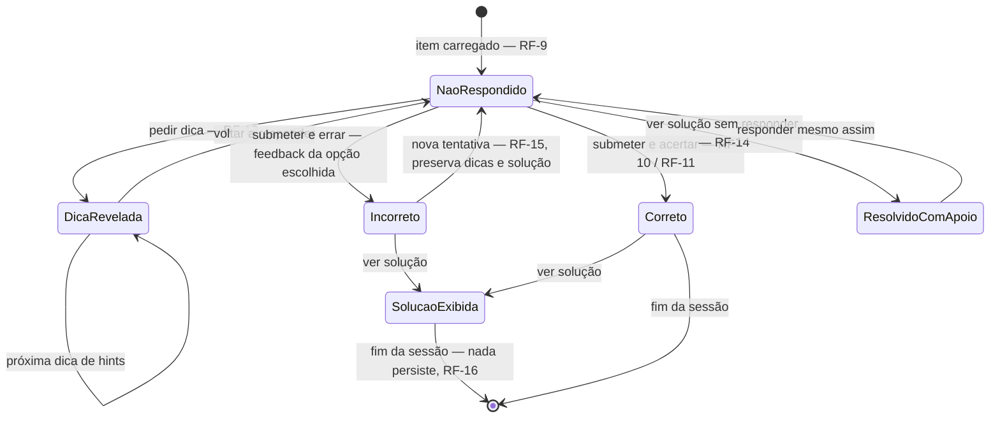

# SPEC — Fatia mínima de aprendizagem

- **Slug:** minimum-learning-slice
- **Status:** approved
- **Autor:** `product-analyst` (requisito) + `docs-writer` (redação)
- **Data:** 2026-08-01
- **Relacionados:** `ADR-0002` (bilinguismo), `ADR-0003` (stack da plataforma),
  `TCK-0002`, `docs/product/roadmap.md` (Fases 2 e 3),
  `content/high-school/algebra/quadratic-equations/`

## Problema

Hoje o acervo existe apenas como arquivos no repositório: um aluno não consegue ler um nó nem
praticar. A menor fatia com valor real é **um aluno abrir um nó de conteúdo no seu idioma, ler
a teoria com a matemática legível, responder um exercício e receber feedback que diga qual foi
o equívoco** — sem conta, sem custo e sem depender de conexão depois da primeira visita.

A fatia junta o mínimo da **Fase 2** do roadmap (leitor bilíngue offline) com o mínimo da
**Fase 3** (player de exercícios com feedback). Não antecipa as Fases 4–6.

## Resultado esperado

Qualquer pessoa abre a página inicial, navega `estágio → área → tópico` até o nó piloto
`high-school/algebra/quadratic-equations`, lê a teoria com LaTeX renderizado e descrição
textual das fórmulas, responde um exercício de múltipla escolha ou numérico, recebe o feedback
diagnóstico da própria resposta, pede dicas progressivas e vê a solução passo a passo — em
pt-BR ou en-US, alternando a qualquer momento sem perder o nó nem o estado do exercício, e com
o conteúdo já visitado abrindo de novo sem rede.

## Escopo

### Dentro

- Índice mínimo de navegação até o nó (estágio → área → tópico), suficiente para chegar ao nó
  piloto sem digitar URL.
- Página de nó: teoria (`theory.<lang>.md`) renderizada com Markdown + KaTeX e metadados de
  `meta.json`.
- Player de exercícios lendo `exercises.json`: tipos `multiple-choice` e `numeric`, dicas
  progressivas, solução passo a passo e feedback por alternativa.
- Alternância pt-BR ↔ en-US em qualquer ponto, sem perder o nó nem o estado do exercício.
- Funcionamento offline do conteúdo já visitado.
- Estados de tela de carregamento, erro, offline e idioma indisponível.

### Fora

Ver a seção **Fora de escopo** adiante.

## Requisitos funcionais

Derivados do contrato real de `content/high-school/algebra/quadratic-equations/`.

- **RF-1 — Chegar ao nó.** A partir da página inicial, o aluno alcança o nó navegando por
  `stage` → `area` → `topic` (valores lidos de `meta.json`), sem digitar URL. A listagem exibe
  `title[lang]`, `summary[lang]`, `difficulty` (1–5) e `estimatedMinutes`.
- **RF-2 — Renderizar a teoria.** O corpo de `theory.<lang>.md` é exibido com hierarquia de
  títulos preservada e LaTeX renderizado: `$…$` inline e `$$…$$` em display. Nenhuma fórmula
  vira imagem; nenhum LaTeX cru aparece na tela.
- **RF-3 — Leitura textual das fórmulas.** Os parágrafos de leitura que acompanham fórmulas em
  display (padrão `*Leitura:* …` no arquivo-fonte) são renderizados e permanecem disponíveis
  ao leitor de tela; não podem ser removidos nem escondidos de forma que só o público vidente
  os alcance.
- **RF-4 — Metadados do nó.** A página exibe `stage`, `area`, `difficulty`,
  `estimatedMinutes`, `tags[]` e `skills[]`, com rótulos traduzidos nos dois idiomas.
- **RF-5 — Status `draft`.** Quando `meta.json.status` for diferente de `published`, a página
  exibe rótulo visível de rascunho (pt-BR e en-US). O nó piloto está `draft`; ele deve aparecer
  mesmo assim, marcado.
- **RF-6 — Pré-requisitos.** `prerequisites[]` é renderizado como lista de links para os nós
  citados. Com o array vazio (caso do nó piloto), a seção não é exibida — sem seção vazia, sem
  erro, sem texto de placeholder.
- **RF-7 — Alternar idioma.** Alternar pt-BR ↔ en-US mantém o mesmo nó, a mesma posição de
  leitura aproximada e o estado do exercício em curso; troca simultaneamente o texto do
  conteúdo e o da interface. Idiomas nunca se misturam na mesma tela.
- **RF-8 — Sem fallback de idioma.** Se `theory.<lang>.md` ou a chave de idioma de um campo
  localizado faltar, o objeto não é exibido naquele idioma: a interface informa a ausência
  explicitamente. Exibir o outro idioma no lugar é defeito.
- **RF-9 — Carregar exercícios.** `exercises.json` é lido pelo par `nodeId` + `version`; os
  itens são apresentados na ordem do arquivo. Cada item mostra `difficulty` e é endereçável
  pelo seu `id` (`qe-001` … `qe-005`).
- **RF-10 — Item `multiple-choice`.** Renderiza `stem[lang]` e todas as `options[].text[lang]`
  com KaTeX; permite selecionar exatamente uma opção; ao submeter, o resultado é decidido por
  `options[].correct` e é exibido o `options[].feedback[lang]` **da opção escolhida** —
  inclusive quando ela é a correta.
- **RF-11 — Item `numeric`.** Aceita entrada numérica e corrige por
  `|resposta − answer| ≤ tolerance`. Com `tolerance: 0` (item `qe-003`), só o valor exato
  acerta. Quando `unit` for nulo ou ausente, nenhuma unidade é exibida ou exigida.
- **RF-12 — Separador decimal por idioma.** Em pt-BR, `3,5` é aceito para `answer: 3.5` (item
  `qe-005`); em en-US, `3.5`. A entrada válida do idioma ativo nunca é rejeitada por
  formatação, e o valor exibido de volta segue a convenção do idioma
  (`docs/content/i18n.md`).
- **RF-13 — Dicas progressivas.** Nenhuma dica aparece antes de pedida. Cada pedido revela a
  próxima entrada de `hints[]` na ordem do arquivo; depois da última, a ação de pedir dica fica
  indisponível e é anunciada como tal.
- **RF-14 — Solução.** `solution[lang]` só aparece depois de o aluno submeter uma resposta ou
  pedir explicitamente "ver solução". Ver a solução sem responder marca o item como resolvido
  com apoio e não conta como acerto.
- **RF-15 — Nova tentativa.** Depois de errar, o aluno pode responder de novo; o item volta ao
  estado "não respondido" preservando as dicas já reveladas e a solução, se já exibida.
- **RF-16 — Estado local e efêmero.** Respostas, dicas e resultados vivem apenas no dispositivo
  e apenas durante a sessão. Nada é enviado a servidor; nenhum identificador de aluno é criado.
  Persistência entre sessões é fora de escopo (RF-16 falha se houver qualquer chamada de rede
  com dado de resposta).
- **RF-17 — URL estável do nó.** A URL pública do nó contém o caminho da taxonomia
  (`high-school/algebra/quadratic-equations`) exatamente como no repositório, e recarregar a
  URL reabre o mesmo nó. `meta.json.id` é o identificador canônico.
- **RF-18 — Validação do contrato antes de publicar.** A carga (build ou runtime) rejeita, de
  forma visível e registrada: item `multiple-choice` sem exatamente uma opção `correct: true`;
  item `numeric` sem `answer` numérico ou com `tolerance` negativa; qualquer campo localizado
  sem as duas chaves `pt-BR` e `en-US`; `nodeId` divergente do caminho do nó. Falha silenciosa
  é defeito.

## Requisitos não funcionais

- **RNF-1 — Paridade bilíngue sem fallback.** Todo texto de conteúdo e de interface existe em
  pt-BR e en-US; a ausência de um dos dois bloqueia a exibição do objeto naquele idioma (nunca
  substitui pelo outro). `L-001`.
- **RNF-2 — Matemática acessível.** KaTeX com saída acessível a leitor de tela; toda fórmula em
  display com descrição textual; nenhuma fórmula em imagem;
  `docs/content/accessibility.md`.
- **RNF-3 — Offline do conteúdo visitado.** Um nó já aberto (teoria, exercícios e assets do
  idioma visitado) abre novamente sem rede. Idioma ou nó nunca visitados, estando offline,
  produzem um estado explícito de indisponibilidade — não um erro genérico nem tela em branco.
- **RNF-4 — Custo zero.** Nenhum serviço pago, backend obrigatório, API comercial ou recurso
  que gere cobrança por uso. Hospedagem de arquivos estáticos deve bastar para toda a fatia.
- **RNF-5 — Slugs como contrato público.** Os segmentos de `content/` aparecem na URL sem
  renomeação, tradução ou normalização. Renomear exige ADR + redirect (`L-003`).
- **RNF-6 — WCAG 2.2 AA.** Operação completa por teclado, foco visível e ordem previsível,
  contraste conforme, alvos de toque adequados, `lang` correto no documento por idioma,
  resultado do exercício anunciado por região viva (não apenas por cor ou ícone) e nenhum
  limite de tempo.
- **RNF-7 — Zero coleta de dados pessoais.** Sem conta, login, e-mail, analytics, cookie de
  rastreio, fingerprint ou recurso de terceiro que registre o visitante. Enquanto não houver
  ADR de privacidade aceito (LGPD/COPPA), qualquer coleta identificável é proibida.
- **RNF-8 — Dispositivo modesto e rede lenta.** A página de teoria deve ser utilizável com
  JavaScript mínimo; os números do orçamento de performance (peso e tempo até conteúdo legível)
  ficam **a definir na implementação** e devem entrar como critério de `/pwa-audit`.
- **RNF-9 — Conteúdo independente da aplicação.** A interface consome `content/` como está. Se
  algo no acervo impedir a implementação, abre-se ticket de conteúdo/schema — não se adapta o
  arquivo dentro deste escopo.
- **RNF-10 — Sem gamificação predatória.** Feedback sem pontuação competitiva, streak, contagem
  regressiva ou ranking (princípio 6 da visão).
- **RNF-11 — Gabarito visível no payload.** Como o acervo é público e não há backend, o
  gabarito trafega junto com o exercício. A fatia assume isso: nenhuma funcionalidade pode
  depender do segredo da resposta (não há avaliação com valor probatório aqui). `L-008`.

## Estados de tela

| Contexto | Estado | Comportamento exigido |
|---|---|---|
| Nó | Carregando | Indicação acessível de carregamento (`aria-busy`/`role=status`), sem salto de layout ao concluir. |
| Nó | Erro de carga | Mensagem no idioma ativo, motivo distinguível (não encontrado × falha de leitura) e ação de tentar de novo. |
| Nó | Caminho inexistente | Estado "nó não encontrado" com link para o índice; a URL não é reescrita silenciosamente. |
| Nó | Rascunho | Rótulo persistente de `draft` enquanto `meta.json.status != "published"`. |
| Exercício | Não respondido | Enunciado e opções/campo ativos; sem dica, sem solução, sem resultado. Ação de responder desabilitada até haver seleção/valor. |
| Exercício | Correto | Marca de acerto não dependente só de cor + `feedback` da opção escolhida + acesso à solução; anunciado por região viva. |
| Exercício | Incorreto | Feedback diagnóstico da opção escolhida (ou da resposta numérica), opção de tentar de novo, dica seguinte e solução disponíveis. |
| Exercício | Dica revelada | Dicas visíveis acumuladas na ordem; controle indisponível após a última. |
| Exercício | Solução exibida | Passo a passo completo; item marcado como resolvido com apoio. |
| Idioma | Alternado | Mesmo nó, mesma posição, estado do exercício preservado, todo o texto no novo idioma. |
| Idioma | Indisponível | Aviso explícito de que o objeto não existe naquele idioma, com retorno ao idioma anterior — nunca fallback silencioso. |
| Rede | Offline com cache | Conteúdo visitado abre normalmente, com indicador de modo offline. |
| Rede | Offline sem cache | Estado explícito "não disponível offline" e sugestão do que já está disponível. |

## Ciclo de vida de um item de exercício

**Leitura.** O diagrama mostra os estados por item (não por nó) e as transições exigidas por
RF-13, RF-14 e RF-15: dicas só surgem sob demanda e são cumulativas; a solução é alcançável
depois de submeter ou explicitamente, e nesse segundo caso o item fica marcado como resolvido
com apoio; errar nunca é terminal — a nova tentativa devolve o item a "não respondido" sem
esconder o que já foi revelado. O diagrama **não** mostra persistência (não há: RF-16 mantém
tudo em memória de sessão), nem pontuação, nem sequenciamento entre itens.

**Fontes.** RF-9…RF-15 e a tabela de estados desta spec;
`content/high-school/algebra/quadratic-equations/exercises.json` (campos `options[].correct`,
`answer`, `tolerance`, `hints[]`, `solution`); `docs/content/exercise-schema.md`.

**Marcação.** Tudo aqui é **proposta** — não existe implementação. O único **estado atual** é
o contrato de dados de `exercises.json`, que já está no repositório.

## Critérios de aceite

Cada critério é verificável e falharia se a implementação estivesse errada.

- [ ] **CA-1.** Dado o índice em pt-BR, quando o aluno navega `Ensino médio → Álgebra →
      Equações do segundo grau`, então a página do nó abre e a URL contém
      `high-school/algebra/quadratic-equations`.
- [ ] **CA-2.** Dado o nó aberto, quando a teoria é renderizada, então nenhum texto entre `$`
      ou `$$` aparece cru e a fórmula `$$ax^2 + bx + c = 0$$` é seguida do parágrafo de leitura
      correspondente, acessível a leitor de tela.
- [ ] **CA-3.** Dado o nó aberto em pt-BR, quando o aluno alterna para en-US, então o título
      passa a "Quadratic equations", todo o texto visível está em en-US, o nó é o mesmo e o
      exercício em curso mantém a resposta selecionada e as dicas reveladas.
- [ ] **CA-4.** Dado o item `qe-001`, quando o aluno escolhe a opção `b`, então a resposta é
      marcada como incorreta e é exibido exatamente o feedback "Você ignorou o sinal negativo…"
      (pt-BR) / "You dropped the minus sign…" (en-US).
- [ ] **CA-5.** Dado o item `qe-001`, quando o aluno escolhe a opção `a`, então a resposta é
      marcada como correta e o feedback da própria opção correta é exibido.
- [ ] **CA-6.** Dado o item `qe-003` (`answer: 3`, `tolerance: 0`), quando o aluno responde
      `2,9`, então a resposta é incorreta; quando responde `3`, é correta.
- [ ] **CA-7.** Dado o item `qe-005` (`answer: 3.5`, `tolerance: 0.001`) em pt-BR, quando o
      aluno digita `3,5`, então a resposta é aceita como correta; em en-US, `3.5` também é
      aceita.
- [ ] **CA-8.** Dado o item `qe-002` sem dicas reveladas, quando o aluno pede dica duas vezes,
      então as duas dicas de `hints[]` aparecem na ordem do arquivo e o controle de dica fica
      indisponível na terceira tentativa.
- [ ] **CA-9.** Dado qualquer item ainda não respondido, quando a página carrega, então
      `solution` não está presente no texto exibido (nem oculto por CSS acessível a leitor de
      tela).
- [ ] **CA-10.** Dado o nó já visitado, quando a rede é desligada e a página é recarregada,
      então teoria e exercícios abrem normalmente e há indicação de modo offline.
- [ ] **CA-11.** Dado um idioma nunca visitado e o dispositivo offline, quando o aluno alterna
      o idioma, então aparece o estado "não disponível offline" — e não o texto do outro
      idioma.
- [ ] **CA-12.** Dada uma sessão completa de leitura e resposta, quando o tráfego de rede é
      inspecionado, então não há requisição contendo resposta do aluno, identificador de
      usuário ou chamada a domínio de analytics.
- [ ] **CA-13.** Dado um `exercises.json` de teste com um item `multiple-choice` sem opção
      `correct: true`, quando o conteúdo é carregado, então a validação falha de forma visível
      e o item não é apresentado ao aluno.
- [ ] **CA-14.** Dado um `meta.json` de teste sem a chave `en-US` em `title`, quando o nó é
      carregado em en-US, então a interface informa a ausência e não exibe o título em pt-BR.
- [ ] **CA-15.** Dado o nó aberto, quando a navegação é feita só por teclado, então índice,
      alternador de idioma, opções, campo numérico, dicas, solução e botão de responder são
      todos alcançáveis com foco visível, e o resultado da resposta é anunciado por região
      viva.
- [ ] **CA-16.** Dado `meta.json.status: "draft"`, quando a página do nó abre, então o rótulo
      de rascunho está visível nos dois idiomas.

## Requisitos transversais

| Requisito | Situação | Como será atendido |
|---|---|---|
| Bilinguismo pt-BR + en-US | Contemplado | RNF-1, RF-7, RF-8, RF-12; provado por CA-3, CA-7, CA-11, CA-14. Sem fallback: idioma ausente vira estado explícito (`ADR-0002`, `L-001`). |
| Acessibilidade WCAG 2.2 AA (inclui matemática acessível) | Contemplado | RNF-2 e RNF-6; RF-3 preserva os parágrafos de leitura das fórmulas em display; provado por CA-2 e CA-15, mais auditoria `/a11y-audit`. |
| Funcionamento offline / PWA | Contemplado | RNF-3; estados "offline com cache" e "offline sem cache" na tabela; provado por CA-10 e CA-11. Estratégia de cache é decisão de implementação. |
| Custo zero | Contemplado | RNF-4: hospedagem estática basta; RF-18 roda na carga/build, sem serviço pago; RNF-11 aceita o gabarito público em vez de exigir backend de correção. |
| Privacidade e dados de menores (LGPD/COPPA) | Contemplado | RNF-7 e RF-16: zero coleta, zero identificador, estado só em memória de sessão; provado por CA-12. Persistência entre sessões fica fora até haver ADR de privacidade aceito. |
| URLs de `content/` preservadas | Contemplado | RNF-5 e RF-17: o caminho da taxonomia aparece na URL sem tradução ou normalização; provado por CA-1 (`L-003`). |
| Correção matemática verificada | Não aplicável nesta spec | A fatia não cria nem altera conteúdo (RNF-9). Os cinco itens do nó piloto já trazem o campo `verified` em `exercises.json` (métodos e data 2026-08-01); qualquer erro encontrado vira ticket de conteúdo, não mudança aqui. |

## Fora de escopo

- Escolher stack, biblioteca de UI, ferramenta de teste ou estratégia de service worker —
  pertence ao `ADR-0003` e às decisões de implementação.
- Conta, login, sincronização entre dispositivos, telemetria, analytics.
- Persistência de progresso entre sessões, domínio por habilidade e recomendação de próximo
  passo (Fase 4).
- Trilhas (`content/paths/`), fóruns e certificados (Fases 5–6).
- Busca, filtros por dificuldade/tag, ordenação e navegação entre nós irmãos.
- Exibição de `references.json` (verificação de fontes é o `TCK-0001`) e de
  `assessments.json`.
- Tipos de exercício ainda inexistentes no acervo (resposta aberta, arrastar, prova).
- Qualquer alteração em `content/` — slugs, teoria, exercícios, schemas.
- Registro do erro do aluno para fins estatísticos.

## Perguntas em aberto

- **Exibir o nó `draft` ao público?** RF-5 e CA-16 assumem que sim, com rótulo visível.
  Alternativa: esconder nós não `published` do índice e alcançá-los só por URL direta. Decisão
  humana.
- ~~**Qual a forma da URL bilíngue?**~~ **Respondida em 2026-08-01** (Douglas Silva, TCK-0016):
  prefixo de idioma **em minúsculas** — `/pt-br/high-school/…`, `/en-us/high-school/…` — com o
  caminho da taxonomia íntegro, como RF-17 exige. Registro em `ADR-0007` (`accepted`); caixa
  mista, sufixo, parâmetro e domínio por idioma estão descartados.
- **O rótulo de rascunho fica visível também no índice**, ou só na página do nó?

## Métricas de sucesso

Alinhadas a `docs/product/vision.md#como-saberemos-que-funcionou`:

1. **Menos de 2 minutos até praticar.** Da página inicial ao primeiro exercício respondido, sem
   conta e sem digitar URL — medido por percurso cronometrado em teste de usabilidade manual
   (CA-1 mais o caminho feliz `qe-001`).
2. **Depois de errar, o aluno sabe por quê.** 100% das opções incorretas do nó piloto exibem o
   feedback diagnóstico da própria opção escolhida — conferível item a item (CA-4).
3. **Abre offline e em celular antigo.** O nó visitado reabre sem rede (CA-10) e a página de
   teoria permanece utilizável com JavaScript mínimo (RNF-8), verificado por `/pwa-audit`.
4. **Reuso legal e sem custo.** A fatia roda em hospedagem estática, sem serviço pago e sem
   coleta de dados (RNF-4, RNF-7, CA-12).

Métrica deliberadamente ausente: qualquer uso de telemetria ou analytics — proibido por RNF-7.
As medições acima são feitas manualmente ou por teste automatizado, nunca por instrumentação do
visitante.
